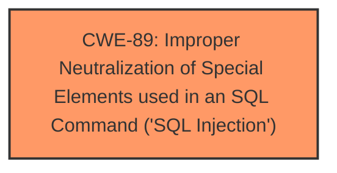

# Analysis Report for CVE-2024-12784

# Vulnerability Analysis Report: CVE-2024-12784

## Description

A vulnerability was found in itsourcecode Vehicle Management System 1.0. It has been classified as critical. Affected is an unknown function of the file editbill.php. The manipulation of the argument id leads to **sql injection**. It is possible to launch the attack remotely. The exploit has been disclosed to the public and may be used.

## Vulnerability Description Key Phrases

- **Weakness:** sql injection
- **Vector:** manipulation of the argument id
- **Product:** itsourcecode Vehicle Management System
- **Version:** 1
- **Component:** editbill.php

## Analysis (with Relationship Data)

# Summary
| CWE ID | CWE Name | Confidence | CWE Abstraction Level | CWE Vulnerability Mapping Label | CWE-Vulnerability Mapping Notes |
|---|---|---|---|---|---|
| CWE-89 | Improper Neutralization of Special Elements used in an SQL Command ('SQL Injection') | 1.0 | Base | Allowed | Primary CWE: The vulnerability description clearly states that the manipulation of the argument 'id' leads to **SQL Injection**. |

## Evidence and Confidence

*   **Confidence Score:** 1.0
*   **Evidence Strength:** HIGH

## Relationship Analysis
The primary relationship considered was the direct match of the vulnerability description to CWE-89, which is a Base level CWE. There were no child CWEs that provided more specific details based on the provided evidence.



## Vulnerability Chain
The vulnerability chain consists of:
1.  The **root cause** is the **improper neutralization** of special elements used in an SQL command.
2.  The impact is the possibility of **SQL Injection**.

## Summary of Analysis
The primary CWE, CWE-89, was selected due to the explicit mention of **SQL injection** in the vulnerability description. The description states that manipulating the 'id' argument leads directly to this vulnerability. The retriever results also strongly suggest CWE-89 as the most relevant CWE. The confidence level is high because the description directly states the type of vulnerability.

The other CWEs from the retriever results were considered but were not used because they were not as directly relevant to the vulnerability description. For example, CWE-79 (Cross-site Scripting) and CWE-434 (Unrestricted Upload of File with Dangerous Type) are both valid weaknesses, but they are not mentioned in the description.

Relevant CWE Information:

# Enhanced Context (25 CWEs)
The following CWEs were identified as potentially relevant to this vulnerability:

## CWE-89: Improper Neutralization of Special Elements used in an SQL Command ('SQL Injection')
**Abstraction Level**: Base
**Similarity Score**: 0.78
**Source**: dense

**Description**:
The product constructs all or part of an SQL command using externally-influenced input from an upstream component, but it does not neutralize or incorrectly neutralizes special elements that could modify the intended SQL command when it is sent to a downstream component. Without sufficient removal or quoting of SQL syntax in user-controllable inputs, the generated SQL query can cause those inputs to be interpreted as SQL instead of ordinary user data.

**Mapping Guidance**:
- Usage: Allowed
- Rationale: This CWE entry is at the Base level of abstraction, which is a preferred level of abstraction for mapping to the root causes of vulnerabilities.


## CWE Relationship Analysis

Current CWEs represent these abstraction levels: .


### Vulnerability Chain Analysis

**Chain starting from CWE-89:**
- 89 (Improper Neutralization of Special Elements used in an SQL Command ('SQL Injection')) - ROOT


**Chain starting from CWE-79:**
- 79 (Improper Neutralization of Input During Web Page Generation ('Cross-site Scripting')) - ROOT


### CWE Relationship Diagram

```mermaid
graph TD
    classDef primary fill:#f96,stroke:#333,stroke-width:2px
    classDef secondary fill:#69f,stroke:#333
    classDef tertiary fill:#9e9,stroke:#333
```


*Report generated on 2025-07-13 03:10:17*
