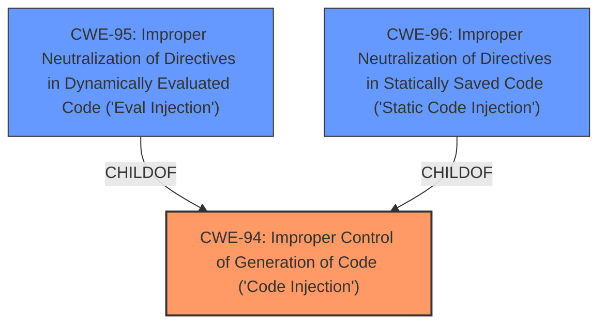

# Enhanced Analysis for CVE-2024-12789

# Summary
| CWE ID | CWE Name | Confidence | CWE Abstraction Level | CWE Vulnerability Mapping Label | CWE-Vulnerability Mapping Notes |
|---|---|---|---|---|---|
| CWE-94 | Improper Control of Generation of Code ('Code Injection') | 0.9 | Base | Allowed-with-Review | Primary CWE |

## Evidence and Confidence

*   **Confidence Score:** 0.9
*   **Evidence Strength:** MEDIUM

## Relationship Analysis
The primary relationship that influenced my decision was the parent-child relationship between CWE-94 and its children, especially CWE-95 and CWE-96. While the description indicates code injection, determining whether it is dynamically evaluated (CWE-95) or statically saved (CWE-96) would require more information. Therefore, the base CWE-94 is the most appropriate.



## Vulnerability Chain
The vulnerability chain starts with the **improper control of code generation (CWE-94)**, leading to the execution of arbitrary code due to the manipulation of the 'tag' argument. The impact is remote code execution.

## Summary of Analysis
The vulnerability description clearly states that the manipulation of the 'tag' argument leads to **code injection**. The retriever results suggest CWE-79 (Cross-site Scripting), CWE-89 (SQL Injection), and CWE-1336 (Improper Neutralization of Special Elements Used in a Template Engine). However, these are not as directly relevant as CWE-94 (Improper Control of Generation of Code ('Code Injection')), which directly addresses the **code injection** aspect.

The evidence is the vulnerability description itself: "The manipulation of the argument tag leads to **code injection**." This is direct evidence supporting the classification of CWE-94.

CWE-94 is selected because it directly addresses the root cause of the vulnerability, which is the **improper control of code generation**. While other CWEs like CWE-79, CWE-89, and CWE-1336 might be related depending on the specific context of the injection, CWE-94 is the most accurate representation of the **root cause**. The other CWEs were considered but deemed less appropriate as they represent specific types of injection or impacts rather than the underlying cause.


## CWE Relationship Analysis

Current CWEs represent these abstraction levels: .


### Vulnerability Chain Analysis

**Chain starting from CWE-89:**
- 89 (Improper Neutralization of Special Elements used in an SQL Command ('SQL Injection')) - ROOT


**Chain starting from CWE-94:**
- 94 (Improper Control of Generation of Code ('Code Injection')) - ROOT


### CWE Relationship Diagram

```mermaid
graph TD
    classDef primary fill:#f96,stroke:#333,stroke-width:2px
    classDef secondary fill:#69f,stroke:#333
    classDef tertiary fill:#9e9,stroke:#333
```