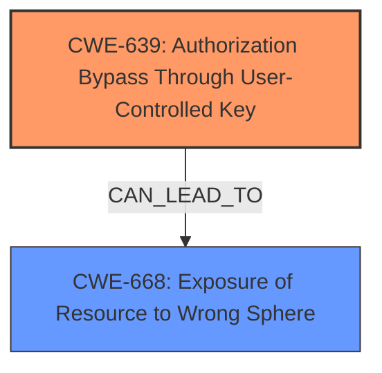

# Analysis for CVE-2024-12880

# Summary

| CWE ID | CWE Name | Confidence | CWE Abstraction Level | CWE Vulnerability Mapping Label | CWE-Vulnerability Mapping Notes |
|---|---|---|---|---|---|
| CWE-639 | Authorization Bypass Through User-Controlled Key | 0.9 | Base | Allowed | Primary CWE. The vulnerability allows a user to bypass authorization by manipulating a key (tenant ID) they control to access resources of other tenants. |
| CWE-668 | Exposure of Resource to Wrong Sphere | 0.7 | Class | Discouraged | Secondary Candidate. This CWE is relevant because the vulnerability results in the exposure of API tokens to the wrong control sphere (other tenants), but CWE-639 is a more specific root cause. |

## Evidence and Confidence

*   **Confidence Score:** 0.9
*   **Evidence Strength:** HIGH

## Relationship Analysis
The primary relationship that influences the decision is that CWE-639 "Authorization Bypass Through User-Controlled Key" is at the Base level of abstraction, which is preferred. CWE-668 "Exposure of Resource to Wrong Sphere" is a Class level CWE and is more general. CWE-639 can lead to CWE-668.

## Vulnerability Chain
The vulnerability chain starts with the **insecure data querying** due to the **improper handling of tenant IDs**, which leads to an authorization bypass, and ultimately results in partial account takeover and exposure of API tokens.

*   Root Cause: **Insecure data querying** (manifested as **improper handling of tenant IDs**), represented by CWE-639 (Authorization Bypass Through User-Controlled Key).
*   Impact: Partial account takeover and exposure of API tokens, which can be represented by CWE-668 (Exposure of Resource to Wrong Sphere).

## Summary of Analysis
The primary weakness is the **insecure data querying** that allows users to manipulate tenant IDs to bypass authorization and access other tenants' API tokens. This aligns well with CWE-639 (Authorization Bypass Through User-Controlled Key), which describes a scenario where authorization is bypassed by modifying a user-controlled key. The "Retriever Results" also lists CWE-639 as the top candidate.

CWE-668 (Exposure of Resource to Wrong Sphere) is a secondary candidate because the vulnerability leads to the exposure of sensitive information (API tokens) to unauthorized actors (other tenants). However, it is a more general CWE and doesn't capture the specific root cause of the vulnerability, which is the authorization bypass through user-controlled key manipulation.

The selection of CWE-639 is based on the explicit mention of manipulating tenant access to query and access API tokens of other tenants, which directly relates to the concept of bypassing authorization using a user-controlled key. This aligns with the CWE's description and mapping guidance, which recommends using Base-level CWEs for root cause analysis.

Other CWEs Considered but Not Used:

*   CWE-863 (Incorrect Authorization): While the vulnerability involves authorization, CWE-639 is more specific in that it highlights the mechanism of the bypass (user-controlled key).
*   CWE-285 (Improper Authorization): Similar to CWE-863, this is a broader category and doesn't capture the specific details of the vulnerability.
*   CWE-425 (Direct Request ('Forced Browsing')): Not applicable as the issue is not direct requests but rather manipulating existing access to gain further access.
*   CWE-22 (Improper Limitation of a Pathname to a Restricted Directory ('Path Traversal')): Not applicable as the issue is not path traversal.
*   CWE-94 (Improper Control of Generation of Code ('Code Injection')): Not applicable as the issue is not code injection.
*   CWE-532 (Insertion of Sensitive Information into Log File): Not applicable as the issue is not the logging of sensitive information.
*   CWE-613 (Insufficient Session Expiration): Not applicable as the issue is not session expiration.
*   CWE-471 (Modification of Assumed-Immutable Data (MAID)): Not applicable as the issue is not modification of data.
*   CWE-73 (External Control of File Name or Path): Not applicable as the issue is not file name or path control.
*   CWE-98 (Improper Control of Filename for Include/Require Statement in PHP Program ('PHP Remote File Inclusion')): Not applicable as the issue is not PHP file inclusion.