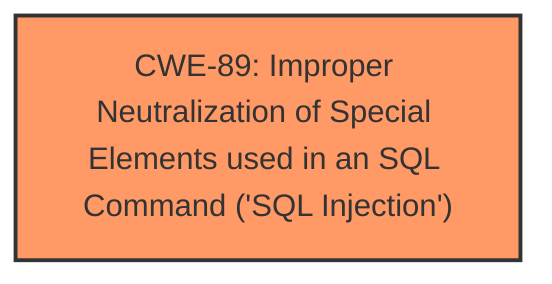

# Analysis Report for CVE-2024-12898

# Vulnerability Analysis Report: CVE-2024-12898

## Description

A vulnerability was found in 1000 Projects Attendance Tracking Management System 1.0. It has been declared as critical. This vulnerability affects unknown code of the file /admin/faculty_action.php. The manipulation of the argument faculty_course_id leads to **sql injection**. The attack can be initiated remotely. The exploit has been disclosed to the public and may be used. Other parameters might be affected as well.

## Vulnerability Description Key Phrases

- **Weakness:** sql injection
- **Vector:** manipulation of faculty_course_id argument
- **Product:** 1000 Projects Attendance Tracking Management System
- **Version:** 1
- **Component:** /admin/faculty_action.php

## Analysis (with Relationship Data)

# Summary
| CWE ID | CWE Name | Confidence | CWE Abstraction Level | CWE Vulnerability Mapping Label | CWE-Vulnerability Mapping Notes |
|---|---|---|---|---|---|
| CWE-89 | Improper Neutralization of Special Elements used in an SQL Command ('SQL Injection') | 1.0 | Base | Allowed | Primary CWE: The vulnerability is caused by **SQL injection** due to **improper neutralization** of the `faculty_course_id` parameter.|

## Evidence and Confidence

*   **Confidence Score:** 1.0
*   **Evidence Strength:** HIGH

## Relationship Analysis
The primary relationship is that CWE-89 is a Base level CWE which directly describes the **SQL Injection** vulnerability. There are no parent-child or chain relationships directly influencing this selection, as the evidence points strongly to this single, specific weakness. The abstraction level is appropriate as a base class.



## Vulnerability Chain
The vulnerability chain consists of:
1.  **Root Cause:** **Improper neutralization** of the `faculty_course_id` parameter when constructing the SQL query.
2.  **Weakness:** **SQL Injection** vulnerability (CWE-89)
3.  **Impact:** Unauthorized database access, sensitive data leakage, data tampering, system control, service interruption.

## Summary of Analysis
The initial analysis strongly suggests CWE-89 as the primary vulnerability due to the **SQL injection** vulnerability in the `/admin/faculty_action.php` file, directly caused by the **improper neutralization** of the `faculty_course_id` parameter.

The evidence includes:
*   Vulnerability Description Key Phrases: "**weakness: sql injection**"
*   CVE Reference Links Content Summary: "The root cause is a SQL injection vulnerability...The vulnerability occurs because the `faculty_course_id` parameter...is directly used in SQL queries without proper sanitization or validation."
*   CVE Reference Links Content Summary: "**SQL Injection:** The primary vulnerability is SQL injection, where an attacker can insert malicious SQL code into the `faculty_course_id` parameter."

The retriever results also list CWE-89 with a high similarity score. The graph relationships confirm that this is the most direct and appropriate CWE for the described vulnerability.

The selection of CWE-89 is based on direct evidence of **SQL injection** and the **improper neutralization** of the `faculty_course_id` parameter. The CWE is at the optimal level of specificity, as it accurately describes the root cause of the vulnerability.


## CWE Relationship Analysis

Current CWEs represent these abstraction levels: .


### Vulnerability Chain Analysis

**Chain starting from CWE-89:**
- 89 (Improper Neutralization of Special Elements used in an SQL Command ('SQL Injection')) - ROOT


### CWE Relationship Diagram

```mermaid
graph TD
    classDef primary fill:#f96,stroke:#333,stroke-width:2px
    classDef secondary fill:#69f,stroke:#333
    classDef tertiary fill:#9e9,stroke:#333
```


*Report generated on 2025-07-13 03:19:14*
