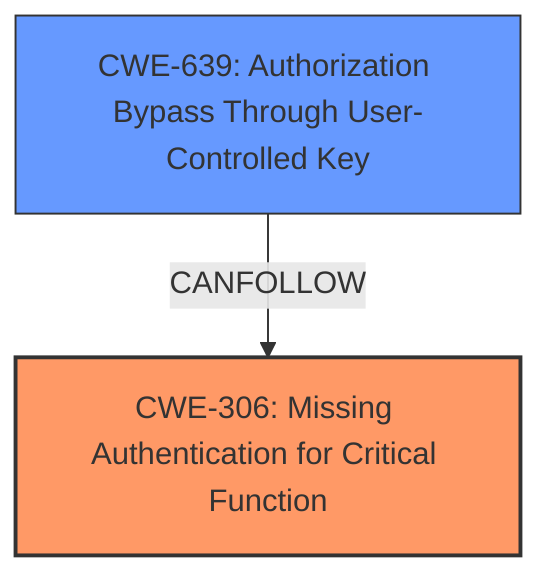

# Enhanced Analysis for CVE-2024-12919

# Summary
| CWE ID | CWE Name | Confidence | CWE Abstraction Level | CWE Vulnerability Mapping Label | CWE-Vulnerability Mapping Notes |
|---|---|---|---|---|---|
| CWE-306 | Missing Authentication for Critical Function | 0.9 | Base | Primary | Allowed |
| CWE-639 | Authorization Bypass Through User-Controlled Key | 0.7 | Base | Secondary | Allowed |

## Evidence and Confidence

*   **Confidence Score:** 0.8
*   **Evidence Strength:** HIGH

## Relationship Analysis
The primary relationship is that CWE-306 [Missing Authentication for Critical Function] and CWE-639 [Authorization Bypass Through User-Controlled Key] can both be present in the same vulnerability. CWE-306 represents the initial failure to authenticate, while CWE-639 describes the subsequent bypass of authorization controls. The abstraction levels (both Base) are appropriate for representing specific weaknesses.



## Vulnerability Chain
The vulnerability chain starts with the **missing authentication** (CWE-306) for the `pms_pb_payment_redirect_link` function. Because of the **missing authentication**, an attacker can then use a valid `pms_payment_id` to **bypass authorization** (CWE-639) and gain access to another user's account. This allows the attacker to log in as any user who has made a purchase on the targeted site.

## Summary of Analysis
The initial assessment identified CWE-306 [Missing Authentication for Critical Function] as the primary weakness due to the lack of identity validation in the `pms_pb_payment_redirect_link` function. The vulnerability description explicitly states that the function uses a user-controlled value to authenticate users "without any further identity validation." This aligns perfectly with the definition of CWE-306, which describes a scenario where a product does not perform any authentication for functionality that requires a provable user identity.

The retriever results also suggested CWE-639 [Authorization Bypass Through User-Controlled Key], which was considered as a secondary weakness because the attacker is using a known payment ID to gain unauthorized access.

The graph relationships influenced the selection by highlighting the potential for these two weaknesses to occur in sequence. The vulnerability description supports this chain of events, as the **missing authentication** allows the attacker to then **bypass authorization** using a valid payment ID.

The selected CWEs are at the optimal level of specificity, as they accurately represent the specific weaknesses present in the vulnerability. CWE-306 describes the **missing authentication**, while CWE-639 describes the **authorization bypass** that results from the missing authentication.

Relevant CWE Information:

# Enhanced Context (25 CWEs)
The following CWEs were identified as potentially relevant to this vulnerability:

## CWE-306: Missing Authentication for Critical Function
**Abstraction Level**: Base
**Similarity Score**: 1336.06
**Source**: sparse

**Description**:
The product does not perform any authentication for functionality that requires a provable user identity or consumes a significant amount of resources.

**Mapping Guidance**:
- Usage: Allowed
- Rationale: This CWE entry is at the Base level of abstraction, which is a preferred level of abstraction for mapping to the root causes of vulnerabilities.

**Relationships**:
- PARENTOF -> CWE-322
- PARENTOF -> CWE-288
- CHILDOF -> CWE-287
- CHILDOF -> CWE-287
- CHILDOF -> CWE-306

## CWE-639: Authorization Bypass Through User-Controlled Key
**Abstraction Level**: Base
**Similarity Score**: 1402.43
**Source**: sparse

**Description**:
The system's authorization functionality does not prevent one user from gaining access to another user's data or record by modifying the key value identifying the data.

**Mapping Guidance**:
- Usage: Allowed
- Rationale: This CWE entry is at the Base level of abstraction, which is a preferred level of abstraction for mapping to the root causes of vulnerabilities.

**Relationships**:
- CANPRECEDE -> CWE-471

CWE-863: Incorrect Authorization
**Abstraction Level**: Class
**Similarity Score**: 1399.47
**Source**: sparse

**Description**:
The product performs an authorization check when an actor attempts to access a resource or perform an action, but it does not correctly perform the check.

**Mapping Guidance**:
- Usage: Allowed-with-Review
- Rationale: This CWE entry is a Class and might have Base-level children that would be more appropriate

### Considered but not used:

*   CWE-863 [Incorrect Authorization], CWE-862 [Missing Authorization], CWE-285 [Improper Authorization] and CWE-287 [Improper Authentication] were considered, but ultimately deemed less appropriate because the core issue is the complete lack of authentication, not an incorrect or missing authorization check after authentication.
*   CWE-352 [Cross-Site Request Forgery (CSRF)] was considered, but the vulnerability is not related to CSRF.
*   CWE-471 [Modification of Assumed-Immutable Data (MAID)] was considered but the root cause is not related to modifying data.


## CWE Relationship Analysis

Current CWEs represent these abstraction levels: .


### Vulnerability Chain Analysis

**Chain starting from CWE-288:**
- 288 (Authentication Bypass Using an Alternate Path or Channel) - ROOT


**Chain starting from CWE-471:**
- 471 (Modification of Assumed-Immutable Data (MAID)) - ROOT


### CWE Relationship Diagram

```mermaid
graph TD
    classDef primary fill:#f96,stroke:#333,stroke-width:2px
    classDef secondary fill:#69f,stroke:#333
    classDef tertiary fill:#9e9,stroke:#333
```