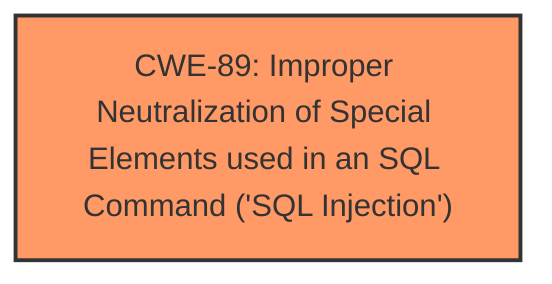

# Analysis Report for CVE-2024-12941

# Vulnerability Analysis Report: CVE-2024-12941

## Description

A vulnerability was found in CodeAstro Blood Donor Management System 1.0 and classified as critical. This issue affects some unknown processing of the file /pages/deletedannounce.php. The manipulation of the argument id leads to **sql injection**. The attack may be initiated remotely. The exploit has been disclosed to the public and may be used.

## Vulnerability Description Key Phrases

- **Weakness:** sql injection
- **Vector:** manipulation of argument id
- **Product:** CodeAstro Blood Donor Management System
- **Version:** 1.0
- **Component:** /pages/deletedannounce.php

## Analysis (with Relationship Data)

# Summary

| CWE ID | CWE Name | Confidence | CWE Abstraction Level | CWE Vulnerability Mapping Label | CWE-Vulnerability Mapping Notes |
|---|---|---|---|---|---|
| CWE-89 | Improper Neutralization of Special Elements used in an SQL Command ('SQL Injection') | 1.0 | Base | Allowed | Primary CWE |

## Evidence and Confidence

*   **Confidence Score:** 1.0
*   **Evidence Strength:** HIGH

## Relationship Analysis
The primary relationship considered was the direct match of the vulnerability description to the definition and examples provided for CWE-89. No child CWEs of CWE-89 were considered because the provided information doesn't specify any particular type of SQL injection, therefore the Base CWE is the best fit.



## Vulnerability Chain
The vulnerability chain is straightforward:

1.  **Root Cause:** **Improper Neutralization of Special Elements used in an SQL Command ('SQL Injection')** (CWE-89) due to insufficient input validation of the `id` parameter.
2.  **Impact:** Unauthorized database access, sensitive data leakage, data tampering, system control, and service interruption.

## Summary of Analysis
The vulnerability is a clear case of SQL injection. The description explicitly states that the manipulation of the `id` argument leads to **sql injection** in the `/pages/deletedannounce.php` file. The CVE Reference Links Content Summary confirms that the root cause is insufficient user input verification for the "id" parameter, allowing attackers to inject malicious SQL queries. The provided payload examples further solidify this assessment.

The retriever results also strongly suggest CWE-89, with a score of 1.0.

Therefore, CWE-89 is the most appropriate classification.

CWE-79, CWE-116, CWE-434, CWE-73, CWE-117, CWE-1336, CWE-94, CWE-494, CWE-22, CWE-41, CWE-183, CWE-639 were considered but are not applicable because the vulnerability is specifically an SQL injection issue, not a general input validation failure or other web-related vulnerability.


## CWE Relationship Analysis

Current CWEs represent these abstraction levels: .


### Vulnerability Chain Analysis

**Chain starting from CWE-183:**
- 183 (Permissive List of Allowed Inputs) - ROOT


**Chain starting from CWE-89:**
- 89 (Improper Neutralization of Special Elements used in an SQL Command ('SQL Injection')) - ROOT


### CWE Relationship Diagram

```mermaid
graph TD
    classDef primary fill:#f96,stroke:#333,stroke-width:2px
    classDef secondary fill:#69f,stroke:#333
    classDef tertiary fill:#9e9,stroke:#333
```


*Report generated on 2025-07-13 03:25:26*
