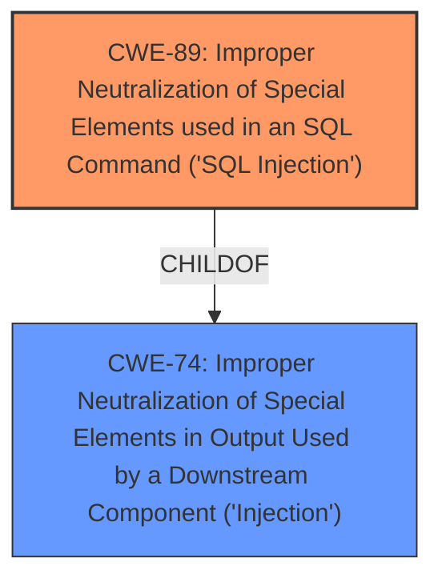

# Raw Analyzer Response for CVE-2024-12943

# Summary
| CWE ID | CWE Name | Confidence | CWE Abstraction Level | CWE Vulnerability Mapping Label | CWE-Vulnerability Mapping Notes |
|---|---|---|---|---|---|
| CWE-89 | Improper Neutralization of Special Elements used in an SQL Command ('SQL Injection') | 1.0 | Base | Allowed | Primary CWE. The application fails to neutralize special elements in SQL commands, leading to SQL injection. |

## Evidence and Confidence

*   **Confidence Score:** 1.0
*   **Evidence Strength:** HIGH

## Relationship Analysis
The primary relationship to consider is that CWE-89 is a Base level CWE, which is appropriate for direct mapping as it represents the root cause of the **SQL Injection** vulnerability. Other CWEs, such as CWE-74 (Improper Neutralization of Special Elements in Output Used by a Downstream Component ('Injection')), are more abstract (Class) and less suitable for directly mapping the root cause. The vulnerability description explicitly indicates **SQL Injection**, making CWE-89 the most specific and accurate choice.

## Vulnerability Chain
The vulnerability chain is straightforward:

1.  **Root Cause:** **Improper Neutralization** of SQL Special Elements (CWE-89). The application fails to sanitize user input used in SQL queries.
2.  **Impact:** **SQL Injection**. An attacker can inject arbitrary SQL code, leading to unauthorized data access, modification, or deletion.

## Summary of Analysis
The analysis is based on the explicit description of an **SQL Injection** vulnerability in the CodeAstro House Rental Management System 1.0. The vulnerability occurs due to **improper neutralization** of special elements within SQL commands, specifically through manipulation of the `m` parameter in the `/ownersignup.php` file.

The evidence supporting this assessment is strong, as indicated by the "CVE Reference Links Content Summary": "The vulnerability stems from a lack of proper input validation and sanitization of the `m` parameter... This allows attackers to inject malicious SQL code directly into SQL queries...".

CWE-89 is the most appropriate selection because it directly addresses the root cause of the vulnerability. It is a Base level CWE, providing sufficient specificity.

Relevant CWE Information:

# Enhanced Context (25 CWEs)
The following CWEs were identified as potentially relevant to this vulnerability:

## CWE-89: Improper Neutralization of Special Elements used in an SQL Command ('SQL Injection')
**Abstraction Level**: Base
**Similarity Score**: 0.76
**Source**: dense

**Description**:
The product constructs all or part of an SQL command using externally-influenced input from an upstream component, but it does not neutralize or incorrectly neutralizes special elements that could modify the intended SQL command when it is sent to a downstream component. Without sufficient removal or quoting of SQL syntax in user-controllable inputs, the generated SQL query can cause those inputs to be interpreted as SQL instead of ordinary user data.

**Mapping Guidance**:
- Usage: Allowed
- Rationale: This CWE entry is at the Base level of abstraction, which is a preferred level of abstraction for mapping to the root causes of vulnerabilities.

## CWE-434: Unrestricted Upload of File with Dangerous Type
The product allows the upload or transfer of dangerous file types that are automatically processed within its environment.

## CWE-472: External Control of Assumed-Immutable Web Parameter
The web application does not sufficiently verify inputs that are assumed to be immutable but are actually externally controllable, such as hidden form fields.

## CWE-425: Direct Request ('Forced Browsing')
The web application does not adequately enforce appropriate authorization on all restricted URLs, scripts, or files.

## CWE-639: Authorization Bypass Through User-Controlled Key
The system's authorization functionality does not prevent one user from gaining access to another user's data or record by modifying the key value identifying the data.

## CWE-79: Improper Neutralization of Input During Web Page Generation ('Cross-site Scripting')
The product does not neutralize or incorrectly neutralizes user-controllable input before it is placed in output that is used as a web page that is served to other users.

## CWE-116: Improper Encoding or Escaping of Output
The product prepares a structured message for communication with another component, but encoding or escaping of the data is either missing or done incorrectly. As a result, the intended structure of the message is not preserved.

## CWE-74: Improper Neutralization of Special Elements in Output Used by a Downstream Component ('Injection')
The product constructs all or part of a command, data structure, or record using externally-influenced input from an upstream component, but it does not neutralize or incorrectly neutralizes special elements that could modify how it is parsed or interpreted when it is sent to a downstream component.

## CWE-95: Improper Neutralization of Directives in Dynamically Evaluated Code ('Eval Injection')
The product receives input from an upstream component, but it does not neutralize or incorrectly neutralizes code syntax before using the input in a dynamic evaluation call (e.g. "eval").

## CWE-138: Improper Neutralization of Special Elements
The product receives input from an upstream component, but it does not neutralize or incorrectly neutralizes special elements that could be interpreted as control elements or syntactic markers when they are sent to a downstream component.

## CWE-89: Improper Neutralization of Special Elements used in an SQL Command ('SQL Injection')
The product constructs all or part of an SQL command using externally-influenced input from an upstream component, but it does not neutralize or incorrectly neutralizes special elements that could modify the intended SQL command when it is sent to a downstream component. Without sufficient removal or quoting of SQL syntax in user-controllable inputs, the generated SQL query can cause those inputs to be interpreted as SQL instead of ordinary user data.

## CWE-79: Improper Neutralization of Input During Web Page Generation ('Cross-site Scripting')
The product does not neutralize or incorrectly neutralizes user-controllable input before it is placed in output that is used as a web page that is served to other users.

## CWE-138: Improper Neutralization of Special Elements
The product receives input from an upstream component, but it does not neutralize or incorrectly neutralizes special elements that could be interpreted as control elements or syntactic markers when they are sent to a downstream component.

## CWE-1336: Improper Neutralization of Special Elements Used in a Template Engine
The product uses a template engine to insert or process externally-influenced input, but it does not neutralize or incorrectly neutralizes special elements or syntax that can be interpreted as template expressions or other code directives when processed by the engine.

## CWE-116: Improper Encoding or Escaping of Output
The product prepares a structured message for communication with another component, but encoding or escaping of the data is either missing or done incorrectly. As a result, the intended structure of the message is not preserved.

## CWE-73: External Control of File Name or Path
CWE-73: External Control of File Name or Path

## CWE-22: Improper Limitation of a Pathname to a Restricted Directory ('Path Traversal')
CWE-22: Improper Limitation of a Pathname to a Restricted Directory ('Path Traversal')

## CWE-434: Unrestricted Upload of File with Dangerous Type
The product allows the upload or transfer of dangerous file types that are automatically processed within its environment.

## CWE-471: Modification of Assumed-Immutable Data (MAID)
CWE-471: Modification of Assumed-Immutable Data (MAID)

## CWE-425: Direct Request ('Forced Browsing')
The web application does not adequately enforce appropriate authorization on all restricted URLs, scripts, or files.

## CWE-113: Improper Neutralization of CRLF Sequences in HTTP Headers ('HTTP Request/Response Splitting')
CWE-113: Improper Neutralization of CRLF Sequences in HTTP Headers ('HTTP Request/Response Splitting')

## CWE-94: Improper Control of Generation of Code ('Code Injection')
CWE-94: Improper Control of Generation of Code ('Code Injection')

## CWE-78: Improper Neutralization of Special Elements used in an OS Command ('OS Command Injection')
CWE-78: Improper Neutralization of Special Elements used in an OS Command ('OS Command Injection')

## CWE-1336: Improper Neutralization of Special Elements Used in a Template Engine
CWE-1336: Improper Neutralization of Special Elements Used in a Template Engine

## CWE-79: Improper Neutralization of Input During Web Page Generation ('Cross-site Scripting')
The product does not neutralize or incorrectly neutralizes user-controllable input before it is placed in output that is used as a web page that is served to other users.