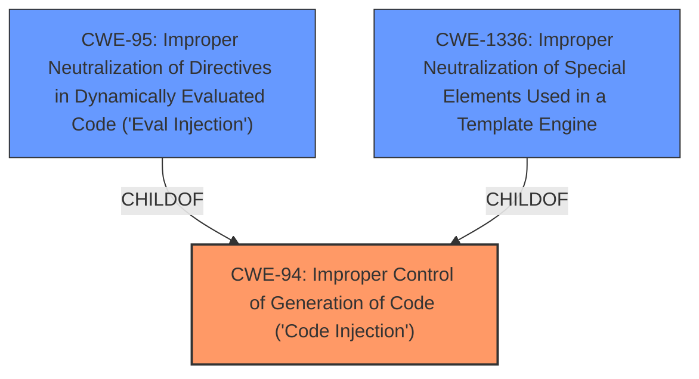

# Analysis Report for CVE-2024-12952

# Vulnerability Analysis Report: CVE-2024-12952

## Description

A vulnerability classified as critical was found in melMass comfy_mtb up to 0.1.4. Affected by this vulnerability is the function run_command of the file comfy_mtb/endpoint.py of the component Dependency Handler. The manipulation leads to **code injection**. The attack can be launched remotely. The exploit has been disclosed to the public and may be used. The patch is named d6e004cce2c32f8e48b868e66b89f82da4887dc3. It is recommended to apply a patch to fix this issue.

## Vulnerability Description Key Phrases

- **Weakness:** code injection
- **Product:** melMass comfy_mtb
- **Version:** up to 0.1.4
- **Component:** comfy_mtb/endpoint.py

## Analysis (with Relationship Data)

# Summary
| CWE ID | CWE Name | Confidence | CWE Abstraction Level | CWE Vulnerability Mapping Label | CWE-Vulnerability Mapping Notes |
|---|---|---|---|---|---|
| CWE-94 | Improper Control of Generation of Code ('Code Injection') | 0.9 | Base | Allowed-with-Review | Primary CWE |

## Evidence and Confidence

*   **Confidence Score:** 0.9
*   **Evidence Strength:** HIGH

## Relationship Analysis
The primary relationship that influenced the selection of CWE-94 is its role as a direct representation of **code injection**, which is the stated **weakness** in the vulnerability description. While other CWEs like CWE-78 ('OS Command Injection') or CWE-89 ('SQL Injection') were considered due to their injection nature, CWE-94 is more general and aptly describes the vulnerability where the control of code generation is **improper**, leading to the execution of unintended code. CWE-94 also has parent-child relationships with CWE-95 ('Eval Injection') and CWE-1336 ('Improper Neutralization of Special Elements Used in a Template Engine'), which are more specific types of code injection, but the provided evidence doesn't specify the injection type, so CWE-94 is appropriate.



## Vulnerability Chain
The vulnerability chain starts with the **improper** control of code generation (CWE-94). This leads to the ability to inject and execute arbitrary code on the system.

## Summary of Analysis
The initial analysis focused on identifying the **root cause** of the vulnerability based on the description and CVE reference links. The description clearly states that the vulnerability is a **code injection** in the melMass comfy_mtb component. The CVE reference confirms the vulnerability is due to **unrestricted dependency installation**, which allows for remote code execution.

The selection of CWE-94 is primarily based on the evidence that highlights the **code injection** vulnerability. The CVE Reference Links Content Summary provides further details about the unrestricted dependency installation leading to the ability to install malicious packages and execute arbitrary code.

The following CWEs were considered but not used:

*   **CWE-78 ('OS Command Injection') and CWE-89 ('SQL Injection')**: These were considered due to their "injection" nature, but the vulnerability is more general than specifically related to OS commands or SQL queries.
*   **CWE-79 ('Cross-site Scripting')**: This is not relevant because the vulnerability does not involve injecting code into a web page.
*   **CWE-113 ('Improper Neutralization of CRLF Sequences in HTTP Headers') and CWE-93 ('Improper Neutralization of CRLF Sequences')**: These are not relevant as the vulnerability doesn't involve CRLF injection.
*   **CWE-73 ('External Control of File Name or Path')**: This isn't relevant because file name/path control isn't the primary issue, it is the ability to run code.

The selected CWE is at the optimal level of specificity because it directly reflects the **weakness** described in the vulnerability, which is **code injection**. The evidence supports this classification, and the relationship analysis confirms that it is more appropriate than other, more specific CWEs.


## CWE Relationship Analysis

Current CWEs represent these abstraction levels: .


### Vulnerability Chain Analysis

**Chain starting from CWE-89:**
- 89 (Improper Neutralization of Special Elements used in an SQL Command ('SQL Injection')) - ROOT


**Chain starting from CWE-94:**
- 94 (Improper Control of Generation of Code ('Code Injection')) - ROOT


### CWE Relationship Diagram

```mermaid
graph TD
    classDef primary fill:#f96,stroke:#333,stroke-width:2px
    classDef secondary fill:#69f,stroke:#333
    classDef tertiary fill:#9e9,stroke:#333
```


*Report generated on 2025-07-13 03:29:09*
