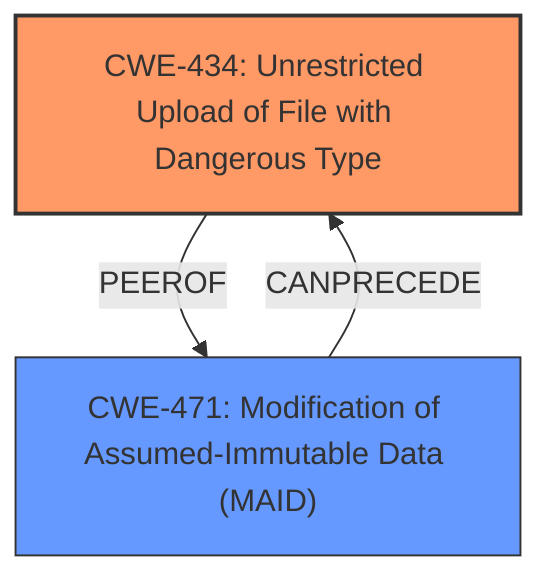

# Enhanced Analysis for CVE-2024-12954

# Summary
| CWE ID | CWE Name | Confidence | CWE Abstraction Level | CWE Vulnerability Mapping Label | CWE-Vulnerability Mapping Notes |
|---|---|---|---|---|---|
| CWE-434 | Unrestricted Upload of File with Dangerous Type | 1.0 | Base | Allowed | Primary CWE |
| CWE-471 | Modification of Assumed-Immutable Data (MAID) | 0.4 | Base | Allowed | Secondary Candidate |

## Evidence and Confidence

*   **Confidence Score:** 0.8
*   **Evidence Strength:** HIGH

## Relationship Analysis
The primary relationship considered was the direct match of CWE-434 to the vulnerability description. The other relationships informed consideration of related weaknesses, particularly those involving data modification and access control, but were ultimately secondary to the direct evidence.



## Vulnerability Chain
The vulnerability chain starts with the **unrestricted upload** (CWE-434), potentially leading to remote command execution and server compromise. There may be missing links in the chain related to specific validation or sanitization weaknesses.

## Summary of Analysis
Based on the provided evidence, the primary vulnerability is an unrestricted file upload, best represented by CWE-434. The analysis considered the vulnerability description, CVE reference links, retriever results, and CWE specifications to arrive at this conclusion.

The vulnerability description clearly states that the manipulation of the `ach_certy` argument leads to **unrestricted upload**. The CVE reference links further confirm this, indicating a lack of file type validation, unrestricted upload path, and no filename sanitization. This directly aligns with the description of CWE-434: "The product allows the upload or transfer of dangerous file types that are automatically processed within its environment."

The retriever results also support this, with CWE-434 being a top candidate. The abstraction level (Base) and usage (Allowed) for CWE-434 are appropriate according to MITRE guidelines.

CWE-471 was considered because the uploaded file could be considered modification of existing data, but it is secondary to the primary issue of unrestricted upload.

Relevant CWE Information:

# Enhanced Context (25 CWEs)
The following CWEs were identified as potentially relevant to this vulnerability:

## CWE-434: Unrestricted Upload of File with Dangerous Type
**Abstraction Level**: Base
**Similarity Score**: 0.84
**Source**: dense

**Description**:
The product allows the upload or transfer of dangerous file types that are automatically processed within its environment.

**Mapping Guidance**:
- Usage: Allowed
- Rationale: This CWE entry is at the Base level of abstraction, which is a preferred level of abstraction for mapping to the root causes of vulnerabilities.

## CWE-471: Modification of Assumed-Immutable Data (MAID)
**Abstraction Level**: base
**Similarity Score**: 4.33
**Source**: graph

**Description**:
CWE-471: Modification of Assumed-Immutable Data (MAID)

**Mapping Guidance**:
- Usage: Allowed
- Rationale: This CWE entry is at the Base level of abstraction, which is a preferred level of abstraction for mapping to the root causes of vulnerabilities.

**Relationships**:
- CANFOLLOW -> CWE-621
- PARENTOF -> CWE-607
- CANFOLLOW -> CWE-602
- PARENTOF -> CWE-473
- PARENTOF -> CWE-472

### Detailed Analysis of Selected CWEs:

*   **CWE-434: Unrestricted Upload of File with Dangerous Type**

    *   **Explanation:** The vulnerability allows uploading files without proper validation, enabling attackers to upload malicious files (e.g., PHP scripts) that can be executed on the server.
    *   **Security Implications:** Remote command execution, server compromise, data breach.
    *   **Relationship Analysis:** N/A
    *   **Mapping Guidance:** The official MITRE mapping guidance designates this CWE as ALLOWED and at the Base level of abstraction, which is appropriate for root causes.
    *   **Evidence:** "**unrestricted upload**", "Lack of file type validation", "allows arbitrary file uploads without proper validation or restrictions."
    *   **Confidence:** 1.0
*   **CWE-471: Modification of Assumed-Immutable Data (MAID)**

    *   **Explanation:** While the primary issue is the unrestricted upload, the resulting action involves the modification of data on the server by the attacker through a file upload. The system assumes the data (existing or new through uploads) is safe.
    *   **Security Implications:** Allows the attacker to modify data, leading to code execution or potentially other attacks depending on the purpose and use of the data.
    *   **Relationship Analysis:** It is related to CWE-434 because unrestricted uploads can lead to modification of data or code on the server.
    *   **Mapping Guidance:** The official MITRE mapping guidance designates this CWE as ALLOWED and at the Base level of abstraction.
    *   **Evidence:** The file upload effectively changes the state of the server.
    *   **Confidence:** 0.4

### CWEs Considered But Not Used:

*   **CWE-79: Improper Neutralization of Input During Web Page Generation ('Cross-site Scripting') and CWE-89: Improper Neutralization of Special Elements used in an SQL Command ('SQL Injection')**: These are not applicable because the vulnerability's root cause is the unrestricted file upload itself, not a failure to neutralize input.
*   **CWE-306: Missing Authentication for Critical Function**: While authentication might be missing, the core issue is the lack of file type validation and unrestricted upload, making CWE-434 more relevant.
*   **CWE-425: Direct Request ('Forced Browsing')**: This CWE is not directly applicable because the issue is not about accessing restricted URLs but rather uploading malicious files.


## CWE Relationship Analysis

Current CWEs represent these abstraction levels: .


### Vulnerability Chain Analysis

**Chain starting from CWE-471:**
- 471 (Modification of Assumed-Immutable Data (MAID)) - ROOT


**Chain starting from CWE-89:**
- 89 (Improper Neutralization of Special Elements used in an SQL Command ('SQL Injection')) - ROOT


### CWE Relationship Diagram

```mermaid
graph TD
    classDef primary fill:#f96,stroke:#333,stroke-width:2px
    classDef secondary fill:#69f,stroke:#333
    classDef tertiary fill:#9e9,stroke:#333
```