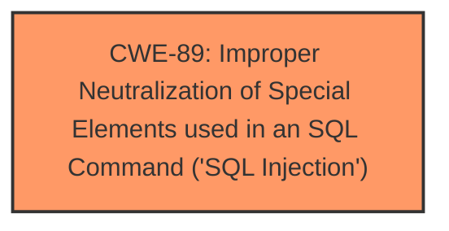

# Analysis for CVE-2024-12960

# Summary
| CWE ID | CWE Name | Confidence | CWE Abstraction Level | CWE Vulnerability Mapping Label | CWE-Vulnerability Mapping Notes |
|---|---|---|---|---|---|
| CWE-89 | Improper Neutralization of Special Elements used in an SQL Command ('SQL Injection') | 1.0 | Base | Allowed | Primary CWE. The vulnerability is an SQL Injection. |

## Evidence and Confidence

*   **Confidence Score:** 1.0
*   **Evidence Strength:** HIGH

## Relationship Analysis
The primary relationship influencing the decision is the direct match of the vulnerability description to the definition of CWE-89. The vulnerability description explicitly states that the manipulation of the argument `q` leads to **sql injection**, and the provided proof of concept demonstrates various SQL injection techniques. CWE-89 is a Base level CWE, which is the preferred level of abstraction.

## Vulnerability Chain
The vulnerability chain is straightforward:

1.  **Root Cause:** **Improper neutralization** of the `q` parameter in `/update_edu_details.php` leads to CWE-89.
2.  **Impact:** Attackers can inject malicious SQL code, leading to unauthorized database access, sensitive data leakage, data tampering, system control, and service interruption.

## Summary of Analysis
The analysis is based on the explicit statement of the vulnerability as an SQL injection and the supporting evidence in the CVE description. The vulnerability description clearly states that manipulating the `q` parameter leads to **sql injection**. The "CVE Reference Links Content Summary" section confirms this, stating that the root cause is the **lack of proper sanitization or validation** of the `q` parameter, leading to the **SQL injection** vulnerability. The provided proof of concept further solidifies this assessment by demonstrating various SQL injection techniques.

CWE-89 is at the optimal level of specificity, as it directly addresses the root cause of the vulnerability. Other CWEs were considered but ultimately deemed less relevant. For example, CWE-79 (Cross-site Scripting) was considered because it involves improper neutralization of input, but it's not relevant because the vulnerability is SQL injection, not XSS. CWE-117 (Improper Output Neutralization for Logs) was also considered but is not applicable as the vulnerability is not related to logging.