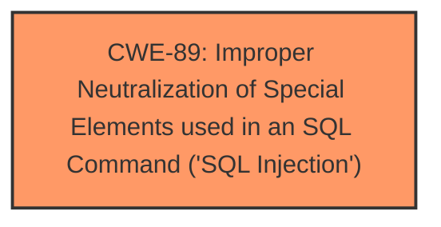

# Analysis for CVE-2024-12962

# Summary

| CWE ID  | CWE Name                                                                                      | Confidence | CWE Abstraction Level | CWE Vulnerability Mapping Label | CWE-Vulnerability Mapping Notes |
| :-------- | :--------------------------------------------------------------------------------------------- | :---------- | :----------------------- | :------------------------------ | :--------------------------------- |
| CWE-89  | Improper Neutralization of Special Elements used in an SQL Command ('SQL Injection') | 1         | Base                     | Primary                         | Allowed                             |

## Evidence and Confidence

*   **Confidence Score:** 1
*   **Evidence Strength:** HIGH

## Relationship Analysis

The primary identified CWE is CWE-89, which stands alone in this case as the direct root cause identified in the vulnerability description. No parent-child or chain relationships are relevant here, as the description directly points to **SQL injection** due to the **manipulation of the skillset argument**.

## Vulnerability Chain

The vulnerability chain is straightforward:

1.  Improper handling of the `skillset` argument.
2.  **SQL Injection** vulnerability (CWE-89)

The root cause is the **lack of proper neutralization** of the `skillset` argument, leading directly to the **SQL injection**.

## Summary of Analysis

The vulnerability description explicitly states that the manipulation of the `skillset` argument leads to **SQL injection**. The retriever results confirm that CWE-89 is the most relevant CWE, with a score of 1.000. The evidence is strong and directly supports the classification of CWE-89 as the primary weakness. The analysis is based on the explicit mention of **SQL injection** in the vulnerability description.

Relevant CWE Information:

# Enhanced Context (25 CWEs)

## CWE-89: Improper Neutralization of Special Elements used in an SQL Command ('SQL Injection')
**Abstraction Level**: Base
**Similarity Score**: 0.75
**Source**: dense

**Description**:
The product constructs all or part of an SQL command using externally-influenced input from an upstream component, but it does not neutralize or incorrectly neutralizes special elements that could modify the intended SQL command when it is sent to a downstream component. Without sufficient removal or quoting of SQL syntax in user-controllable inputs, the generated SQL query can cause those inputs to be interpreted as SQL instead of ordinary user data.

**Mapping Guidance**:
- Usage: Allowed
- Rationale: This CWE entry is at the Base level of abstraction, which is a preferred level of abstraction for mapping to the root causes of vulnerabilities.

## CWE-89: Improper Neutralization of Special Elements used in an SQL Command ('SQL Injection')
**Abstraction Level**: Base
**Similarity Score**: 583.97
**Source**: sparse

**Description**:
The product constructs all or part of an SQL command using externally-influenced input from an upstream component, but it does not neutralize or incorrectly neutralizes special elements that could modify the intended SQL command when it is sent to a downstream component. Without sufficient removal or quoting of SQL syntax in user-controllable inputs, the generated SQL query can cause those inputs to be interpreted as SQL instead of ordinary user data.

**Mapping Guidance**:
- Usage: Allowed
- Rationale: This CWE entry is at the Base level of abstraction, which is a preferred level of abstraction for mapping to the root causes of vulnerabilities.