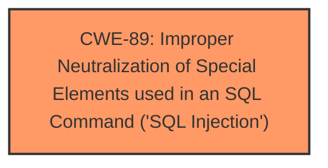

# Analysis Report for CVE-2024-12977

# Vulnerability Analysis Report: CVE-2024-12977

## Description

A vulnerability, which was classified as critical, was found in PHPGurukul Complaint Management System 1.0. This affects an unknown part of the file /admin/state.php. The manipulation of the argument state leads to **sql injection**. It is possible to initiate the attack remotely. The exploit has been disclosed to the public and may be used.

## Vulnerability Description Key Phrases

- **Weakness:** sql injection
- **Product:** PHPGurukul Complaint Management System
- **Version:** 1.0
- **Component:** /admin/state.php

## Analysis (with Relationship Data)

# Summary

| CWE ID | CWE Name | Confidence | CWE Abstraction Level | CWE Vulnerability Mapping Label | CWE-Vulnerability Mapping Notes |
|---|---|---|---|---|---|
| CWE-89 | Improper Neutralization of Special Elements used in an SQL Command ('SQL Injection') | 1.0 | Base | Allowed | Primary CWE |

## Evidence and Confidence

*   **Confidence Score:** 1.0
*   **Evidence Strength:** HIGH

## Relationship Analysis

The primary relationship that influenced the decision was the direct match of the vulnerability description to **CWE-89** Improper Neutralization of Special Elements used in an SQL Command ('SQL Injection'). The retriever results also strongly suggested this CWE.



## Vulnerability Chain

The vulnerability chain consists of:
1.  **Root Cause:** **CWE-89** Improper Neutralization of Special Elements used in an SQL Command ('SQL Injection')

## Summary of Analysis

The vulnerability description clearly states that the manipulation of the `state` argument leads to **sql injection**. The CVE Reference Links Content Summary confirms that the application directly incorporates user-supplied input from the `state` parameter into SQL queries without proper sanitization or validation. This directly aligns with **CWE-89's** description of constructing an SQL command using externally-influenced input without proper neutralization. The retriever results also identify **CWE-89** as the top candidate. There is strong evidence supporting this classification.

Other CWEs Considered and Rejected:

*   CWE-79: Improper Neutralization of Input During Web Page Generation ('Cross-site Scripting'): While input neutralization is a concern, the core issue is the direct injection into an SQL query, not web page generation.
*   CWE-434: Unrestricted Upload of File with Dangerous Type: Not relevant as the vulnerability does not involve file uploads.
*   CWE-1336: Improper Neutralization of Special Elements Used in a Template Engine: Not relevant as the vulnerability does not involve template engines.
*   CWE-425: Direct Request ('Forced Browsing'): Not relevant as there is no mention of authorization issues, only **SQL Injection**

The selected CWE is at the optimal level of specificity because it accurately captures the root cause of the vulnerability, which is the improper neutralization of special elements used in an SQL command.


## CWE Relationship Analysis

Current CWEs represent these abstraction levels: .


### Vulnerability Chain Analysis

**Chain starting from CWE-89:**
- 89 (Improper Neutralization of Special Elements used in an SQL Command ('SQL Injection')) - ROOT


**Chain starting from CWE-79:**
- 79 (Improper Neutralization of Input During Web Page Generation ('Cross-site Scripting')) - ROOT


### CWE Relationship Diagram

```mermaid
graph TD
    classDef primary fill:#f96,stroke:#333,stroke-width:2px
    classDef secondary fill:#69f,stroke:#333
    classDef tertiary fill:#9e9,stroke:#333
```


*Report generated on 2025-07-13 03:34:48*
