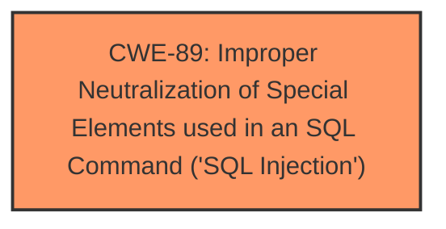

# Raw Analyzer Response for CVE-2024-13014

# Summary

| CWE ID | CWE Name | Confidence | CWE Abstraction Level | CWE Vulnerability Mapping Label | CWE-Vulnerability Mapping Notes |
|---|---|---|---|---|---|
| CWE-89 | Improper Neutralization of Special Elements used in an SQL Command ('SQL Injection') | 1.0 | Base | Allowed | Primary CWE |

## Evidence and Confidence

*   **Confidence Score:** 1.0
*   **Evidence Strength:** HIGH

## Relationship Analysis
The primary relationship impacting the decision is the direct match of the vulnerability description to the definition of CWE-89. The retriever results strongly suggest CWE-89. No other relationships (parent-child, chain, or peer) are relevant in this case, as the evidence directly supports the selection of CWE-89. The abstraction level is Base, which is the preferred level.

## Vulnerability Chain
The vulnerability chain consists of a single step:

1.  **Root Cause:** **Improper neutralization of special elements** in the `searchdata` argument leading to **SQL Injection**.
2.  **Impact:** Remote attacker can manipulate SQL queries.

## Summary of Analysis
The vulnerability description clearly states that the **weakness** is **SQL Injection** due to the manipulation of the `searchdata` argument in the `/admin/search-maid.php` file. This aligns perfectly with CWE-89, "Improper Neutralization of Special Elements used in an SQL Command ('SQL Injection')". The retriever results also indicate CWE-89 as the top candidate with a score of 1.0.

The evidence is strong and directly supports the selection of CWE-89. There are no contradictory factors or alternative interpretations. The CWE is at the optimal level of specificity (Base).

Relevant CWE Information:

# Enhanced Context (25 CWEs)
The following CWEs were identified as potentially relevant to this vulnerability:

## CWE-89: Improper Neutralization of Special Elements used in an SQL Command ('SQL Injection')
**Abstraction Level**: Base
**Similarity Score**: 0.77
**Source**: dense

**Description**:
The product constructs all or part of an SQL command using externally-influenced input from an upstream component, but it does not neutralize or incorrectly neutralizes special elements that could modify the intended SQL command when it is sent to a downstream component. Without sufficient removal or quoting of SQL syntax in user-controllable inputs, the generated SQL query can cause those inputs to be interpreted as SQL instead of ordinary user data.

**Mapping Guidance**:
- Usage: Allowed
- Rationale: This CWE entry is at the Base level of abstraction, which is a preferred level of abstraction for mapping to the root causes of vulnerabilities.
## CWE-89: Improper Neutralization of Special Elements used in an SQL Command ('SQL Injection')
**Abstraction Level**: Base
**Similarity Score**: 681.59
**Source**: sparse

**Description**:
The product constructs all or part of an SQL command using externally-influenced input from an upstream component, but it does not neutralize or incorrectly neutralizes special elements that could modify the intended SQL command when it is sent to a downstream component. Without sufficient removal or quoting of SQL syntax in user-controllable inputs, the generated SQL query can cause those inputs to be interpreted as SQL instead of ordinary user data.

**Mapping Guidance**:
- Usage: Allowed
- Rationale: This CWE entry is at the Base level of abstraction, which is a preferred level of abstraction for mapping to the root causes of vulnerabilities.