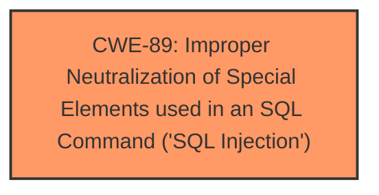

# Analysis for CVE-2024-13016

# Summary
| CWE ID | CWE Name | Confidence | CWE Abstraction Level | CWE Vulnerability Mapping Label | CWE-Vulnerability Mapping Notes |
|---|---|---|---|---|---|
| CWE-89 | Improper Neutralization of Special Elements used in an SQL Command ('SQL Injection') | 1.0 | Base | Allowed | Primary CWE. The vulnerability description explicitly states that the manipulation of the `editid` argument leads to **SQL Injection**. |

## Evidence and Confidence

*   **Confidence Score:** 1.0
*   **Evidence Strength:** HIGH

## Relationship Analysis
The primary relationship to consider is that CWE-89 is a Base level CWE, providing a specific description of the **SQL Injection** **weakness**. There are no child CWEs that are more specific based on the provided information.

## Vulnerability Chain
The vulnerability chain is straightforward:
1.  **Root Cause:** CWE-89 - Improper Neutralization of Special Elements used in an SQL Command ('SQL Injection'). The application **fails to properly neutralize** input when constructing SQL queries.
2.  Impact: An attacker can manipulate the `editid` argument to inject arbitrary SQL commands.

## Summary of Analysis
The vulnerability description clearly states that the manipulation of the `editid` argument leads to **SQL Injection**. The retriever results strongly support CWE-89 as the primary CWE, with a score of 1.0. The evidence is strong, and the selection of CWE-89 aligns with the MITRE mapping guidance.

The selection of CWE-89 is at the optimal level of specificity, as it directly addresses the **root cause** of the vulnerability. Other CWEs, such as CWE-74 (Improper Neutralization of Special Elements in Output Used by a Downstream Component ('Injection')), are too general and do not accurately reflect the specific **SQL Injection** **weakness**.

The following CWEs were considered but not used:

*   CWE-79 (Improper Neutralization of Input During Web Page Generation ('Cross-site Scripting')): While input neutralization is a concern, the core issue is **SQL Injection**, not XSS.
*   CWE-434 (Unrestricted Upload of File with Dangerous Type): This is not related to the described vulnerability.
*   CWE-1336 (Improper Neutralization of Special Elements Used in a Template Engine): There is no indication that a template engine is involved.
*   CWE-96 (Improper Neutralization of Directives in Statically Saved Code ('Static Code Injection')): This is not relevant to the described vulnerability.
*   CWE-73 (External Control of File Name or Path): There is no mention of file name or path manipulation.