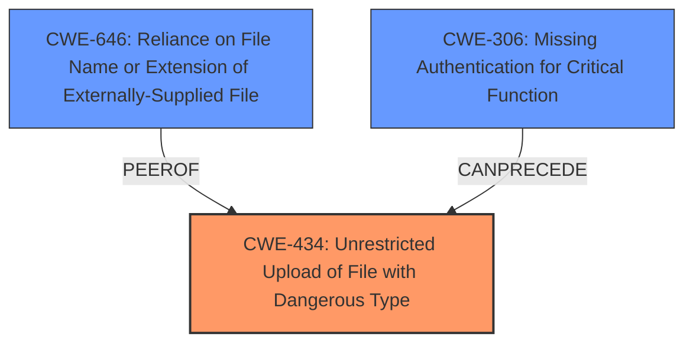

# Raw Analyzer Response for CVE-2024-13022

# Summary
| CWE ID | CWE Name | Confidence | CWE Abstraction Level | CWE Vulnerability Mapping Label | CWE-Vulnerability Mapping Notes |
|---|---|---|---|---|---|
| CWE-434 | Unrestricted Upload of File with Dangerous Type | 1.0 | Base | Primary | Allowed |
| CWE-646 | Reliance on File Name or Extension of Externally-Supplied File | 0.7 | Variant | Secondary | Allowed |
| CWE-306 | Missing Authentication for Critical Function | 0.6 | Base | Secondary | Allowed |

## Evidence and Confidence

*   **Confidence Score:** 0.8
*   **Evidence Strength:** HIGH

## Relationship Analysis
The primary relationship that influenced the CWE selection was the direct match of the vulnerability description to CWE-434. The "Unrestricted Upload of File with Dangerous Type" aligns with the **"unrestricted upload"** weakness described. Additionally, CWE-646 is a variant that describes a specific type of unrestricted file upload where the system relies on the filename or extension, which is relevant because the summary states the code lacks checks to validate the file's content, extension, or MIME type. CWE-306 is related because the attacker appears to need to be authenticated to access the /upload endpoint.

## Vulnerability Chain
The vulnerability chain starts with the **unrestricted upload** due to the **lack of proper file content validation**. This leads to the ability to upload malicious files which could then lead to Remote Code Execution and Website Defacement.
  - The first in the "Vulnerability Chain" is CWE-434 **Unrestricted Upload of File with Dangerous Type** because that is the **weakness**.
  - It is then followed by CWE-646 **Reliance on File Name or Extension of Externally-Supplied File**, which is a variant of unrestricted file upload
  - The chain then requires CWE-306 **Missing Authentication for Critical Function** to be able to access the upload endpoint.

## Summary of Analysis
The initial analysis focused on the **unrestricted upload** weakness, which directly corresponds to CWE-434. The retriever results also highlighted CWE-434 as a top candidate, solidifying this choice. The vulnerability description key phrases also point to **unrestricted upload**. The evidence from the "CVE Reference Links Content Summary" confirms that the root cause is the **lack of proper file content validation** in the `OssService.upload` method, which allows any type of file to be uploaded.

The selection of CWE-434 is at the optimal level of specificity because it directly addresses the core weakness. While other CWEs like CWE-22 (Path Traversal) or CWE-79 (Cross-site Scripting) could be potential impacts of exploiting the **unrestricted upload**, they are not the root cause. CWE-646, while closely related to CWE-434, is more specific because the filename or extension of externally-supplied file is being relied upon which causes the vulnerability. The evidence supports this because the summary states the code lacks checks to validate the file's content, extension, or MIME type.

CWE-306 is included as a secondary CWE because the attacker appears to need to be authenticated to access the /upload endpoint.

CWE-79 (Improper Neutralization of Input During Web Page Generation ('Cross-site Scripting')), CWE-89 (Improper Neutralization of Special Elements used in an SQL Command ('SQL Injection')), CWE-22 (Improper Limitation of a Pathname to a Restricted Directory ('Path Traversal')), and CWE-1336 (Improper Neutralization of Special Elements Used in a Template Engine) were considered but not used because they are not the root cause of this vulnerability. They could be consequences of exploiting the **unrestricted upload**, but the initial weakness is the **unrestricted upload** itself.

# Relevant CWE Information:

## CWE-434: Unrestricted Upload of File with Dangerous Type
The product allows the upload or transfer of dangerous file types that are automatically processed within its environment.

## CWE-646: Reliance on File Name or Extension of Externally-Supplied File
The program relies on the file name or extension of an externally-supplied file to make decisions about the file's type or the actions that will be performed on it. This can lead to vulnerabilities if the file name or extension is not a reliable indicator of the file's actual content or intended use.

## CWE-306: Missing Authentication for Critical Function
The application does not require authentication for a resource or function that requires it.