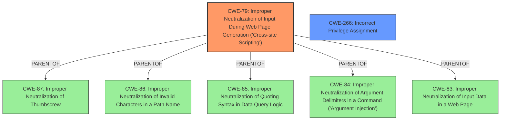

# Raw Analyzer Response for CVE-2024-13053

# Summary
| CWE ID | CWE Name | Confidence | CWE Abstraction Level | CWE Vulnerability Mapping Label | CWE-Vulnerability Mapping Notes |
|---|---|---|---|---|---|
| CWE-79 | Improper Neutralization of Input During Web Page Generation ('Cross-site Scripting') | 1.0 | Base | Allowed | Primary CWE |
| CWE-266 | Incorrect Privilege Assignment | 0.4 | Base | Allowed | Secondary Candidate |

## Evidence and Confidence

*   **Confidence Score:** 0.8
*   **Evidence Strength:** HIGH

## Relationship Analysis
The primary CWE is CWE-79, which is a Base level CWE. CWE-79 has several parent CWEs (CWE-87, CWE-86, CWE-85, CWE-84, CWE-83). The vulnerability involves **lack of sanitisation** which can lead to XSS. The secondary CWE, CWE-266, is related because the vulnerability can be exploited by high privilege users such as admins. There's a possibility that the incorrect privilege assignment (CWE-266) exacerbated the XSS vulnerability (CWE-79) by allowing admins to inject malicious code via unsanitized settings. I am more confident about CWE-79 since the key weakness is **lack of sanitisation**.

## Vulnerability Chain
The vulnerability chain starts with the **failure to sanitize and escape** settings within the Form Maker plugin. This **root cause** leads to the possibility of injecting malicious scripts. The **lack of sanitization** allows high-privilege users to inject XSS payloads into the plugin's settings. When these settings are displayed, the injected script is executed, leading to Stored Cross-Site Scripting (XSS).

## Summary of Analysis
The initial analysis identified CWE-79 as the primary weakness because the **root cause** of the vulnerability is the **lack of sanitization and escaping of settings**. This allows for XSS attacks. The Retriever results also listed CWE-79 as a relevant CWE. The final decision is based on the fact that the plugin **does not sanitise and escape some of its settings**, which is a direct instance of **Improper Neutralization of Input During Web Page Generation ('Cross-site Scripting')**.

The selection of CWE-79 is at the optimal level of specificity because it directly addresses the vulnerability's root cause, i.e. the **improper neutralization of input**.

Relevant CWE Information:

*   **CWE-79: Improper Neutralization of Input During Web Page Generation ('Cross-site Scripting')**
    *   The plugin **does not sanitise and escape some of its settings**, which directly matches the CWE-79 description.
    *   Impact: This allows high privilege users such as admin to perform Stored Cross-Site Scripting attacks.
*   **CWE-266: Incorrect Privilege Assignment**
    *   This CWE was considered because the vulnerability can be exploited by high privilege users such as admins.
    *   It could be a secondary factor because the admins have the privilege to modify the settings that are not sanitised.
    *   The reason it is not the primary is that the root cause is the **lack of sanitisation**, not the privilege assignment.

Other CWEs Considered but Not Used:

*   CWE-352: Cross-Site Request Forgery (CSRF) - Not applicable because the vulnerability is Stored XSS, not CSRF.
*   CWE-862: Missing Authorization - While privilege is a factor, the **root cause** is **lack of sanitisation**, not missing authorisation.
*   CWE-89: Improper Neutralization of Special Elements used in an SQL Command ('SQL Injection') - Not applicable because the vulnerability is XSS, not SQL Injection.
*   CWE-434: Unrestricted Upload of File with Dangerous Type - Not applicable because the vulnerability is related to settings, not file uploads.
*   CWE-472: External Control of Assumed-Immutable Web Parameter - Not applicable, the issue is not external control of assumed immutable parameters.