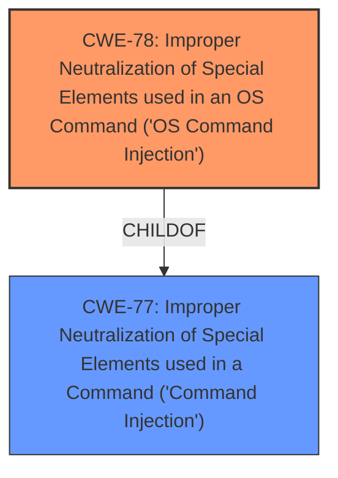

# Analysis for CVE-2024-13062

# Summary
| CWE ID | CWE Name | Confidence | CWE Abstraction Level | CWE Vulnerability Mapping Label | CWE-Vulnerability Mapping Notes |
|---|---|---|---|---|---|
| CWE-78 | Improper Neutralization of Special Elements used in an OS Command ('OS Command Injection') | 0.9 | Base | Primary | Allowed |
| CWE-77 | Improper Neutralization of Special Elements used in a Command ('Command Injection') | 0.7 | Class | Secondary | Allowed-with-Review |

## Evidence and Confidence

*   **Confidence Score:** 0.8
*   **Evidence Strength:** HIGH

## Relationship Analysis
The primary CWE is CWE-78, which is a Base level weakness. CWE-77 is a Class level weakness and a parent of CWE-78. While both involve command injection, CWE-78 is specific to OS commands, which aligns with the description of arbitrary command execution.

## Vulnerability Chain
The vulnerability chain starts with an **unintended entry point vulnerability**, leading to a command injection vulnerability, and finally resulting in arbitrary command execution. The **root cause** is the **unintended entry point**, which allows for the injection of commands.

## Summary of Analysis
The initial assessment points towards a command injection vulnerability, specifically CWE-78, due to the potential for arbitrary command execution. The vulnerability description mentions an **unintended entry point vulnerability** that allows for arbitrary command execution, and the CVE Reference Links Content Summary confirms "Injection and execution vulnerabilities" as the **root cause**.

CWE-78 is the most appropriate because the vulnerability allows authenticated administrators to execute arbitrary *OS* commands on the router.

CWE-77 was considered, but it is a more general case of command injection. Since the context involves OS commands, CWE-78 is a better fit.

Relevant CWE Information:

# Enhanced Context (25 CWEs)
The following CWEs were identified as potentially relevant to this vulnerability:

## CWE-78: Improper Neutralization of Special Elements used in an OS Command ('OS Command Injection')
**Abstraction Level**: Base
**Similarity Score**: 0.74
**Source**: dense

**Description**:
The product constructs all or part of an OS command using externally-influenced input from an upstream component, but it does not neutralize or incorrectly neutralizes special elements that could modify the intended OS command when it is sent to a downstream component.

**Mapping Guidance**:
- Usage: Allowed
- Rationale: This CWE entry is at the Base level of abstraction, which is a preferred level of abstraction for mapping to the root causes of vulnerabilities.

## CWE-77: Improper Neutralization of Special Elements used in a Command ('Command Injection')
**Abstraction Level**: Class
**Similarity Score**: 0.72
**Source**: dense

**Description**:
The product constructs all or part of a command using externally-influenced input from an upstream component, but it does not neutralize or incorrectly neutralizes special elements that could modify the intended command when it is sent to a downstream component.

**Mapping Guidance**:
- Usage: Allowed-with-Review
- Rationale: CWE-77 is often misused when OS command injection (CWE-78) was intended instead [REF-1287].

### Technical Explanation for CWE-78:

*   **How the vulnerability's details match the CWE's characteristics:** The vulnerability allows an authenticated administrator to inject and execute arbitrary OS commands due to an **unintended entry point**, aligning perfectly with CWE-78's description of constructing OS commands using externally influenced input without proper neutralization.
*   **The security implications and potential impact:** An attacker with administrative privileges can gain complete control over the router by executing arbitrary commands, potentially leading to data theft, malware installation, or denial of service.
*   **Any parent-child relationships or chain patterns that influenced your mapping:** CWE-78 is a child of CWE-77, which represents a more general case of command injection. However, the specific mention of OS commands makes CWE-78 the more appropriate choice.
*   **Whether the weakness is primary or secondary in the vulnerability:** CWE-78 is the primary weakness, as it directly describes the type of command injection vulnerability.
*   **How the official MITRE mapping guidance influenced your decision:** The MITRE mapping guidance for CWE-78 allows its usage and states that it is at the Base level of abstraction, which is preferred.

### Technical Explanation for CWE-77:

*   **How the vulnerability's details match the CWE's characteristics:** CWE-77 describes a general command injection vulnerability where a product constructs a command using external input without proper neutralization.
*   **The security implications and potential impact:** Similar to CWE-78, successful exploitation of CWE-77 can lead to arbitrary command execution, potentially allowing an attacker to gain unauthorized access or control over the system.
*   **Any parent-child relationships or chain patterns that influenced your mapping:** CWE-77 is a parent of CWE-78.
*   **Whether the weakness is primary or secondary in the vulnerability:** CWE-77 is a secondary weakness because the description specifies OS commands, making CWE-78 a better fit.
*   **How the official MITRE mapping guidance influenced your decision:** The MITRE mapping guidance for CWE-77 recommends reviewing whether a more specific child CWE is applicable.

### Other CWEs Considered but Not Used:

*   CWE-20 (Improper Input Validation): While input validation is often related to command injection, it's not the direct cause in this case. The **root cause** is the **unintended entry point**, not the lack of input validation.
*   CWE-798 (Use of Hard-coded Credentials): The vulnerability description doesn't mention anything about hard-coded credentials.
*   CWE-321 (Use of Hard-coded Cryptographic Key): The vulnerability description doesn't mention anything about hard-coded cryptographic keys.
*   CWE-427 (Uncontrolled Search Path Element): This is not relevant to the described vulnerability.
*   CWE-119 (Improper Restriction of Operations within the Bounds of a Memory Buffer): This is not relevant to the described vulnerability.