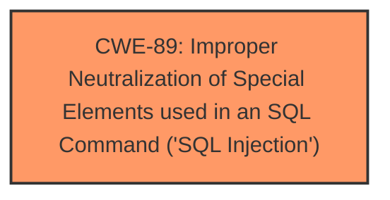

# Enhanced Analysis for CVE-2024-13079

# Summary
| CWE ID | CWE Name | Confidence | CWE Abstraction Level | CWE Vulnerability Mapping Label | CWE-Vulnerability Mapping Notes |
|---|---|---|---|---|---|
| CWE-89 | Improper Neutralization of Special Elements used in an SQL Command ('SQL Injection') | 1.0 | Base | Allowed | Primary CWE. The vulnerability description explicitly states "manipulation of the argument editid leads to **sql injection**." |

## Evidence and Confidence

*   **Confidence Score:** 1.0
*   **Evidence Strength:** HIGH

## Relationship Analysis
The primary CWE is CWE-89, which is a Base level CWE. There are no relevant parent-child or chain relationships to consider in this case, as the description directly points to SQL injection. The abstraction level is appropriate as it's a Base CWE.



## Vulnerability Chain
The vulnerability chain is straightforward:

1.  **Root Cause:** CWE-89 - Improper Neutralization of Special Elements used in an SQL Command ('SQL Injection'). The application fails to properly sanitize user input used in an SQL query.
2.  **Impact:** Remote attackers can manipulate the `editid` argument to inject arbitrary SQL commands, potentially leading to unauthorized data access, modification, or deletion.

## Summary of Analysis
The vulnerability description clearly states that the manipulation of the `editid` argument leads to **sql injection**. The Retriever Results also list CWE-89 as the top candidate with a score of 1.0. Therefore, CWE-89 is the most appropriate CWE for this vulnerability. The evidence is strong and directly supports this classification.

Relevant CWE Information:
- **CWE-89**: Improper Neutralization of Special Elements used in an SQL Command ('SQL Injection') is selected because the description explicitly mentions **SQL injection** as the **weakness**. This is a direct match.
- Other CWEs were considered from the Retriever Results, but were rejected because they did not align as closely with the provided evidence. For example, CWE-79 (Improper Neutralization of Input During Web Page Generation ('Cross-site Scripting')) and CWE-434 (Unrestricted Upload of File with Dangerous Type) were considered, but there's no evidence in the description to suggest XSS or file upload vulnerabilities. The focus is clearly on **SQL injection**.


## CWE Relationship Analysis

Current CWEs represent these abstraction levels: .


### Vulnerability Chain Analysis

**Chain starting from CWE-89:**
- 89 (Improper Neutralization of Special Elements used in an SQL Command ('SQL Injection')) - ROOT


**Chain starting from CWE-79:**
- 79 (Improper Neutralization of Input During Web Page Generation ('Cross-site Scripting')) - ROOT


### CWE Relationship Diagram

```mermaid
graph TD
    classDef primary fill:#f96,stroke:#333,stroke-width:2px
    classDef secondary fill:#69f,stroke:#333
    classDef tertiary fill:#9e9,stroke:#333
```