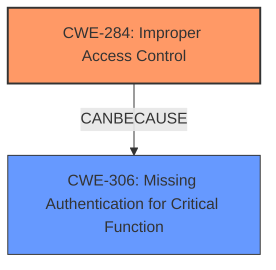

# Raw Analyzer Response for CVE-2024-13107

# Summary
| CWE ID | CWE Name | Confidence | CWE Abstraction Level | CWE Vulnerability Mapping Label | CWE-Vulnerability Mapping Notes |
|---|---|---|---|---|---|
| **CWE-284** | **Improper Access Control** | 1 | Base | Primary | Allowed |
| CWE-306 | Missing Authentication for Critical Function | 0.7 | Base | Secondary | Allowed |

## Evidence and Confidence

*   **Confidence Score:** 0.9
*   **Evidence Strength:** HIGH

## Relationship Analysis
The primary relationship is between CWE-284 and its parents. CWE-284 is a base level CWE, so it has class and pillar parents. CWE-306 is a related issue that can lead to improper access control, indicating a potential chain where missing authentication allows unauthorized access.

## Vulnerability Chain
The vulnerability chain starts with the **improper access controls** (CWE-284) due to the **missing authentication** (CWE-306) for the `form2LocalAclEditcfg.cgi` handler. This allows an attacker to modify the ACL, leading to potential DoS or further compromise.

## Summary of Analysis
The analysis is based on the detailed information available in the CVE Reference Links Content Summary, which provides a clear description of the vulnerability's root cause and impact. The initial assessment strongly points to **CWE-284 (Improper Access Control)** as the primary weakness, supported by the description "**improper access controls**" and the fact that the `form2LocalAclEditcfg.cgi` handler is accessible without authentication. This is further supported by the content summary stating: "The root cause is an **improper access control vulnerability** within the D-Link DIR-816A2 router's web management interface. Specifically, the `form2LocalAclEditcfg.cgi` handler is accessible without requiring authentication."

The retriever results also list several CWEs related to neutralization of special elements (SQL Injection, Cross-Site Scripting, OS Command Injection). However, these CWEs do not represent the root cause of the vulnerability, which is the lack of access control. The retriever result **CWE-306 (Missing Authentication for Critical Function)** is also relevant, as the missing authentication is the reason why access control is **improper**. Therefore, CWE-306 is a secondary issue that contributes to the primary issue of **improper access control**.

The selected CWEs are at the optimal level of specificity. **CWE-284 (Improper Access Control)** is a base-level CWE that accurately represents the weakness, and **CWE-306 (Missing Authentication for Critical Function)** further describes the reason for the **improper access control**.

Relevant CWE Information:

# Enhanced Context (25 CWEs)
The following CWEs were identified as potentially relevant to this vulnerability:

## CWE-425: Direct Request ('Forced Browsing')
**Abstraction Level**: Base
**Similarity Score**: 0.77
**Source**: dense

**Description**:
The web application does not adequately enforce appropriate authorization on all restricted URLs, scripts, or files.

**Mapping Guidance**:
- Usage: Allowed
- Rationale: This CWE entry is at the Base level of abstraction, which is a preferred level of abstraction for mapping to the root causes of vulnerabilities.

*Analysis:* CWE-425 describes a lack of authorization enforcement which is related to improper access controls. However, the description and content summary specifically mention missing authentication which is a more precise root cause.

## CWE-923: Improper Restriction of Communication Channel to Intended Endpoints
**Abstraction Level**: Class
**Similarity Score**: 0.75
**Source**: dense

**Description**:
The product establishes a communication channel to (or from) an endpoint for privileged or protected operations, but it does not properly ensure that it is communicating with the correct endpoint.

**Mapping Guidance**:
- Usage: Allowed-with-Review
- Rationale: This CWE entry is a Class and might have Base-level children that would be more appropriate

*Analysis:* CWE-923 is related to communication channels, which is not the primary issue in this vulnerability. The main issue is the lack of authentication and subsequent **improper access control**.

## CWE-78: Improper Neutralization of Special Elements used in an OS Command ('OS Command Injection')
**Abstraction Level**: Base
**Similarity Score**: 0.75
**Source**: dense

**Description**:
The product constructs all or part of an OS command using externally-influenced input from an upstream component, but it does not neutralize or incorrectly neutralizes special elements that could modify the intended OS command when it is sent to a downstream component.

**Mapping Guidance**:
- Usage: Allowed
- Rationale: This CWE entry is at the Base level of abstraction, which is a preferred level of abstraction for mapping to the root causes of vulnerabilities.

*Analysis:* CWE-78 is about OS command injection, which is not relevant to this vulnerability. The issue is with access control, not with command injection.

## CWE-134: Use of Externally-Controlled Format String
**Abstraction Level**: Base
**Similarity Score**: 0.75
**Source**: dense

**Description**:
The product uses a function that accepts a format string as an argument, but the format string originates from an external source.

**Mapping Guidance**:
- Usage: Allowed
- Rationale: This CWE entry is at the Base level of abstraction, which is a preferred level of abstraction for mapping to the root causes of vulnerabilities.

*Analysis:* CWE-134 is about format string vulnerabilities, which is not relevant to this vulnerability. The issue is with access control, not with format strings.

## CWE-288: Authentication Bypass Using an Alternate Path or Channel
**Abstraction Level**: Base
**Similarity Score**: 0.74
**Source**: dense

**Description**:
The product requires authentication, but the product has an alternate path or channel that does not require authentication.

**Mapping Guidance**:
- Usage: Allowed
- Rationale: This CWE entry is at the Base level of abstraction, which is a preferred level of abstraction for mapping to the root causes of vulnerabilities.

*Analysis:* While this vulnerability does involve a lack of authentication, the core issue is **improper access control**. CWE-306 is more directly related to missing authentication.

## CWE-138: Improper Neutralization of Special Elements
**Abstraction Level**: Class
**Similarity Score**: 0.74
**Source**: dense

**Description**:
The product receives input from an upstream component, but it does not neutralize or incorrectly neutralizes special elements that could be interpreted as control elements or syntactic markers when they are sent to a downstream component.

**Mapping Guidance**:
- Usage: Discouraged
- Rationale: This CWE entry is a level-1 Class (i.e., a child of a Pillar). It might have lower-level children that would be more appropriate

*Analysis:* CWE-138 is a general class of weakness and doesn't precisely fit the vulnerability. The root cause is missing authentication and **improper access control**.

## CWE-790: Improper Filtering of Special Elements
**Abstraction Level**: Class
**Similarity Score**: 0.74
**Source**: dense

**Description**:
The product receives data from an upstream component, but does not filter or incorrectly filters special elements before sending it to a downstream component.

**Mapping Guidance**:
- Usage: Allowed-with-Review
- Rationale: This CWE entry is a Class and might have Base-level children that would be more appropriate

*Analysis:* CWE-790 is about improper filtering, which is not the primary issue in this vulnerability. The main issue is the lack of authentication and subsequent **improper access control**.

## CWE-472: External Control of Assumed-Immutable Web Parameter
**Abstraction Level**: Base
**Similarity Score**: 0.74
**Source**: dense

**Description**:
The web application does not sufficiently verify inputs that are assumed to be immutable but are actually externally controllable, such as hidden form fields.

**Mapping Guidance**:
- Usage: Allowed
- Rationale: This CWE entry is at the Base level of abstraction, which is a preferred level of abstraction for mapping to the root causes of vulnerabilities.

*Analysis:* CWE-472 is about externally controllable parameters, which is not directly related to the root cause of missing authentication and **improper access control** in this vulnerability.

## CWE-497: Exposure of Sensitive System Information to an Unauthorized Control Sphere
**Abstraction Level**: Base
**Similarity Score**: 0.74
**Source**: dense

**Description**:
The product does not properly prevent sensitive system-level information from being accessed by unauthorized actors who do not have the same level of access to the underlying system as the product does.

**Mapping Guidance**:
- Usage: Allowed
- R