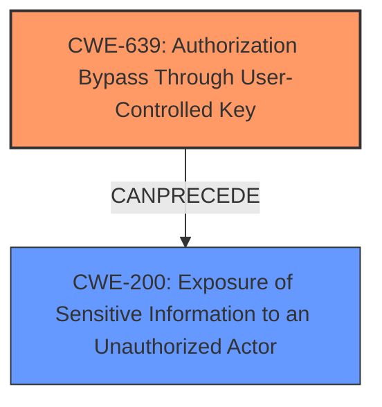

# Enhanced Analysis for CVE-2024-13110

# Summary
| CWE ID | CWE Name | Confidence | CWE Abstraction Level | CWE Vulnerability Mapping Label | CWE-Vulnerability Mapping Notes |
|---|---|---|---|---|---|
| CWE-639 | Authorization Bypass Through User-Controlled Key | 0.9 | Base | Allowed | Primary CWE. The application's authorization functionality does not prevent one user from gaining access to another user's data or record by modifying the key value identifying the data. |
| CWE-200 | Exposure of Sensitive Information to an Unauthorized Actor | 0.7 | Class | Discouraged | Secondary CWE. The application exposes sensitive information to an unauthorized actor due to the authorization bypass. |

## Evidence and Confidence

*   **Confidence Score:** 0.8
*   **Evidence Strength:** HIGH

## Relationship Analysis
The primary weakness is CWE-639, which describes how an attacker can bypass authorization by manipulating a user-controlled key (exam ID). This leads directly to CWE-200, as the attacker gains unauthorized access to sensitive exam data. The relationship is a direct consequence: bypassing authorization *causes* sensitive information exposure. The chosen CWEs are at the base level, providing the most specific description of the vulnerability.



## Vulnerability Chain
The vulnerability chain starts with the **lack of authorization** (CWE-639), which allows an attacker to manipulate the exam ID in the URL. This leads to **information disclosure** (CWE-200), where the attacker gains access to sensitive exam data that should have been protected.

## Summary of Analysis
Based on the evidence from the CVE Reference Links Content Summary, the **root cause** of this vulnerability is the **lack of authorization** checks when accessing exam results. The application directly uses the exam ID provided in the URL to retrieve and display the results, without verifying if the user is authorized to view those results. This corresponds directly to CWE-639, "Authorization Bypass Through User-Controlled Key". The impact of this vulnerability is information disclosure, as unauthorized users can view the exam results of others. This corresponds to CWE-200, "Exposure of Sensitive Information to an Unauthorized Actor".

The following is the relevant evidence:

"The vulnerability stems from a **lack of input validation or authorization** in the `PaperController.java` file within the `yfexam-exam` application. Specifically, the application doesn't restrict the input ID when accessing exam results, which allows users to directly view the answers of any exam by manipulating the URL."

"**Insecure Direct Object Reference (IDOR):** The application directly uses the exam ID provided in the URL to retrieve and display the exam results, without verifying if the user is authorized to view those results."

"**Lack of Authorization:** There's no proper authorization check to ensure that only the user who took the exam can view the results during the answering process."

CWE-639 is at the Base level of abstraction, which is preferred. CWE-200 is a Class, but it accurately reflects the impact of the vulnerability, and there are no more specific children that fit the description.

Other CWEs Considered and Rejected:

*   CWE-425 (Direct Request ('Forced Browsing')): While related, CWE-639 is more specific to the authorization bypass via user-controlled key.
*   CWE-285 (Improper Authorization): This is a higher-level class, and CWE-639 provides a more specific description of the vulnerability.
*   CWE-79 (Improper Neutralization of Input During Web Page Generation ('Cross-site Scripting')): This is not relevant as the vulnerability is related to authorization, not input sanitization.
*   CWE-89 (Improper Neutralization of Special Elements used in an SQL Command ('SQL Injection')): This is not relevant as the vulnerability is related to authorization, not SQL injection.
*   CWE-203 (Observable Discrepancy): This is not directly related as the primary issue is the ability to directly access other users' exam data through a predictable pattern, rather than discrepancies in responses revealing information.
*   CWE-497 (Exposure of Sensitive System Information to an Unauthorized Control Sphere): Although sensitive information is exposed, CWE-200 is a more direct description of the impact.
*   CWE-472 (External Control of Assumed-Immutable Web Parameter): While the exam ID could be considered an assumed-immutable parameter, the core issue is the lack of authorization, not the mutability of the parameter itself.
*   CWE-345 (Insufficient Verification of Data Authenticity): The vulnerability is not about verifying the authenticity of the data, but rather about unauthorized access to it.
*   CWE-923 (Improper Restriction of Communication Channel to Intended Endpoints): This is not relevant as the vulnerability doesn't involve communication channels or endpoints.
*   CWE-807 (Reliance on Untrusted Inputs in a Security Decision): This is close, as the application relies on the exam ID, but CWE-639 more accurately describes the authorization bypass.
*   CWE-1391 (Use of Weak Credentials): Not relevant as the vulnerability doesn't involve weak credentials.


## CWE Relationship Analysis

Current CWEs represent these abstraction levels: .


### Vulnerability Chain Analysis

**Chain starting from CWE-89:**
- 89 (Improper Neutralization of Special Elements used in an SQL Command ('SQL Injection')) - ROOT


**Chain starting from CWE-203:**
- 203 (Observable Discrepancy) - ROOT


### CWE Relationship Diagram

```mermaid
graph TD
    classDef primary fill:#f96,stroke:#333,stroke-width:2px
    classDef secondary fill:#69f,stroke:#333
    classDef tertiary fill:#9e9,stroke:#333
```