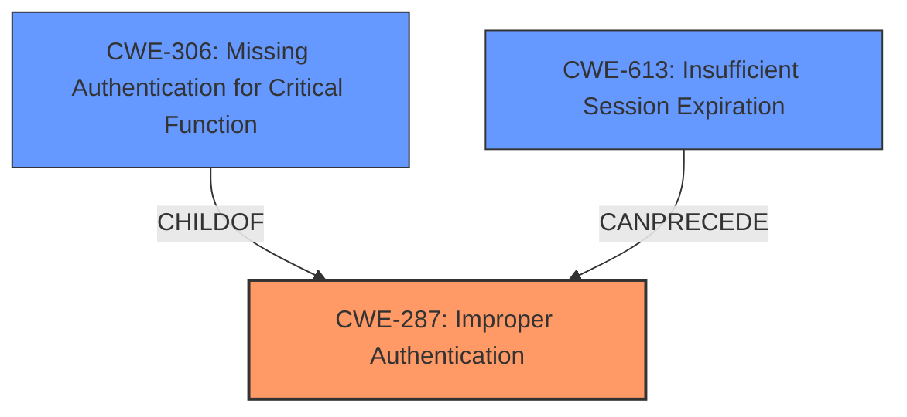

# Analysis for CVE-2024-13111

# Summary
| CWE ID | CWE Name | Confidence | CWE Abstraction Level | CWE Vulnerability Mapping Label | CWE-Vulnerability Mapping Notes |
|---|---|---|---|---|---|
| CWE-287 | Improper Authentication | 0.9 | Class | Primary | Allowed-with-Review |
| CWE-306 | Missing Authentication for Critical Function | 0.7 | Base | Secondary | Allowed |
| CWE-613 | Insufficient Session Expiration | 0.6 | Base | Secondary | Allowed |

## Evidence and Confidence

*   **Confidence Score:** 0.9
*   **Evidence Strength:** HIGH

## Relationship Analysis
The primary CWE selected is CWE-287 (Improper Authentication), a class-level CWE. CWE-306 (Missing Authentication for Critical Function) is a child of CWE-287, but less appropriate since authentication *is* happening, just improperly. CWE-613 (Insufficient Session Expiration) is related as a potential contributing factor, as JWTs are not being invalidated on logout. The relationships between these CWEs help illustrate the nuances of the vulnerability: authentication exists but is flawed in its implementation and token management.

## Vulnerability Chain
The vulnerability chain starts with **improper authentication** (CWE-287), specifically related to JWT handling. The JWTs are not invalidated upon logout, effectively leading to **insufficient session expiration** (CWE-613). This could be viewed as **missing authentication for critical function** (CWE-306) because even after logout, the JWT remains valid, granting access as if the user is still authenticated. The ultimate impact is privilege escalation, where an attacker can gain unauthorized access to resources.

## Summary of Analysis
The initial assessment based on the vulnerability description and key phrases pointed to **improper authentication** as the root cause. The retriever results also highlighted CWE-287 as a relevant candidate. Further analysis of the CVE reference links content summary confirmed this, emphasizing the **improper** handling of JWTs and the lack of invalidation upon logout.

CWE-287 (Improper Authentication) is chosen as the primary CWE because the core issue lies in the flawed implementation of the authentication process, specifically the failure to invalidate JWTs. While CWE-306 (Missing Authentication for Critical Function) could be considered, it is less accurate because authentication *is* present, but it's not functioning correctly after logout. CWE-613 (Insufficient Session Expiration) describes a related issue that enables the vulnerability.

The selection of CWE-287 is at the class level due to its broader applicability to the overall authentication flaw. A more specific variant might exist, but the provided evidence primarily focuses on the **improper** authentication aspect.

Relevant CWE Information:

# Enhanced Context (25 CWEs)
The following CWEs were identified as potentially relevant to this vulnerability:

## CWE-472: External Control of Assumed-Immutable Web Parameter
**Abstraction Level**: Base
**Similarity Score**: 0.79
**Source**: dense

**Description**:
The web application does not sufficiently verify inputs that are assumed to be immutable but are actually externally controllable, such as hidden form fields.

**Mapping Guidance**:
- Usage: Allowed
- Rationale: This CWE entry is at the Base level of abstraction, which is a preferred level of abstraction for mapping to the root causes of vulnerabilities.

## CWE-303: Incorrect Implementation of Authentication Algorithm
**Abstraction Level**: Base
**Similarity Score**: 0.78
**Source**: dense

**Description**:
The requirements for the product dictate the use of an established authentication algorithm, but the implementation of the algorithm is incorrect.

**Mapping Guidance**:
- Usage: Allowed
- Rationale: This CWE entry is at the Base level of abstraction, which is a preferred level of abstraction for mapping to the root causes of vulnerabilities.

**Why Not Used**: While this seems relevant, the description focuses on incorrect authentication algorithm, and the report focuses on not invalidating JWT tokens, which is a separate concern from algorithm implementation.

## CWE-1391: Use of Weak Credentials
**Abstraction Level**: Class
**Similarity Score**: 0.77
**Source**: dense

**Description**:
The product uses weak credentials (such as a default key or hard-coded password) that can be calculated, derived, reused, or guessed by an attacker.

**Mapping Guidance**:
- Usage: Allowed-with-Review
- Rationale: This CWE entry is a Class and might have Base-level children that would be more appropriate

**Why Not Used**: The vulnerability isn't about weak credentials, it is about JWT token validation, and is therefore not applicable.

## CWE-807: Reliance on Untrusted Inputs in a Security Decision
**Abstraction Level**: Base
**Similarity Score**: 0.77
**Source**: dense

**Description**:
The product uses a protection mechanism that relies on the existence or values of an input, but the input can be modified by an untrusted actor in a way that bypasses the protection mechanism.

**Mapping Guidance**:
- Usage: Allowed
- Rationale: This CWE entry is at the Base level of abstraction, which is a preferred level of abstraction for mapping to the root causes of vulnerabilities.

**Why Not Used**: The vulnerability isn't about relying on untrusted inputs, but about **improper** authentication, and is therefore not applicable.

## CWE-497: Exposure of Sensitive System Information to an Unauthorized Control Sphere
**Abstraction Level**: Base
**Similarity Score**: 0.77
**Source**: dense

**Description**:
The product does not properly prevent sensitive system-level information from being accessed by unauthorized actors who do not have the same level of access to the underlying system as the product does.

**Mapping Guidance**:
- Usage: Allowed
- Rationale: This CWE entry is at the Base level of abstraction, which is a preferred level of abstraction for mapping to the root causes of vulnerabilities.

**Why Not Used**: The vulnerability isn't about information exposure but about **improper** authentication, and is therefore not applicable.

## CWE-425: Direct Request ('Forced Browsing')
**Abstraction Level**: Base
**Similarity Score**: 0.77
**Source**: dense

**Description**:
The web application does not adequately enforce appropriate authorization on all restricted URLs, scripts, or files.

**Mapping Guidance**:
- Usage: Allowed
- Rationale: This CWE entry is at the Base level of abstraction, which is a preferred level of abstraction for mapping to the root causes of vulnerabilities.

**Why Not Used**: The vulnerability isn't about forced browsing, but about **improper** authentication, and is therefore not applicable.

## CWE-639: Authorization Bypass Through User-Controlled Key
**Abstraction Level**: Base
**Similarity Score**: 0.77
**Source**: dense

**Description**:
The system's authorization functionality does not prevent one user from gaining access to another user's data or record by modifying the key value identifying the data.

**Mapping Guidance**:
- Usage: Allowed
- Rationale: This CWE entry is at the Base level of abstraction, which is a preferred level of abstraction for mapping to the root causes of vulnerabilities.

**Why Not Used**: The vulnerability isn't about authorization bypass, but about **improper** authentication, and is therefore not applicable.

## CWE-74: Improper Neutralization of Special Elements in Output Used by a Downstream Component ('Injection')
**Abstraction Level**: Class
**Similarity Score**: 0.77
**Source**: dense

**Description**:
The product constructs all or part of a command, data structure, or record using externally-influenced input from an upstream component, but it does not neutralize or incorrectly neutralizes special elements that could modify how it is parsed or interpreted when it is sent to a downstream component.

**Mapping Guidance**:
- Usage: Discouraged
- Rationale: CWE-74 is high-level and often misused when lower-level weaknesses are more appropriate.

**Why Not Used**: The vulnerability isn't about injection, but about **improper** authentication, and is therefore not applicable.

## CWE-345: Insufficient Verification of Data Authenticity
**Abstraction Level**: Class
**Similarity Score**: 0.77
**Source**: dense

**Description**:
The product does not sufficiently verify the origin or authenticity of data, in a way that causes it to accept invalid data.

**Mapping Guidance**:
- Usage: Discouraged
- Rationale: This CWE entry is a level-1 Class (i.e., a child of a Pillar). It might have lower-level children that would