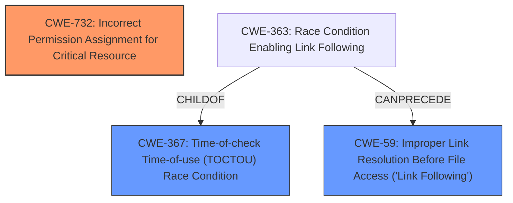

# Analysis Report for CVE-2024-13177

# Vulnerability Analysis Report: CVE-2024-13177

## Description

Netskope Client on Mac OS is impacted by a vulnerability in which the postinstall script **does not properly validate the path of the file nsinstallation**. A standard user could potentially create a symlink of the file nsinstallation to escalate the privileges of a different file on the system. This issue affects Netskope Client before 123.0, before 117.1.11.2310, before 120.1.10.2306.

## Vulnerability Description Key Phrases

- **Rootcause:** does not properly validate the path of the file nsinstallation
- **Impact:** escalate the privileges of a different file on the system
- **Vector:** symlink of the file nsinstallation
- **Attacker:** standard user
- **Product:** Netskope Client
- **Version:** before 123.0, before 117.1.11.2310, before 120.1.10.2306
- **Component:** postinstall script

## Analysis (with Relationship Data)

# Summary
| CWE ID | CWE Name | Confidence | CWE Abstraction Level | CWE Vulnerability Mapping Label | CWE-Vulnerability Mapping Notes |
|---|---|---|---|---|---|
| CWE-732 | Incorrect Permission Assignment for Critical Resource | 0.8 | Class | Allowed-with-Review | Primary CWE |
| CWE-367 | Time-of-check Time-of-use (TOCTOU) Race Condition | 0.6 | Base | Allowed | Secondary Candidate |
| CWE-59 | Improper Link Resolution Before File Access ('Link Following') | 0.6 | Base | Allowed | Secondary Candidate |

## Evidence and Confidence

*   **Confidence Score:** 0.7
*   **Evidence Strength:** MEDIUM

## Relationship Analysis
The primary CWE selected is CWE-732 which is a Class-level CWE. While it is preferred to select a Base or Variant level CWE, there isn't sufficient information to determine which base CWE would be most appropriate. CWE-732 relates to incorrect assignment of permissions, which directly addresses the vulnerability's impact of escalating privileges. CWE-367 and CWE-59 were considered due to the vulnerability involving symlinks, however, the root cause is the incorrect permission assignment.



## Vulnerability Chain
The vulnerability chain starts with the **incorrect permission assignment** (CWE-732) on the `nsinstallation` file. This allows a standard user to create a symlink. The **improper link resolution** (CWE-59) combined with a possible **TOCTOU race condition** (CWE-367) then enables the user to escalate privileges on a different file. The root cause is the permission issue and the final impact is privilege escalation.

## Summary of Analysis
The vulnerability description states that the postinstall script **does not properly validate the path of the file nsinstallation**. A standard user could potentially create a symlink of the file `nsinstallation` to escalate the privileges of a different file on the system.

The primary weakness is **incorrect permission assignment** for a critical resource (CWE-732). The vulnerability allows a standard user to create a symlink and potentially escalate privileges. This is due to the **lack of proper validation of the file path**, which is the root cause.

Other CWEs considered:

*   CWE-250 (Execution with Unnecessary Privileges): While privilege escalation is the impact, the root cause is the **incorrect permission assignment**, not running with unnecessary privileges.
*   CWE-367 (Time-of-check Time-of-use (TOCTOU) Race Condition): This could be a contributing factor, but it's not the primary cause. The race condition could enable the exploit, but the **incorrect permissions** are what allow it in the first place.
*   CWE-59 (Improper Link Resolution Before File Access ('Link Following')): This is a consequence of the **incorrect permissions** and **lack of path validation**. The symlink allows the user to bypass intended access controls.
*   CWE-22 (Improper Limitation of a Pathname to a Restricted Directory ('Path Traversal')): While related to path handling, this is less specific than CWE-732. The issue is not directly related to path traversal, but rather the **incorrect permissions** on the target file.
*   CWE-269 (Improper Privilege Management): This is a broad class and the guidance discourages its use. CWE-732 is a more specific classification.
*   CWE-863 (Incorrect Authorization): Authorization usually refers to the process of determining if someone is allowed to do something. Permissions refer to what someone can access, which makes CWE-732 a better fit.
*   CWE-427 (Uncontrolled Search Path Element): This doesn't fit because the vulnerability isn't about searching for executables in an uncontrolled path, it's about the **incorrect permissions** on a specific file.
*   CWE-363 (Race Condition Enabling Link Following): This is a specific type of race condition related to link following. While relevant, the core issue is the **incorrect permissions** that allow the race condition to be exploited.

CWE-732 best captures the root cause of the vulnerability, which is the **incorrect permission assignment** for the critical resource (`nsinstallation`). This allows a standard user to exploit the system by creating a symlink and escalating privileges.


## CWE Relationship Analysis

Current CWEs represent these abstraction levels: .


### Vulnerability Chain Analysis

**Chain starting from CWE-863:**
- 863 (Incorrect Authorization) - ROOT


**Chain starting from CWE-427:**
- 427 (Uncontrolled Search Path Element) - ROOT


### CWE Relationship Diagram

```mermaid
graph TD
    classDef primary fill:#f96,stroke:#333,stroke-width:2px
    classDef secondary fill:#69f,stroke:#333
    classDef tertiary fill:#9e9,stroke:#333
```


*Report generated on 2025-07-13 03:54:49*
