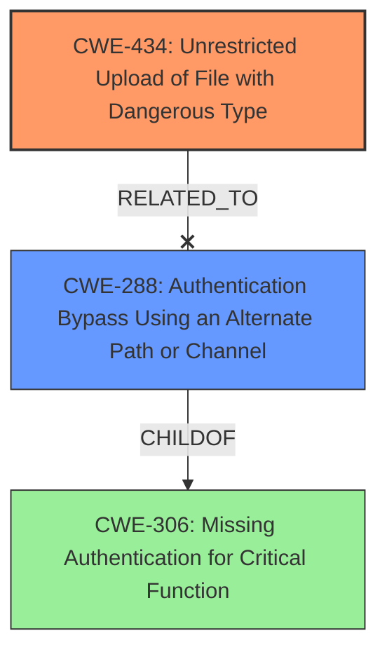

# Enhanced Analysis for CVE-2024-13201

# Summary
| CWE ID | CWE Name | Confidence | CWE Abstraction Level | CWE Vulnerability Mapping Label | CWE-Vulnerability Mapping Notes |
|---|---|---|---|---|---|
| CWE-434 | Unrestricted Upload of File with Dangerous Type | 1.0 | Base | Allowed | Primary CWE: The application allows uploading files without proper validation, leading to potential execution of dangerous file types. |
| CWE-288 | Authentication Bypass Using an Alternate Path or Channel | 0.7 | Variant | Allowed | Secondary CWE: This might be a potential risk if the admin panel lacks proper authentication checks, allowing unauthorized access to the upload function. |

## Evidence and Confidence

*   **Confidence Score:** 0.9
*   **Evidence Strength:** HIGH

## Relationship Analysis
The primary CWE is CWE-434, which directly reflects the vulnerability description stating "**unrestricted upload**". CWE-288 is considered as a possible related weakness if the upload functionality lacks adequate authentication. CWE-434 is a base-level CWE, which is the preferred level of abstraction.



## Vulnerability Chain
The vulnerability chain starts with the **unrestricted upload** (CWE-434), which allows an attacker to upload malicious files. This can potentially lead to remote code execution. If authentication is missing or bypassed (CWE-288), the attacker can directly exploit the upload functionality.

## Summary of Analysis
The primary assessment is based on the explicit description of "**unrestricted upload**" in the vulnerability description. The CVE Reference Links Content Summary confirms this by stating the upload method "does not restrict the types of files that can be uploaded." This directly maps to CWE-434 (Unrestricted Upload of File with Dangerous Type). The relationship analysis shows that CWE-288 (Authentication Bypass Using an Alternate Path or Channel) could be a contributing factor, particularly if the /admin/attach/upload endpoint lacks proper authentication. I am overriding the retriever results because the vulnerability description and CVE Reference Links Content Summary provide strong evidence that this is **unrestricted upload**.

Relevant CWE Information:

# Enhanced Context (25 CWEs)
The following CWEs were identified as potentially relevant to this vulnerability:

## CWE-434: Unrestricted Upload of File with Dangerous Type
**Abstraction Level**: Base
**Similarity Score**: 0.82
**Source**: dense

**Description**:
The product allows the upload or transfer of dangerous file types that are automatically processed within its environment.

**Mapping Guidance**:
- Usage: Allowed
- Rationale: This CWE entry is at the Base level of abstraction, which is a preferred level of abstraction for mapping to the root causes of vulnerabilities.

The application allows uploading files without proper validation, leading to potential execution of dangerous file types.

## CWE-288: Authentication Bypass Using an Alternate Path or Channel
**Abstraction Level**: Variant
**Similarity Score**: N/A
**Source**: N/A

**Description**:
The software uses an alternate mechanism to bypass authentication, such as by directly manipulating a cookie or other variable, or by accessing a resource through a different URL.

**Mapping Guidance**:
- Usage: Allowed
- Rationale: This CWE entry is at the Variant level of abstraction, which is a preferred level of abstraction for mapping to the root causes of vulnerabilities.

This is a variant of CWE-306, and it might be a potential risk if the admin panel lacks proper authentication checks, allowing unauthorized access to the upload function.

## CWE-306: Missing Authentication for Critical Function
**Abstraction Level**: base
**Similarity Score**: 2.33
**Source**: graph

**Description**:
CWE-306: Missing Authentication for Critical Function

**Mapping Guidance**:
- Usage: Allowed
- Rationale: This CWE entry is at the Base level of abstraction, which is a preferred level of abstraction for mapping to the root causes of vulnerabilities.

**Relationships**:
- PARENTOF -> CWE-322
- PARENTOF -> CWE-288
- CHILDOF -> CWE-287
- CHILDOF -> CWE-287
- CHILDOF -> CWE-306


## CWE Relationship Analysis

Current CWEs represent these abstraction levels: .


### Vulnerability Chain Analysis

**Chain starting from CWE-288:**
- 288 (Authentication Bypass Using an Alternate Path or Channel) - ROOT


**Chain starting from CWE-306:**
- 306 (Missing Authentication for Critical Function) - ROOT


### CWE Relationship Diagram

```mermaid
graph TD
    classDef primary fill:#f96,stroke:#333,stroke-width:2px
    classDef secondary fill:#69f,stroke:#333
    classDef tertiary fill:#9e9,stroke:#333
```