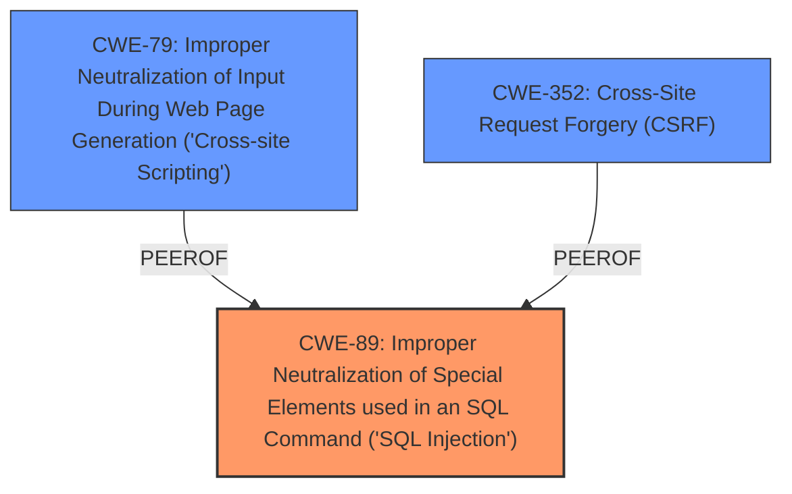

# Analysis for CVE-2024-13204

# Summary
| CWE ID | CWE Name | Confidence | CWE Abstraction Level | CWE Vulnerability Mapping Label | CWE-Vulnerability Mapping Notes |
|---|---|---|---|---|---|
| CWE-89 | Improper Neutralization of Special Elements used in an SQL Command ('SQL Injection') | 1.0 | Base | Allowed | Primary CWE. The vulnerability description clearly states that the manipulation of the `blog_id` argument leads to **SQL injection**. |
| CWE-79 | Improper Neutralization of Input During Web Page Generation ('Cross-site Scripting') | 0.7 | Base | Allowed | Secondary CWE. The CVE Reference Links Content Summary indicates an XSS vulnerability in addition to the SQL Injection. |
| CWE-352 | Cross-Site Request Forgery (CSRF) | 0.6 | Compound | Allowed | Secondary CWE. The CVE Reference Links Content Summary indicates a CSRF vulnerability in addition to the SQL Injection and XSS. |

## Evidence and Confidence

*   **Confidence Score:** 0.9
*   **Evidence Strength:** HIGH

## Relationship Analysis
The primary weakness is CWE-89, **SQL Injection**, which can lead to other vulnerabilities. The retriever results and the CVE Reference Links Content Summary indicate the presence of **Cross-Site Scripting (XSS)** which is CWE-79 and Cross-Site Request Forgery (CSRF) which is CWE-352. CWE-79 and CWE-352 are both PeerOf CWE-89. The primary CWE is at the Base level.

## Vulnerability Chain
The vulnerability chain starts with the **SQL Injection** (**CWE-89**). According to the CVE Reference Links Content Summary, the **SQL Injection** vulnerability allows for the retrieval of admin credentials. This then allows for **Cross-Site Scripting (XSS)** (**CWE-79**) by injecting malicious JavaScript code via the admin panel. The CVE Reference Links Content Summary also mentions a Cross-Site Request Forgery (CSRF) vulnerability, so **CWE-352** is included in the chain.

## Summary of Analysis
The vulnerability description clearly points to **SQL Injection** due to the manipulation of the `blog_id` argument, making **CWE-89** the primary weakness. The CVE Reference Links Content Summary confirms this and further identifies **XSS** and CSRF vulnerabilities. This additional information strengthens the selection of **CWE-79** and **CWE-352** as secondary weaknesses. The relationship analysis shows that these vulnerabilities are related, with **SQL Injection** potentially leading to the exploitation of the others. The chosen CWEs are at the Base level of abstraction, providing sufficient specificity for the described vulnerabilities.

Other CWEs considered but not used:

*   CWE-73 (External Control of File Name or Path): While file paths might be involved, the core issue is the **SQL Injection** and not direct manipulation of file paths.
*   CWE-434 (Unrestricted Upload of File with Dangerous Type): This CWE is not directly related to the described vulnerability, which focuses on **SQL Injection** and resulting **XSS**.
*   CWE-94 (Improper Control of Generation of Code ('Code Injection')): This is too general. The **SQL Injection** is the root cause, not arbitrary code injection.
*   CWE-306 (Missing Authentication for Critical Function): While authentication might be bypassed due to the **SQL Injection**, the primary issue is the improper handling of SQL queries.
*   CWE-1336 (Improper Neutralization of Special Elements Used in a Template Engine): This is not applicable as there is no mention of a template engine in the vulnerability description.