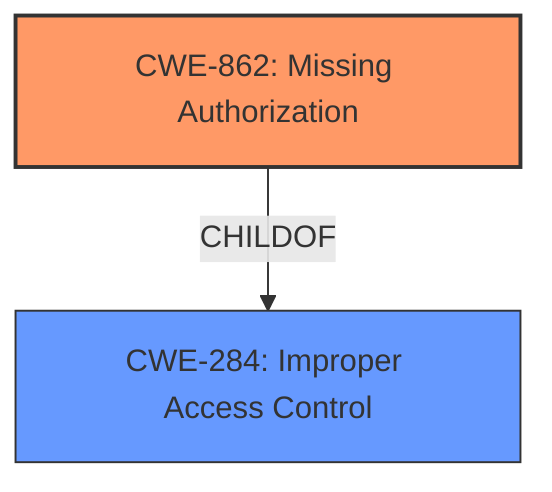

# Enhanced Analysis for CVE-2024-13240

# Summary
| CWE ID | CWE Name | Confidence | CWE Abstraction Level | CWE Vulnerability Mapping Label | CWE-Vulnerability Mapping Notes |
|---|---|---|---|---|---|
| CWE-862 | Missing Authorization | 0.8 | Class | Primary CWE | Allowed-with-Review |
| CWE-284 | Improper Access Control | 0.6 | Class | Secondary Candidate | Discouraged |

## Evidence and Confidence

*   **Confidence Score:** 0.7
*   **Evidence Strength:** MEDIUM

## Relationship Analysis
The primary relationship influencing the decision is the parent-child relationship between CWE-284 (Improper Access Control) and CWE-862 (Missing Authorization). While the description mentions "Improper Access Control," the CWE guidance suggests using more specific child CWEs when applicable. Since the description implies a lack of authorization checks, CWE-862 is a more precise classification than its parent, CWE-284. The abstraction level of CWE-862 as a Class is higher than preferred, but the vulnerability description lacks the specificity to identify a more granular Base-level CWE.



## Vulnerability Chain
The vulnerability chain begins with the **Improper Access Control**, specifically a **Missing Authorization**, leading to the impact of allowing unauthorized collection of data from common resource locations. The root cause is the absence of proper authorization checks.

## Summary of Analysis
The initial assessment identified **Improper Access Control** as the primary weakness. However, after reviewing the CWE guidance, it became clear that a more specific CWE was warranted. The guidance explicitly states that CWE-284 (Improper Access Control) should be avoided if a more specific child CWE like 862, 863, or 306 is appropriate. Given the description "allows Collect Data from Common Resource Locations", it strongly suggests a **Missing Authorization** check, which aligns with CWE-862.

The selection of CWE-862 is based on the following evidence:
*   The vulnerability description explicitly mentions **Improper Access Control**.
*   The impact is "Collect Data from Common Resource Locations," indicating a lack of proper authorization.
*   The CWE guidance advises against using CWE-284 when a more specific authorization-related CWE is applicable.

CWE-862 is at a Class level, which is higher than preferred. However, there isn't enough information to determine the exact mechanism causing the missing authorization (e.g., a specific configuration error), so a more specific Base-level CWE cannot be confidently assigned.

Other CWEs considered:

*   CWE-284: Was initially considered due to the "Improper Access Control" phrase but was deemed too general.
*   CWE-863: Incorrect Authorization was considered, however, the description doesn't indicate there is any authorization check at all.
*   CWE-306: Missing Authentication was considered but the description doesn't indicate if authentication is missing.

Relevant CWE Information:

# Enhanced Context (25 CWEs)
The following CWEs were identified as potentially relevant to this vulnerability:

## CWE-862: Missing Authorization
**Abstraction Level**: Class
**Similarity Score**: 0.121 (sparse)
**Description**: The product does not perform an authorization check before allowing an actor to access a resource or perform an action.
**Mapping Guidance**:
- Usage: Allowed
- Rationale: This CWE entry is a Class and might have Base-level children that would be more appropriate.

## CWE-284: Improper Access Control
**Abstraction Level**: Class
**Description**: The software does not adequately restrict access to resources or actions to only those who are authorized.
**Mapping Guidance**:
- Usage: Discouraged
- Rationale: CWE-285 is high-level and lower-level CWEs can frequently be used instead. It is a level-1 Class (i.e., a child of a Pillar).

## CWE-862: Missing Authorization
CWE ID: CWE-862
CWE Name: Missing Authorization
Confidence: 0.8
CWE Abstraction Level: Class
CWE Vulnerability Mapping Label: Primary CWE
CWE-Vulnerability Mapping Notes: Allowed

Technical Explanation:
CWE-862 (Missing Authorization) is selected because the vulnerability description states "Improper Access Control" and the impact is the ability to "Collect Data from Common Resource Locations." This implies that the system is not performing authorization checks to ensure that only authorized users can access the data.
Security Implications:
The security implication of CWE-862 is that unauthorized users can access sensitive data or perform privileged actions, leading to information disclosure, data modification, or system compromise.
Parent-Child Relationships:
CWE-862 is a child of CWE-284 (Improper Access Control).
Mapping Guidance:
The MITRE mapping guidance indicates that CWE-862 is a more specific and preferred choice over CWE-284 when the issue is a lack of authorization checks.

CWE ID: CWE-284
CWE Name: Improper Access Control
Confidence: 0.6
CWE Abstraction Level: Class
CWE Vulnerability Mapping Label: Secondary Candidate
CWE-Vulnerability Mapping Notes: Discouraged

Technical Explanation:
CWE-284 (Improper Access Control) is a broader category that encompasses various access control issues. While the vulnerability description mentions "Improper Access Control", it is less specific than CWE-862.
Security Implications:
The security implication of CWE-284 is that unauthorized users can gain access to sensitive resources or perform unauthorized actions.
Parent-Child Relationships:
CWE-284 is a parent of CWE-862.
Mapping Guidance:
The MITRE mapping guidance discourages the use of CWE-284 when a more specific child CWE, such as CWE-862, is applicable.


## CWE Relationship Analysis

Current CWEs represent these abstraction levels: .


### Vulnerability Chain Analysis

**Chain starting from CWE-863:**
- 863 (Incorrect Authorization) - ROOT


**Chain starting from CWE-862:**
- 862 (Missing Authorization) - ROOT


### CWE Relationship Diagram

```mermaid
graph TD
    classDef primary fill:#f96,stroke:#333,stroke-width:2px
    classDef secondary fill:#69f,stroke:#333
    classDef tertiary fill:#9e9,stroke:#333
```