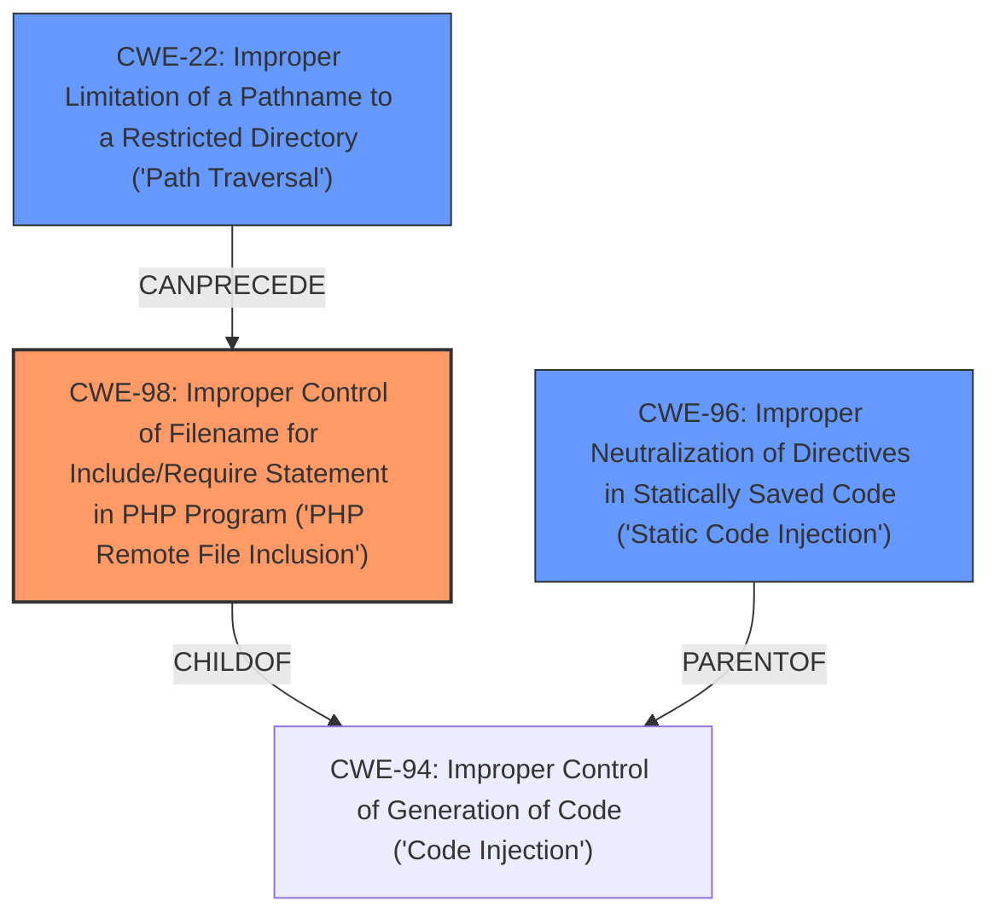

# Analysis Report for CVE-2024-13268

# Vulnerability Analysis Report: CVE-2024-13268

## Description

**Improper Neutralization of Directives in Statically Saved Code** (Static Code Injection) vulnerability in Drupal Opigno allows PHP **Local File Inclusion**.This issue affects Opigno from 7.X-1.0 before 7.X-1.23.

## Vulnerability Description Key Phrases

- **Rootcause:** Improper Neutralization of Directives in Statically Saved Code
- **Weakness:** Local File Inclusion
- **Product:** Drupal Opigno
- **Version:** 7.X-1.0 before 7.X-1.23

## Analysis (with Relationship Data)

# Summary
| CWE ID | CWE Name | Confidence | CWE Abstraction Level | CWE Vulnerability Mapping Label | CWE-Vulnerability Mapping Notes |
|---|---|---|---|---|---|
| CWE-98 | Improper Control of Filename for Include/Require Statement in PHP Program ('PHP Remote File Inclusion') | 0.9 | Variant | Allowed | Primary CWE. This is the root cause that allows local file inclusion. |
| CWE-96 | Improper Neutralization of Directives in Statically Saved Code ('Static Code Injection') | 0.7 | Base | Allowed | Secondary. The vulnerability description indicates **Improper Neutralization of Directives in Statically Saved Code** (Static Code Injection), which is a more general description of the issue. |
| CWE-22 | Improper Limitation of a Pathname to a Restricted Directory ('Path Traversal') | 0.5 | Base | Allowed | Secondary. The vulnerability leads to **Local File Inclusion**, which can be achieved via Path Traversal |

## Evidence and Confidence

*   **Confidence Score:** 0.8
*   **Evidence Strength:** MEDIUM

## Relationship Analysis

The primary weakness is CWE-98, which is a specific type of file inclusion vulnerability in PHP. CWE-96 is a broader category that encompasses various types of static code injection. CWE-22 (Path Traversal) can be a means to achieve local file inclusion.



## Vulnerability Chain

The vulnerability chain starts with **Improper Neutralization of Directives in Statically Saved Code** (Static Code Injection) in the Opigno module, leading to **Local File Inclusion**. This is achieved by an **Improper Control of Filename for Include/Require Statement in PHP Program ('PHP Remote File Inclusion')**.

## Summary of Analysis

The vulnerability description explicitly mentions "**Improper Neutralization of Directives in Statically Saved Code**" as the root cause and "**Local File Inclusion**" as the weakness.

Based on the **Retriever Results**, CWE-98 is the top candidate. This aligns well with the "**Local File Inclusion**" aspect of the vulnerability. CWE-98 (PHP Remote File Inclusion) is a variant that specifically targets PHP applications using `include` or `require` statements with improperly controlled filenames. Given that the vulnerability is in a Drupal module (which is PHP-based), CWE-98 is a strong candidate.

CWE-96 (**Improper Neutralization of Directives in Statically Saved Code**) is also relevant, as it reflects the stated root cause. However, it's more general than CWE-98. Since CWE-98 is a child of CWE-94 (**Improper Control of Generation of Code**), and CWE-96 is a parent of CWE-94, CWE-98 is more specific and preferred.

CWE-22 (**Improper Limitation of a Pathname to a Restricted Directory ('Path Traversal')**) is included as a possible secondary CWE since local file inclusion can be achieved using directory traversal techniques if the injected filename contains path traversal sequences.

The final assessment prioritizes CWE-98 as the primary CWE because it accurately reflects the specific type of file inclusion vulnerability in the PHP context. CWE-96 is included as a secondary CWE because it reflects the **Improper Neutralization of Directives in Statically Saved Code**, but it's less specific. CWE-22 is added as a secondary issue as Path Traversal can lead to local file inclusion.

Relevant CWE Information:

# Enhanced Context (25 CWEs)
The following CWEs were identified as potentially relevant to this vulnerability:

## CWE-96: Improper Neutralization of Directives in Statically Saved Code ('Static Code Injection')
**Abstraction Level**: Base
**Similarity Score**: 0.80
**Source**: dense

**Description**:
The product receives input from an upstream component, but it does not neutralize or incorrectly neutralizes code syntax before inserting the input into an executable resource, such as a library, configuration file, or template.

**Mapping Guidance**:
- Usage: Allowed
- Rationale: This CWE entry is at the Base level of abstraction, which is a preferred level of abstraction for mapping to the root causes of vulnerabilities.


## CWE-80: Improper Neutralization of Script-Related HTML Tags in a Web Page (Basic XSS)
**Abstraction Level**: Variant
**Similarity Score**: 0.75
**Source**: dense

**Description**:
The product receives input from an upstream component, but it does not neutralize or incorrectly neutralizes special characters such as "<", ">", and "&" that could be interpreted as web-scripting elements when they are sent to a downstream component that processes web pages.

**Mapping Guidance**:
- Usage: Allowed
- Rationale: This CWE entry is at the Variant level of abstraction, which is a preferred level of abstraction for mapping to the root causes of vulnerabilities.


## CWE-95: Improper Neutralization of Directives in Dynamically Evaluated Code ('Eval Injection')
**Abstraction Level**: Variant
**Similarity Score**: 0.75
**Source**: dense

**Description**:
The product receives input from an upstream component, but it does not neutralize or incorrectly neutralizes code syntax before using the input in a dynamic evaluation call (e.g. "eval").

**Mapping Guidance**:
- Usage: Allowed
- Rationale: This CWE entry is at the Variant level of abstraction, which is a preferred level of abstraction for mapping to the root causes of vulnerabilities.


## CWE-74: Improper Neutralization of Special Elements in Output Used by a Downstream Component ('Injection')
**Abstraction Level**: Class
**Similarity Score**: 0.74
**Source**: dense

**Description**:
The product constructs all or part of a command, data structure, or record using externally-influenced input from an upstream component, but it does not neutralize or incorrectly neutralizes special elements that could modify how it is parsed or interpreted when it is sent to a downstream component.

**Mapping Guidance**:
- Usage: Discouraged
- Rationale: CWE-74 is high-level and often misused when lower-level weaknesses are more appropriate.


## CWE-425: Direct Request ('Forced Browsing')
**Abstraction Level**: Base
**Similarity Score**: 0.74
**Source**: dense

**Description**:
The web application does not adequately enforce appropriate authorization on all restricted URLs, scripts, or files.

**Mapping Guidance**:
- Usage: Allowed
- Rationale: This CWE entry is at the Base level of abstraction, which is a preferred level of abstraction for mapping to the root causes of vulnerabilities.


## CWE-434: Unrestricted Upload of File with Dangerous Type
**Abstraction Level**: Base
**Similarity Score**: 0.73
**Source**: dense

**Description**:
The product allows the upload or transfer of dangerous file types that are automatically processed within its environment.

**Mapping Guidance**:
- Usage: Allowed
- Rationale: This CWE entry is at the Base level of abstraction, which is a preferred level of abstraction for mapping to the root causes of vulnerabilities.


## CWE-472: External Control of Assumed-Immutable Web Parameter
**Abstraction Level**: Base
**Similarity Score**: 0.73
**Source**: dense

**Description**:
The web application does not sufficiently verify inputs that are assumed to be immutable but are actually externally controllable, such as hidden form fields.

**Mapping Guidance**:
- Usage: Allowed
- Rationale: This CWE entry is at the Base level of abstraction, which is a preferred level of abstraction for mapping to the root causes of vulnerabilities.


## CWE-138: Improper Neutralization of Special Elements
**Abstraction Level**: Class
**Similarity Score**: 0.73
**Source**: dense

**Description**:
The product receives input from an upstream component, but it does not neutralize or incorrectly neutralizes special elements that could be interpreted as control elements or syntactic markers when they are sent to a downstream component.

**Mapping Guidance**:
- Usage: Discouraged
- Rationale: This CWE entry is a level-1 Class (i.e., a child of a Pillar). It might have lower-level children that would be more appropriate


## CWE-88: Improper Neutralization of Argument Delimiters in a Command ('Argument Injection')
**Abstraction Level**: Base
**Similarity Score**: 0.73
**Source**: dense

**Description**:
The product constructs a string for


## CWE Relationship Analysis

Current CWEs represent these abstraction levels: .


### Vulnerability Chain Analysis

**Chain starting from CWE-94:**
- 94 (Improper Control of Generation of Code ('Code Injection')) - ROOT


**Chain starting from CWE-80:**
- 80 (Improper Neutralization of Script-Related HTML Tags in a Web Page (Basic XSS)) - ROOT


### CWE Relationship Diagram

```mermaid
graph TD
    classDef primary fill:#f96,stroke:#333,stroke-width:2px
    classDef secondary fill:#69f,stroke:#333
    classDef tertiary fill:#9e9,stroke:#333
```


*Report generated on 2025-07-13 04:02:57*
