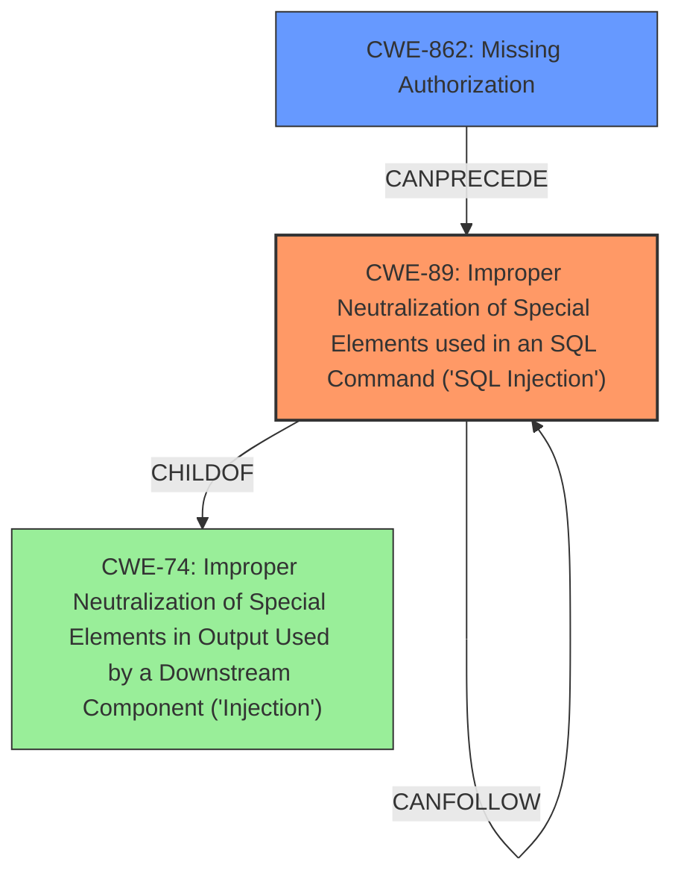

# Raw Analyzer Response for CVE-2024-13321

# Summary

| CWE ID  | CWE Name                                                                  | Confidence | CWE Abstraction Level | CWE Vulnerability Mapping Label | CWE-Vulnerability Mapping Notes |
| :-------- | :------------------------------------------------------------------------ | :--------- | :-------------------- | :------------------------------ | :------------------------------ |
| CWE-89    | Improper Neutralization of Special Elements used in an SQL Command ('SQL Injection') | 1.0        | Base                  | Primary                         | Allowed                       |
| CWE-862   | Missing Authorization                                                       | 0.9        | Class                 | Secondary                       | Allowed-with-Review           |

## Evidence and Confidence

*   **Confidence Score:** 0.95
*   **Evidence Strength:** HIGH

## Relationship Analysis

The primary relationship is that CWE-89 [Improper Neutralization of Special Elements used in an SQL Command ('SQL Injection')] is a consequence of CWE-862 [Missing Authorization]. If there was proper authorization, the unauthenticated attacker would not be able to inject SQL commands.

## Vulnerability Chain

The vulnerability chain starts with **insufficient authorization checks** (CWE-862), which allows an unauthenticated attacker to inject SQL commands (CWE-89), leading to the ability to **extract sensitive information from the database**.

## Summary of Analysis

The vulnerability is an SQL injection vulnerability (CWE-89) that is made possible due to a **lack of authorization checks** (CWE-862) on the `handle_get_stats()` function. The evidence for this assessment is strong, as the description explicitly states both the **root cause** (**insufficient authorization checks**) and the **weakness** (**SQL injection**). The graph relationships show how these CWEs can be related, with improper or missing authorization often leading to vulnerabilities like SQL injection. CWE-89 is at the optimal level of specificity, as it clearly describes the type of injection vulnerability.

The selection of CWE-89 is strongly supported by the retriever results, which give it a score of 1.0. The guidance also supports this selection, as it indicates that if the root cause is a missing authorization check, then CWE-862 is the appropriate CWE.

The vulnerability description key phrases indicates:
- **rootcause:** **insufficient authorization checks on the handle_get_stats() function**
- **weakness:** **SQL injection**

CWE-862 [Missing Authorization] is the root cause.
CWE-89 [Improper Neutralization of Special Elements used in an SQL Command ('SQL Injection')] is the weakness.

Other CWEs Considered:

*   CWE-284 [Improper Access Control]: This is a more general CWE and less specific than CWE-862, which directly addresses the **missing authorization**. Therefore, CWE-284 is not the most appropriate choice.
*   CWE-863 [Incorrect Authorization]: This CWE applies when there is an authorization check, but it is implemented incorrectly. In this case, the description indicates that authorization checks are **insufficient**, implying that they are missing, making CWE-862 a better fit.
*   CWE-306 [Missing Authentication for Critical Function]: While related to access control, this is about missing authentication, not authorization. Since the vulnerability description does not suggest any problems with authentication, this CWE is not applicable.
*   CWE-74 [Improper Neutralization of Special Elements in Output Used by a Downstream Component ('Injection')]: CWE-74 is a Class-level CWE. CWE-89 is a child of CWE-74 and more descriptive, so is a better fit.