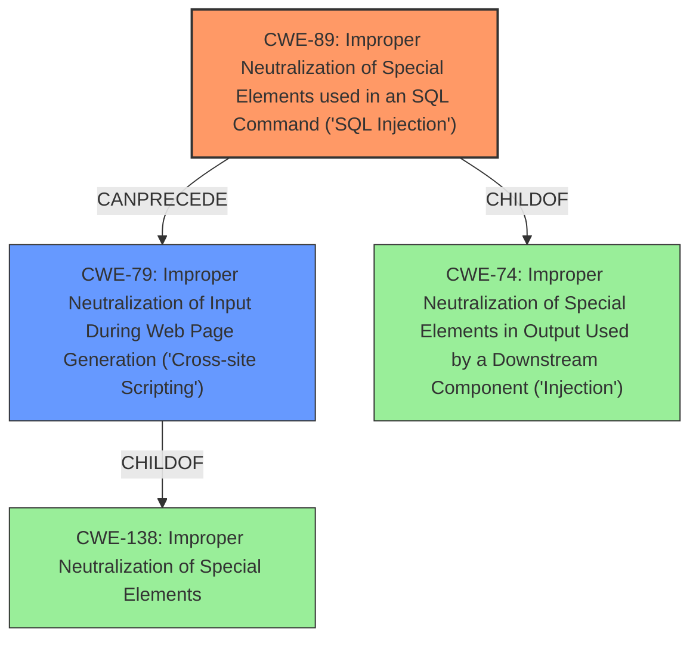

# Analysis Report for CVE-2024-13440

# Vulnerability Analysis Report: CVE-2024-13440

## Description

The Super Store Finder plugin for WordPress is vulnerable to SQL Injection via the ssf_wp_user_name parameter in all versions up to, and including, 7.0 due to **insufficient escaping on the user supplied parameter and lack of sufficient preparation on the existing SQL query**. This makes it possible for unauthenticated attackers to append additional SQL queries into an already existing query to store **cross-site scripting** in store reviews.

## Vulnerability Description Key Phrases

- **Rootcause:** insufficient escaping on the user supplied parameter and lack of sufficient preparation on the existing SQL query
- **Weakness:** ['cross-site scripting', 'SQL injection']
- **Impact:** append additional SQL queries
- **Attacker:** unauthenticated attackers
- **Product:** Super Store Finder WordPress plugin
- **Version:** up to and including 7.0
- **Component:** ssf_wp_user_name parameter

## Analysis (with Relationship Data)

# Summary
| CWE ID | CWE Name | Confidence | CWE Abstraction Level | CWE Vulnerability Mapping Label | CWE-Vulnerability Mapping Notes |
|---|---|---|---|---|---|
| CWE-89 | Improper Neutralization of Special Elements used in an SQL Command ('SQL Injection') | 1.0 | Base | Allowed | Primary CWE. **Insufficient escaping** and **lack of sufficient preparation on the existing SQL query** which resulted in SQL Injection. |
| CWE-79 | Improper Neutralization of Input During Web Page Generation ('Cross-site Scripting') | 1.0 | Base | Allowed | Secondary CWE. Storing **cross-site scripting** in store reviews is a consequence of the SQL Injection. |

## Evidence and Confidence

*   **Confidence Score:** 1.0
*   **Evidence Strength:** HIGH

## Relationship Analysis
The primary weakness is CWE-89, which is a Base level CWE. CWE-79 is a consequence of the SQL injection. CWE-89's parent is CWE-74, and CWE-79's parent is CWE-138. The injection of SQL commands leads to the ability to store XSS payloads.



## Vulnerability Chain
The vulnerability chain starts with **insufficient escaping** and **lack of sufficient preparation on the existing SQL query** (CWE-89), which leads to the ability to **append additional SQL queries** and store **cross-site scripting** (CWE-79) in store reviews.

## Summary of Analysis
The primary weakness is CWE-89 because the root cause is **insufficient escaping on the user supplied parameter and lack of sufficient preparation on the existing SQL query**. The secondary weakness is CWE-79, because the SQL injection leads to the storage of **cross-site scripting** payloads.

The vulnerability description clearly states the root cause: "**insufficient escaping on the user supplied parameter and lack of sufficient preparation on the existing SQL query**". This directly aligns with the definition of CWE-89, which involves **improper neutralization of special elements used in an SQL command**. The description also mentions that this allows **unauthenticated attackers to append additional SQL queries into an already existing query to store cross-site scripting in store reviews**. The **cross-site scripting** aspect is mapped to CWE-79 because the successful SQL injection enables the storage of malicious scripts that are later rendered in a web page.

CWE-116, CWE-352, CWE-90, CWE-138, CWE-943 and CWE-341 were considered but not used. CWE-116 is too broad, CWE-352 is not applicable because it's CSRF, CWE-90 is for LDAP Injection not SQL Injection, CWE-138 is too broad, CWE-943 is similar to CWE-89 but less specific, and CWE-341 is not relevant to this vulnerability.


## CWE Relationship Analysis

Current CWEs represent these abstraction levels: .


### Vulnerability Chain Analysis

**Chain starting from CWE-90:**
- 90 (Improper Neutralization of Special Elements used in an LDAP Query ('LDAP Injection')) - ROOT


**Chain starting from CWE-89:**
- 89 (Improper Neutralization of Special Elements used in an SQL Command ('SQL Injection')) - ROOT


### CWE Relationship Diagram

```mermaid
graph TD
    classDef primary fill:#f96,stroke:#333,stroke-width:2px
    classDef secondary fill:#69f,stroke:#333
    classDef tertiary fill:#9e9,stroke:#333
```


*Report generated on 2025-07-13 04:09:48*
