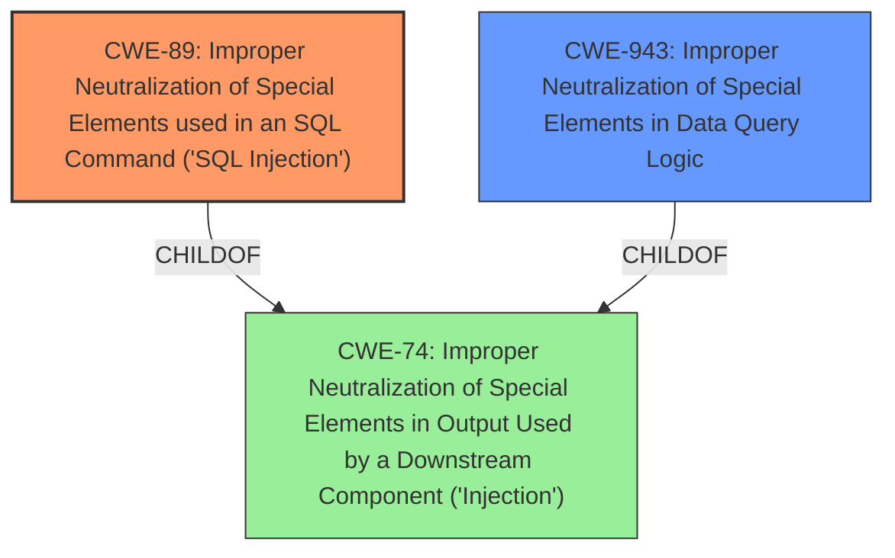

# Analysis for CVE-2024-13481

# Summary
| CWE ID  | CWE Name                                                                           | Confidence | CWE Abstraction Level | CWE Vulnerability Mapping Label | CWE-Vulnerability Mapping Notes |
| :-------- | :--------------------------------------------------------------------------------- | :--------- | :---------------------- | :------------------------------ | :------------------------------ |
| CWE-89  | Improper Neutralization of Special Elements used in an SQL Command ('SQL Injection') | 1          | Base                    | Primary                         | Allowed                       |
| CWE-943 | Improper Neutralization of Special Elements in Data Query Logic                      | 0.7        | Base                    | Secondary                       | Allowed                       |

## Evidence and Confidence

*   **Confidence Score:** 0.9
*   **Evidence Strength:** HIGH

## Relationship Analysis

The primary CWE is CWE-89, which represents the classic SQL Injection vulnerability due to **insufficient neutralization** of user-supplied input. CWE-943 is a related CWE that focuses on **improper neutralization** within the data query logic itself, which can contribute to SQL Injection. CWE-89 is a child of CWE-74 (Improper Neutralization of Special Elements in Output Used by a Downstream Component ('Injection')), while CWE-943 is also a child of CWE-74. The relationship suggests that the injection occurs because the data query logic is not properly neutralized.

## Vulnerability Chain

The vulnerability chain starts with the **insufficient escaping** and **lack of sufficient preparation** of the SQL query. This leads to the **SQL Injection** vulnerability (CWE-89) and allows attackers to **append additional SQL queries**, ultimately enabling them to **extract sensitive information from the database**.

Root Cause: **Insufficient escaping** and **lack of sufficient preparation** on the existing SQL query.
Weakness: CWE-89 - Improper Neutralization of Special Elements used in an SQL Command ('SQL Injection')
Impact: Extract sensitive information from the database, append additional SQL queries.

## Summary of Analysis

The analysis indicates a clear SQL Injection vulnerability (CWE-89) due to **insufficient neutralization** of user-supplied input when constructing SQL queries. The vulnerability description explicitly mentions **'insufficient escaping on the user supplied parameter and lack of sufficient preparation on the existing SQL query'** which directly aligns with CWE-89. The ability to **'append additional SQL queries into already existing queries that can be used to extract sensitive information from the database'** further supports this classification.

CWE-943 (Improper Neutralization of Special Elements in Data Query Logic) is considered a secondary CWE because it highlights the **lack of sufficient preparation on the existing SQL query**, which is a contributing factor to the SQL Injection. The combination of **insufficient escaping** and **improper neutralization in data query logic** allows the attacker to inject malicious SQL code.

The selected CWEs are at the optimal level of specificity, with CWE-89 representing the core SQL Injection vulnerability and CWE-943 providing additional context on the **improper neutralization** within the data query logic. Other CWEs, such as CWE-116 (Improper Encoding or Escaping of Output), were considered but deemed less specific as they represent a broader class of output encoding issues.

Relevant CWE Information:

# Enhanced Context (25 CWEs)
The following CWEs were identified as potentially relevant to this vulnerability:

## CWE-74: Improper Neutralization of Special Elements in Output Used by a Downstream Component ('Injection')
**Abstraction Level**: Class
**Similarity Score**: 0.72
**Source**: dense

**Description**:
The product constructs all or part of a command, data structure, or record using externally-influenced input from an upstream component, but it does not neutralize or incorrectly neutralizes special elements that could modify how it is parsed or interpreted when it is sent to a downstream component.

**Mapping Guidance**:
- Usage: Discouraged
- Rationale: CWE-74 is high-level and often misused when lower-level weaknesses are more appropriate.

*This CWE is too general, and lower-level CWEs like CWE-89 and CWE-943 are more appropriate.*

## CWE-116: Improper Encoding or Escaping of Output
**Abstraction Level**: Class
**Similarity Score**: 0.72
**Source**: dense

**Description**:
The product prepares a structured message for communication with another component, but encoding or escaping of the data is either missing or done incorrectly. As a result, the intended structure of the message is not preserved.

**Mapping Guidance**:
- Usage: Allowed-with-Review
- Rationale: This CWE entry is a Class and might have Base-level children that would be more appropriate

*This CWE is too general, and lower-level CWEs like CWE-89 and CWE-943 are more appropriate.*

## CWE-138: Improper Neutralization of Special Elements
**Abstraction Level**: Class
**Similarity Score**: 0.72
**Source**: dense

**Description**:
The product receives input from an upstream component, but it does not neutralize or incorrectly neutralizes special elements that could be interpreted as control elements or syntactic markers when they are sent to a downstream component.

**Mapping Guidance**:
- Usage: Discouraged
- Rationale: This CWE entry is a level-1 Class (i.e., a child of a Pillar). It might have lower-level children that would be more appropriate

*This CWE is too general, and lower-level CWEs like CWE-89 and CWE-943 are more appropriate.*

## CWE-425: Direct Request ('Forced Browsing')
**Abstraction Level**: Base
**Similarity Score**: 0.72
**Source**: dense

**Description**:
The web application does not adequately enforce appropriate authorization on all restricted URLs, scripts, or files.

**Mapping Guidance**:
- Usage: Allowed
- Rationale: This CWE entry is at the Base level of abstraction, which is a preferred level of abstraction for mapping to the root causes of vulnerabilities.

*This CWE is not relevant to the SQL Injection vulnerability.*

## CWE-472: External Control of Assumed-Immutable Web Parameter
**Abstraction Level**: Base
**Similarity Score**: 0.72
**Source**: dense

**Description**:
The web application does not sufficiently verify inputs that are assumed to be immutable but are actually externally controllable, such as hidden form fields.

**Mapping Guidance**:
- Usage: Allowed
- Rationale: This CWE entry is at the Base level of abstraction, which is a preferred level of abstraction for mapping to the root causes of vulnerabilities.

*This CWE is not relevant to the SQL Injection vulnerability.*

## CWE-303: Incorrect Implementation of Authentication Algorithm
**Abstraction Level**: Base
**Similarity Score**: 0.71
**Source**: dense

**Description**:
The requirements for the product dictate the use of an established authentication algorithm, but the implementation of the algorithm is incorrect.

**Mapping Guidance**:
- Usage: Allowed
- Rationale: This CWE entry is at the Base level of abstraction, which is a preferred level of abstraction for mapping to the root causes of vulnerabilities.

*This CWE is not relevant to the SQL Injection vulnerability.*

## CWE-184: Incomplete List of Disallowed Inputs
**Abstraction Level**: Base
**Similarity Score**: 0.71
**Source**: dense

**Description**:
The product implements a protection mechanism that relies on a list of inputs (or properties of inputs) that are not allowed by policy or otherwise require other action to neutralize before additional processing takes place, but the list is incomplete.

**Mapping Guidance**:
- Usage: Allowed
- Rationale: This CWE entry is at the Base level of abstraction, which is a preferred level of abstraction for mapping to the root causes of vulnerabilities.

*This CWE is not relevant to the SQL Injection vulnerability.*

## CWE-212: Improper Removal of Sensitive Information Before Storage or Transfer
**Abstraction Level**: Base
**Similarity Score**: 0.71
**Source**: dense

**Description**:
The product stores, transfers, or shares a resource that contains sensitive information, but it does not properly remove that information before the product makes the resource available to unauthorized actors.

**Mapping Guidance**:
- Usage: Allowed
- Rationale: This CWE entry is at the Base level of abstraction, which is a preferred level of abstraction for mapping to the root causes of vulnerabilities.

*This CWE is not relevant to the SQL Injection vulnerability.*

## CWE-319: Cleartext Transmission of Sensitive Information
**Abstraction Level**: Base
**Similarity Score**: