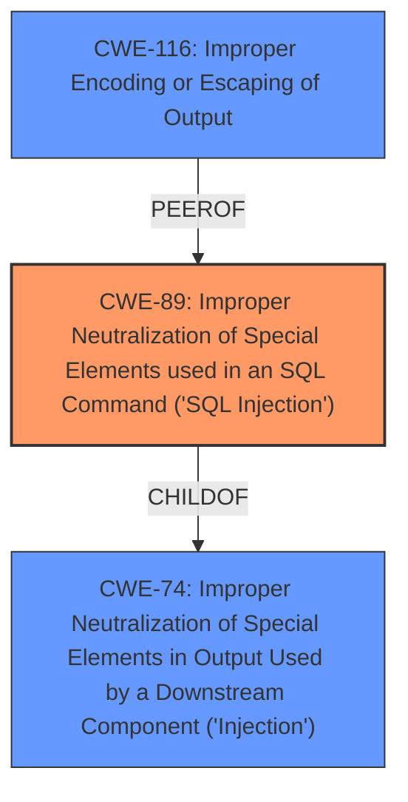

# Analysis for CVE-2024-13489

# Summary

| CWE ID   | CWE Name                                                                     | Confidence | CWE Abstraction Level | CWE Vulnerability Mapping Label | CWE-Vulnerability Mapping Notes |
| :--------- | :--------------------------------------------------------------------------- | :--------- | :---------------------- | :------------------------------ | :------------------------------ |
| CWE-89   | Improper Neutralization of Special Elements used in an SQL Command ('SQL Injection') | 1          | Base                    | Primary                         | Allowed                         |
| CWE-116  | Improper Encoding or Escaping of Output                                      | 0.7        | Class                   | Secondary                       | Allowed-with-Review             |

## Evidence and Confidence

*   **Confidence Score:** 0.9
*   **Evidence Strength:** HIGH

## Relationship Analysis

The primary relationship influencing the decision is the hierarchical relationship between CWE-74 (Improper Neutralization of Special Elements in Output Used by a Downstream Component ('Injection')) and its child CWE-89 (Improper Neutralization of Special Elements used in an SQL Command ('SQL Injection')). CWE-89 is more specific and accurately describes the vulnerability, where **insufficient escaping** leads to **SQL Injection**. CWE-116 (Improper Encoding or Escaping of Output) is considered as a related issue, where the output to the SQL query is not properly encoded or escaped.

## Vulnerability Chain

The vulnerability chain starts with **insufficient escaping on the user supplied parameter and lack of sufficient preparation on the existing SQL query** (root cause), leading to **SQL Injection** (weakness), and resulting in the ability to **extract sensitive information from the database** (impact).

Root Cause: **Insufficient escaping/preparation** -> Weakness: **SQL Injection** -> Impact: **Data Extraction**

## Summary of Analysis

The analysis is based on the provided vulnerability description, which clearly states that the vulnerability is due to **insufficient escaping on the user supplied parameter and lack of sufficient preparation on the existing SQL query**, leading to **SQL Injection**.

The description explicitly identifies that this makes it possible for unauthenticated attackers to append additional SQL queries into already existing queries that can be used to extract sensitive information from the database.

CWE-89 (Improper Neutralization of Special Elements used in an SQL Command ('SQL Injection')) is selected as the primary CWE because it directly addresses the root cause and the technical details of the vulnerability, i.e., the **insufficient escaping** leads directly to the **SQL Injection** vulnerability. It is also the top CWE for the **WEAKNESS: 'SQL injection'** as well as the **ROOTCAUSE: 'insufficient escaping on the user supplied parameter and lack of sufficient preparation on the existing SQL query'**.

CWE-116 (Improper Encoding or Escaping of Output) is a related weakness because the **insufficient escaping** is a form of improper encoding or escaping.

The selected CWEs are at the optimal level of specificity, as CWE-89 is a Base level CWE, providing a precise description of the vulnerability, and CWE-116 is a class-level CWE representing the general problem of output handling.

Relevant CWE Information:

# Enhanced Context (25 CWEs)
The following CWEs were identified as potentially relevant to this vulnerability:

## CWE-74: Improper Neutralization of Special Elements in Output Used by a Downstream Component ('Injection')
**Abstraction Level**: Class
**Similarity Score**: 0.72
**Source**: dense

**Description**:
The product constructs all or part of a command, data structure, or record using externally-influenced input from an upstream component, but it does not neutralize or incorrectly neutralizes special elements that could modify how it is parsed or interpreted when it is sent to a downstream component.

**Mapping Guidance**:
- Usage: Discouraged
- Rationale: CWE-74 is high-level and often misused when lower-level weaknesses are more appropriate.
*Reasoning*: CWE-74 is too general, and CWE-89 is a more specific child that better describes the vulnerability.

## CWE-472: External Control of Assumed-Immutable Web Parameter
**Abstraction Level**: Base
**Similarity Score**: 0.72
**Source**: dense

**Description**:
The web application does not sufficiently verify inputs that are assumed to be immutable but are actually externally controllable, such as hidden form fields.

**Mapping Guidance**:
- Usage: Allowed
- Rationale: This CWE entry is at the Base level of abstraction, which is a preferred level of abstraction for mapping to the root causes of vulnerabilities.
*Reasoning*: This CWE is not relevant because the vulnerability is not about externally controllable immutable web parameters, but about **improper neutralization** of input leading to **SQL Injection**.

## CWE-116: Improper Encoding or Escaping of Output
**Abstraction Level**: Class
**Similarity Score**: 0.72
**Source**: dense

**Description**:
The product prepares a structured message for communication with another component, but encoding or escaping of the data is either missing or done incorrectly. As a result, the intended structure of the message is not preserved.

**Mapping Guidance**:
- Usage: Allowed-with-Review
- Rationale: This CWE entry is a Class and might have Base-level children that would be more appropriate
*Reasoning*: Considered as a secondary weakness because the **insufficient escaping** is a form of improper encoding or escaping.

## CWE-138: Improper Neutralization of Special Elements
**Abstraction Level**: Class
**Similarity Score**: 0.72
**Source**: dense

**Description**:
The product receives input from an upstream component, but it does not neutralize or incorrectly neutralizes special elements that could be interpreted as control elements or syntactic markers when they are sent to a downstream component.

**Mapping Guidance**:
- Usage: Discouraged
- Rationale: This CWE entry is a level-1 Class (i.e., a child of a Pillar). It might have lower-level children that would be more appropriate
*Reasoning*: CWE-138 is too general, and CWE-89 is a more specific child that better describes the vulnerability.

## CWE-425: Direct Request ('Forced Browsing')
**Abstraction Level**: Base
**Similarity Score**: 0.72
**Source**: dense

**Description**:
The web application does not adequately enforce appropriate authorization on all restricted URLs, scripts, or files.

**Mapping Guidance**:
- Usage: Allowed
- Rationale: This CWE entry is at the Base level of abstraction, which is a preferred level of abstraction for mapping to the root causes of vulnerabilities.
*Reasoning*: Not relevant to the identified vulnerability which is related to **insufficient escaping** of input, leading to **SQL Injection**, and not to authorization issues.

## CWE-303: Incorrect Implementation of Authentication Algorithm
**Abstraction Level**: Base
**Similarity Score**: 0.72
**Source**: dense

**Description**:
The requirements for the product dictate the use of an established authentication algorithm, but the implementation of the algorithm is incorrect.

**Mapping Guidance**:
- Usage: Allowed
- Rationale: This CWE entry is at the Base level of abstraction, which is a preferred level of abstraction for mapping to the root causes of vulnerabilities.
*Reasoning*: Not relevant as the vulnerability is not due to an incorrect implementation of an authentication algorithm.

## CWE-212: Improper Removal of Sensitive Information Before Storage or Transfer
**Abstraction Level**: Base
**Similarity Score**: 0.71
**Source**: dense

**Description**:
The product stores, transfers, or shares a resource that contains sensitive information, but it does not properly remove that information before the product makes the resource available to unauthorized actors.

**Mapping Guidance**:
- Usage: Allowed
- Rationale: This CWE entry is at the Base level of abstraction, which is a preferred level of abstraction for mapping to the root causes of vulnerabilities.
*Reasoning*: Not relevant as the vulnerability is not about the removal of sensitive information.

## CWE-184: Incomplete List of Disallowed Inputs
**Abstraction Level**: Base
**Similarity Score**: 0.71
**Source**: dense

**Description**:
The product implements a protection mechanism that relies on a list of inputs (or properties of inputs) that are not allowed by policy or otherwise require other action to neutralize before additional processing takes place, but the list is incomplete.

**Mapping Guidance**:
- Usage: Allowed
- Rationale: This CWE entry is at the Base level of abstraction, which is a preferred level of abstraction for mapping to the root causes of vulnerabilities.
*Reasoning*: This is not about an incomplete list of disallowed inputs, but about the **insufficient escaping** of input.