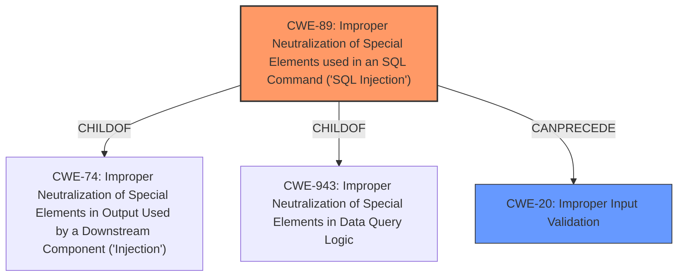

# Raw Analyzer Response for CVE-2024-13491

# Summary
| CWE ID | CWE Name | Confidence | CWE Abstraction Level | CWE Vulnerability Mapping Label | CWE-Vulnerability Mapping Notes |
|---|---|---|---|---|---|
| CWE-89 | Improper Neutralization of Special Elements used in an SQL Command ('SQL Injection') | 1.0 | Base | Allowed | Primary CWE |
| CWE-20 | Improper Input Validation | 0.7 | Class | Discouraged | Secondary Candidate |

## Evidence and Confidence

*   **Confidence Score:** 0.9
*   **Evidence Strength:** HIGH

## Relationship Analysis
The primary relationship is that CWE-89 [CWE-89: Improper Neutralization of Special Elements used in an SQL Command ('SQL Injection')] is a child of CWE-74 [CWE-74: Improper Neutralization of Special Elements in Output Used by a Downstream Component ('Injection')] and CWE-943 [CWE-943: Improper Neutralization of Special Elements in Data Query Logic']. CWE-20 [CWE-20: Improper Input Validation] is a more general class of weakness, and while applicable, CWE-89 provides a more specific and accurate representation of the vulnerability. The abstraction levels influenced the selection, favoring the base level CWE-89 over the class level CWE-20.

## Vulnerability Chain
The vulnerability chain starts with **insufficient escaping on the user supplied parameter and lack of sufficient preparation on the existing SQL query**, leading to **SQL Injection**, which allows **unauthenticated attackers to extract sensitive information from the database**. Thus, the chain is: Improper Input Handling -> SQL Injection -> Information Disclosure.

## Summary of Analysis
The primary CWE is clearly CWE-89 [CWE-89: Improper Neutralization of Special Elements used in an SQL Command ('SQL Injection')], as the vulnerability description explicitly mentions "**SQL Injection**" and the root cause is "**insufficient escaping on the user supplied parameter and lack of sufficient preparation on the existing SQL query**". This aligns directly with CWE-89's description: "The product constructs all or part of an SQL command using externally-influenced input...but it does not neutralize or incorrectly neutralizes special elements that could modify the intended SQL command."

CWE-20 [CWE-20: Improper Input Validation] was considered but ultimately deemed less specific. While **insufficient escaping** and **lack of sufficient preparation** can be considered forms of improper input validation, CWE-89 directly addresses the specific context of SQL injection. The mapping guidance for CWE-20 discourages its use when lower-level CWEs are available.

The evidence strongly supports CWE-89, and its base level abstraction provides the optimal level of specificity for this vulnerability. The vulnerability chain clearly shows that the root cause (improper input handling) leads directly to SQL injection and then to information disclosure.