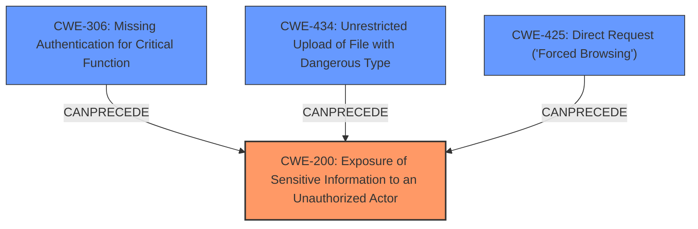

# Analysis Report for CVE-2024-13611

# Vulnerability Analysis Report: CVE-2024-13611

## Description

The Better Messages Live Chat for WordPress, BuddyPress, PeepSo, Ultimate Member, BuddyBoss plugin for WordPress is vulnerable to Sensitive Information Exposure in all versions up to, and including, 2.6.9 via the bp-better-messages directory. This makes it possible for unauthenticated attackers to extract sensitive data stored insecurely in the /wp-content/uploads/bp-better-messages directory which can contain file attachments included in chat messages.

## Vulnerability Description Key Phrases

- **Weakness:** Information Exposure, Sensitive Information Exposure
- **Product:** Better Messages Live Chat plugin for WordPress
- **Impact:** Information Exposure
- **Attacker:** unauthenticated attackers
- **Version:** all versions up to and including 2.6.9

## Analysis (with Relationship Data)

# Summary
| CWE ID | CWE Name | Confidence | CWE Abstraction Level | CWE Vulnerability Mapping Label | CWE-Vulnerability Mapping Notes |
|---|---|---|---|---|---|
| CWE-200 | Exposure of Sensitive Information to an Unauthorized Actor | 0.9 | Class | Primary CWE | Allowed, This CWE is a Class and might have Base-level children that would be more appropriate, but given the lack of detail, this is the best fit. |
| CWE-306 | Missing Authentication for Critical Function | 0.6 | Base | Secondary Candidate | Allowed |
| CWE-434 | Unrestricted Upload of File with Dangerous Type | 0.5 | Base | Secondary Candidate | Allowed |
| CWE-425 | Direct Request ('Forced Browsing') | 0.5 | Base | Secondary Candidate | Allowed |

## Evidence and Confidence

*   **Confidence Score:** 0.7
*   **Evidence Strength:** MEDIUM

## Relationship Analysis
The primary relationship influencing the decision is the parent-child relationship between CWE-200 and its base-level children. While the description suggests potential base-level CWEs related to specific information exposure scenarios, the lack of precise technical details makes it difficult to select a more specific child. There exist chain relationships with other CWEs that relate to file uploads, authentication, and authorization. These are marked as secondary candidates given the information provided.



## Vulnerability Chain
The vulnerability chain starts with the **insecure storage of sensitive data** within the `/wp-content/uploads/bp-better-messages` directory. This leads to **unauthenticated attackers** being able to directly access these files, resulting in **sensitive information exposure**. The chain could be extended if the attacker is able to upload files of dangerous types and execute them.

## Summary of Analysis
The initial analysis focused on identifying the root cause of the vulnerability, which is the **insecure storage of sensitive data** leading to information exposure.

The primary CWE, CWE-200, was selected because it directly addresses the **exposure of sensitive information to unauthorized actors**. The vulnerability description explicitly mentions that unauthenticated attackers can extract sensitive data, which aligns with the CWE-200 description.

The retriever results suggested several other relevant CWEs, including CWE-306, CWE-434, and CWE-425. These were considered as secondary candidates because they represent potential contributing factors or related weaknesses. For example, CWE-306 (Missing Authentication for Critical Function) could be relevant if the directory containing the sensitive data should have required authentication. CWE-434 (Unrestricted Upload of File with Dangerous Type) could be relevant if the plugin allows uploading dangerous file types, which could then be executed. CWE-425 (Direct Request ('Forced Browsing')) could be relevant if the application does not adequately enforce appropriate authorization on all restricted URLs, scripts, or files.

Ultimately, CWE-200 was chosen as the primary CWE because it directly reflects the observed vulnerability. The other CWEs are considered secondary candidates because they represent potential contributing factors or related weaknesses.

Relevant CWE Information:

# Enhanced Context (25 CWEs)
The following CWEs were identified as potentially relevant to this vulnerability:

## CWE-472: External Control of Assumed-Immutable Web Parameter
**Abstraction Level**: Base
**Similarity Score**: 0.77
**Source**: dense

**Description**:
The web application does not sufficiently verify inputs that are assumed to be immutable but are actually externally controllable, such as hidden form fields.

**Mapping Guidance**:
- Usage: Allowed
- Rationale: This CWE entry is at the Base level of abstraction, which is a preferred level of abstraction for mapping to the root causes of vulnerabilities.

## CWE-434: Unrestricted Upload of File with Dangerous Type
**Abstraction Level**: Base
**Similarity Score**: 0.77
**Source**: dense

**Description**:
The product allows the upload or transfer of dangerous file types that are automatically processed within its environment.

**Mapping Guidance**:
- Usage: Allowed
- Rationale: This CWE entry is at the Base level of abstraction, which is a preferred level of abstraction for mapping to the root causes of vulnerabilities.

## CWE-425: Direct Request ('Forced Browsing')
**Abstraction Level**: Base
**Similarity Score**: 0.77
**Source**: dense

**Description**:
The web application does not adequately enforce appropriate authorization on all restricted URLs, scripts, or files.

**Mapping Guidance**:
- Usage: Allowed
- Rationale: This CWE entry is at the Base level of abstraction, which is a preferred level of abstraction for mapping to the root causes of vulnerabilities.

## CWE-538: Insertion of Sensitive Information into Externally-Accessible File or Directory
**Abstraction Level**: Base
**Similarity Score**: 0.76
**Source**: dense

**Description**:
The product places sensitive information into files or directories that are accessible to actors who are allowed to have access to the files, but not to the sensitive information.

**Mapping Guidance**:
- Usage: Allowed
- Rationale: This CWE entry is at the Base level of abstraction, which is a preferred level of abstraction for mapping to the root causes of vulnerabilities.

## CWE-359: Exposure of Private Personal Information to an Unauthorized Actor
**Abstraction Level**: Base
**Similarity Score**: 0.76
**Source**: dense

**Description**:
The product does not properly prevent a person's private, personal information from being accessed by actors who either (1) are not explicitly authorized to access the information or (2) do not have the implicit consent of the person about whom the information is collected.

**Mapping Guidance**:
- Usage: Allowed
- Rationale: This CWE entry is at the Base level of abstraction, which is a preferred level of abstraction for mapping to the root causes of vulnerabilities.

## CWE-352: Cross-Site Request Forgery (CSRF)
**Abstraction Level**: Compound
**Similarity Score**: 0.76
**Source**: dense

**Description**:
The web application does not, or can not, sufficiently verify whether a well-formed, valid, consistent request was intentionally provided by the user who submitted the request.

**Mapping Guidance**:
- Usage: Allowed
- Rationale: This is a well-known Composite of multiple weaknesses that must all occur simultaneously, although it is attack-oriented in nature.

## CWE-639: Authorization Bypass Through User-Controlled Key
**Abstraction Level**: Base
**Similarity Score**: 0.76
**Source**: dense

**Description**:
The system's authorization functionality does not prevent one user from gaining access to another user's data or record by modifying the key value identifying the data.

**Mapping Guidance**:
- Usage: Allowed
- Rationale: This CWE entry is at the Base level of abstraction, which is a preferred level of abstraction for mapping to the root causes of vulnerabilities.

## CWE-201: Insertion of Sensitive Information Into Sent Data
**Abstraction Level**: Base
**Similarity Score**: 0.75
**Source**: dense

**Description**:
The code transmits data to another actor, but a portion of the data includes sensitive information that should not be accessible to that actor.

**Mapping Guidance**:
- Usage: Allowed
- Rationale: This CWE entry is at the Base level of abstraction, which is a preferred level of abstraction for mapping to the root causes of vulnerabilities.

## CWE-116: Improper Encoding or Escaping of Output
**Abstraction Level**: Class
**Similarity Score**: 0.75
**Source**: dense

**Description**:
The product prepares a structured message for communication with another component, but encoding or escaping of the data is either missing or done incorrectly. As a result, the intended structure of the message is not preserved.

**Mapping Guidance**:
- Usage: Allowed-with-Review
- Rationale: This CWE entry is a Class and might have Base-level children that would be more appropriate

## CWE-319: Cleartext Transmission of Sensitive Information
**Abstraction Level**: Base
**Similarity Score**: 0.74
**Source**: dense

**Description**:
The product transmits sensitive or security-critical data in cleartext in a communication channel that can be sniffed by unauthorized actors.

**Mapping Guidance**:
- Usage: Allowed
- Rationale: This CWE entry is at the Base level of abstraction, which is a preferred level of abstraction for mapping to the root causes of vulnerabilities.

##


## CWE Relationship Analysis

Current CWEs represent these abstraction levels: .


### Vulnerability Chain Analysis

**Chain starting from CWE-359:**
- 359 (Exposure of Private Personal Information to an Unauthorized Actor) - ROOT


**Chain starting from CWE-116:**
- 116 (Improper Encoding or Escaping of Output) - ROOT


### CWE Relationship Diagram

```mermaid
graph TD
    classDef primary fill:#f96,stroke:#333,stroke-width:2px
    classDef secondary fill:#69f,stroke:#333
    classDef tertiary fill:#9e9,stroke:#333
```


*Report generated on 2025-07-13 04:23:57*
