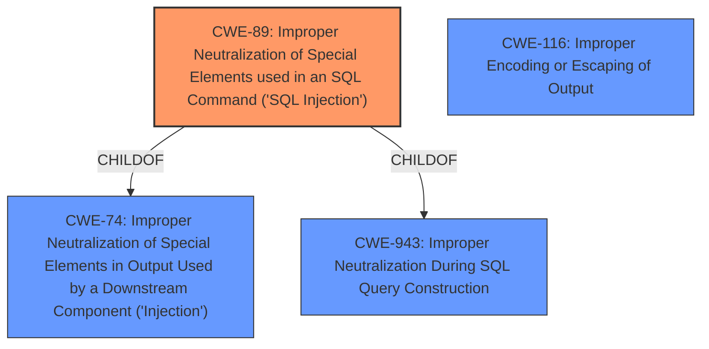

# Enhanced Analysis for CVE-2024-13676

# Summary
| CWE ID | CWE Name | Confidence | CWE Abstraction Level | CWE Vulnerability Mapping Label | CWE-Vulnerability Mapping Notes |
|---|---|---|---|---|---|
| CWE-89 | Improper Neutralization of Special Elements used in an SQL Command ('SQL Injection') | 1.0 | Base | Primary | Allowed |
| CWE-116 | Improper Encoding or Escaping of Output | 0.7 | Class | Secondary | Allowed-with-Review |

## Evidence and Confidence

*   **Confidence Score:** 0.9
*   **Evidence Strength:** HIGH

## Relationship Analysis
The primary CWE is CWE-89, which is a Base level CWE and a child of CWE-74 (Improper Neutralization of Special Elements in Output Used by a Downstream Component ('Injection')) and CWE-943 (Improper Neutralization During SQL Query Construction). CWE-116 is a Class level CWE, which can be considered as a secondary weakness due to the **insufficient escaping**.



## Vulnerability Chain
The vulnerability chain starts with **insufficient escaping on the user-supplied parameter** (CWE-116) and **lack of sufficient preparation on the existing SQL query**, leading to **SQL Injection** (CWE-89), which allows an attacker to **extract sensitive information from the database**.

## Summary of Analysis
The primary weakness is CWE-89, **Improper Neutralization of Special Elements used in an SQL Command ('SQL Injection')**, because the plugin **does not neutralize or incorrectly neutralizes** special elements that could modify the intended SQL command. The vulnerability description explicitly states that there is "lack of sufficient preparation on the existing SQL query". This aligns directly with the definition of CWE-89.

The secondary weakness is CWE-116, **Improper Encoding or Escaping of Output**, because the plugin has "**insufficient escaping on the user supplied parameter**". This means the data isn't properly encoded before being used in a structured message (in this case, an SQL query). While CWE-89 is the more direct cause of the **SQL Injection**, the lack of proper escaping (CWE-116) contributes to the vulnerability.

I considered other CWEs such as CWE-90 (Improper Neutralization of Special Elements used in an LDAP Query ('LDAP Injection')), CWE-79 (Improper Neutralization of Input During Web Page Generation ('Cross-site Scripting')), and CWE-94 (Improper Control of Generation of Code ('Code Injection')), but they do not match the specific vulnerability of SQL injection. CWE-352 (Cross-Site Request Forgery (CSRF)) was also considered but rejected as it is not relevant to the described vulnerability.
The selection of CWE-89 and CWE-116 is at the optimal level of specificity, as they accurately represent the root cause and contributing factor to the vulnerability.


## CWE Relationship Analysis

Current CWEs represent these abstraction levels: .


### Vulnerability Chain Analysis

**Chain starting from CWE-90:**
- 90 (Improper Neutralization of Special Elements used in an LDAP Query ('LDAP Injection')) - ROOT


**Chain starting from CWE-89:**
- 89 (Improper Neutralization of Special Elements used in an SQL Command ('SQL Injection')) - ROOT


### CWE Relationship Diagram

```mermaid
graph TD
    classDef primary fill:#f96,stroke:#333,stroke-width:2px
    classDef secondary fill:#69f,stroke:#333
    classDef tertiary fill:#9e9,stroke:#333
```