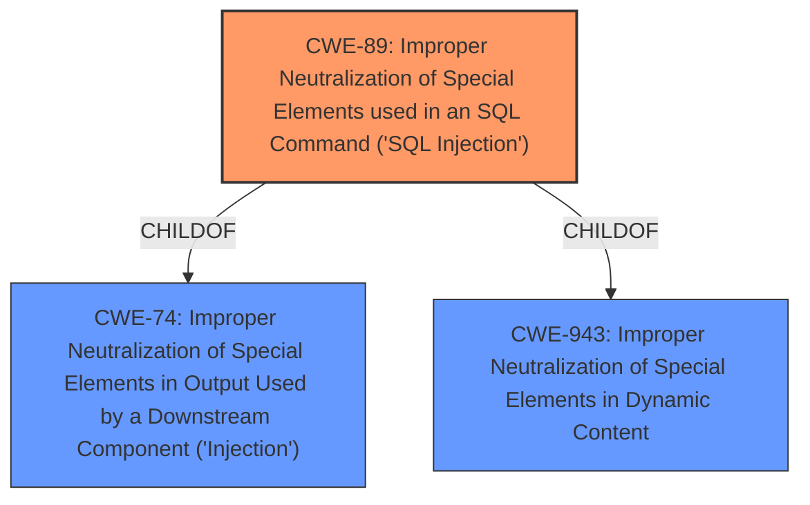

# Analysis Report for CVE-2024-13778

# Vulnerability Analysis Report: CVE-2024-13778

## Description

The Hero Mega Menu - Responsive WordPress Menu Plugin plugin for WordPress is vulnerable to SQL Injection via several functions in all versions up to, and including, 1.16.5 due to **insufficient escaping on the user supplied parameter and lack of sufficient preparation on the existing SQL query**. This makes it possible for authenticated attackers, with Subscriber-level access and above, to append additional SQL queries into already existing queries that can be used to extract sensitive information from the database.

## Vulnerability Description Key Phrases

- **Rootcause:** insufficient escaping on the user supplied parameter and lack of sufficient preparation on the existing SQL query
- **Weakness:** SQL injection
- **Impact:** ['extract sensitive information from the database', 'append additional SQL queries']
- **Attacker:** authenticated attackers
- **Product:** Hero Mega Menu - Responsive WordPress Menu Plugin
- **Version:** up to and including 1.16.5

## Analysis (with Relationship Data)

# Summary
| CWE ID | CWE Name | Confidence | CWE Abstraction Level | CWE Vulnerability Mapping Label | CWE-Vulnerability Mapping Notes |
|---|---|---|---|---|---|
| CWE-89 | Improper Neutralization of Special Elements used in an SQL Command ('SQL Injection') | 1.0 | Base | Allowed | Primary CWE. The vulnerability is due to **insufficient escaping on the user supplied parameter and lack of sufficient preparation on the existing SQL query**, leading to SQL Injection. |

## Evidence and Confidence

*   **Confidence Score:** 1.0
*   **Evidence Strength:** HIGH

## Relationship Analysis
The primary CWE is CWE-89, which is a base level CWE. Other CWEs considered included CWE-79, CWE-90. However, the vulnerability description explicitly mentions SQL injection, making CWE-89 the most appropriate choice.



## Vulnerability Chain
The vulnerability chain starts with **insufficient escaping on the user supplied parameter and lack of sufficient preparation on the existing SQL query** (CWE-89). This leads to the ability to extract sensitive information from the database and append additional SQL queries.

## Summary of Analysis
The analysis is based on the provided vulnerability description, which states that the Hero Mega Menu plugin is vulnerable to SQL Injection due to **insufficient escaping on the user supplied parameter and lack of sufficient preparation on the existing SQL query**. The description also states that attackers can extract sensitive information from the database.

The retriever results list CWE-89 as the top candidate.

The evidence "due to **insufficient escaping on the user supplied parameter and lack of sufficient preparation on the existing SQL query**" strongly supports the selection of CWE-89. The description clearly indicates that the plugin fails to properly neutralize special elements in SQL commands, allowing attackers to inject malicious SQL code.

CWE-89 is at the optimal level of specificity because it directly addresses the root cause of the vulnerability: the improper neutralization of special elements used in an SQL command. Other CWEs, such as CWE-74 (Improper Neutralization of Special Elements in Output Used by a Downstream Component ('Injection')), are more general and do not specifically address SQL injection.


## CWE Relationship Analysis

Current CWEs represent these abstraction levels: .


### Vulnerability Chain Analysis

**Chain starting from CWE-90:**
- 90 (Improper Neutralization of Special Elements used in an LDAP Query ('LDAP Injection')) - ROOT


**Chain starting from CWE-89:**
- 89 (Improper Neutralization of Special Elements used in an SQL Command ('SQL Injection')) - ROOT


### CWE Relationship Diagram

```mermaid
graph TD
    classDef primary fill:#f96,stroke:#333,stroke-width:2px
    classDef secondary fill:#69f,stroke:#333
    classDef tertiary fill:#9e9,stroke:#333
```


*Report generated on 2025-07-13 04:33:58*
