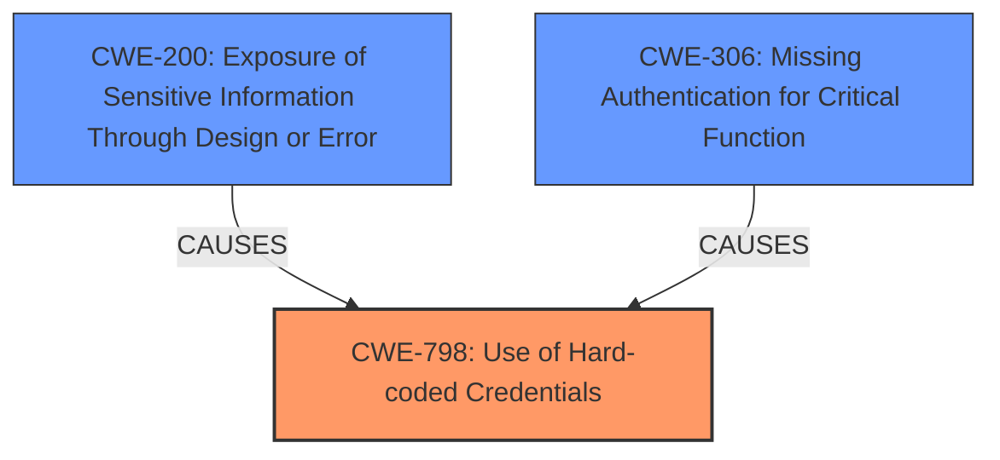

# Analysis for CVE-2024-13820

# Summary
| CWE ID | CWE Name | Confidence | CWE Abstraction Level | CWE Vulnerability Mapping Label | CWE-Vulnerability Mapping Notes |
|---|---|---|---|---|---|
| CWE-798 | Use of Hard-coded Credentials | 1.0 | Base | Allowed | Primary CWE. The root cause is the use of a hardcoded hash for authentication. |
| CWE-306 | Missing Authentication for Critical Function | 0.9 | Base | Allowed | Secondary CWE. The hardcoded hash bypasses any meaningful authentication mechanism. |
| CWE-200 | Exposure of Sensitive Information Through Design or Error | 0.8 | Class | Allowed-with-Review | Secondary CWE. The hardcoded hash allows attackers to extract sensitive information. |

## Evidence and Confidence

*   **Confidence Score:** 0.9
*   **Evidence Strength:** HIGH

## Relationship Analysis
The primary weakness is CWE-798, which is the root cause of the vulnerability. CWE-306 is also present since there is **missing authentication** that the **hardcoded credentials** are meant to provide. CWE-200 is the result of the **hardcoded credentials** being used and **missing authentication** which leads to exposure of sensitive information.

## Vulnerability Chain
1.  **Root Cause:** CWE-798 (**Use of Hard-coded Credentials**) - The application uses a hardcoded hash for authentication.
2.  **Prerequisite Weakness:** CWE-306 (**Missing Authentication for Critical Function**) - Since the application relies solely on the **hardcoded hash**, it lacks proper authentication mechanisms.
3.  **Impact:** CWE-200 (**Exposure of Sensitive Information Through Design or Error**) - Due to the **hardcoded credentials** and **missing authentication**, sensitive information is exposed to unauthenticated attackers.

## Summary of Analysis
The primary CWE is CWE-798 (**Use of Hard-coded Credentials**) because the **root cause** is the **hardcoded hash** used for authentication. This is supported by the "Vulnerability Description Key Phrases" which lists "**hardcoded hash**" as the **rootcause**. The "CVE Reference Links Content Summary" confirms the use of a hardcoded SHA512 hash for authentication. CWE-306 (**Missing Authentication for Critical Function**) is a contributing factor, as the application **lacks** proper authentication and relies on the **insecure** **hardcoded hash**. CWE-200 (**Exposure of Sensitive Information Through Design or Error**) is a consequence of the **hardcoded credentials** and **missing authentication**. The "CVE Reference Links Content Summary" confirms that the **hardcoded hash** allows unauthorized access to debugging functionality which exposes sensitive information.
The CWEs are at an appropriate level of specificity. CWE-798 is a Base CWE that accurately describes the use of **hardcoded credentials**. CWE-306 is a Base CWE that accurately describes the **lack** of proper authentication. CWE-200 is a Class CWE that accurately describes the resulting exposure of sensitive information.

Relevant CWE Information:

**CWE-798: Use of Hard-coded Credentials**
*   The vulnerability description states that the plugin uses a "**hardcoded hash**".
*   The "CVE Reference Links Content Summary" shows the code snippet where the hardcoded hash is used for authorization.
*   The "Retriever Results" list CWE-798 as a potential match.
*   Mapping Guidance: Usage: Allowed, Rationale: This CWE entry is at the Base level of abstraction, which is a preferred level of abstraction for mapping to the root causes of vulnerabilities.

**CWE-306: Missing Authentication for Critical Function**
*   The "CVE Reference Links Content Summary" states that the code **lacks** a robust authentication mechanism.
*   The "Retriever Results" list CWE-306 as a potential match.
*   Mapping Guidance: Usage: Allowed, Rationale: This CWE entry is at the Base level of abstraction, which is a preferred level of abstraction for mapping to the root causes of vulnerabilities.

**CWE-200: Exposure of Sensitive Information Through Design or Error**
*   The vulnerability description states that the vulnerability leads to "**Sensitive Information Exposure**".
*   The "CVE Reference Links Content Summary" states that an attacker can extract sensitive data including environment information, plugin tokens, shipping configurations, and limited vendor information.

**CWEs Considered But Not Used:**

*   CWE-259 (**Use of Hard-coded Password**) and CWE-321 (**Use of Hard-coded Cryptographic Key**): These are variants of CWE-798 but are more specific to passwords or cryptographic keys. The vulnerability uses a **hardcoded hash**, which is a broader category covered by CWE-798.
*   CWE-522 (**Insufficiently Protected Credentials**): This is a Class CWE and less specific than CWE-798, which directly addresses the use of **hardcoded credentials**.
*   CWE-863 (**Incorrect Authorization**) and CWE-862 (**Missing Authorization**): While authorization is related, the primary issue is the use of **hardcoded credentials** for authentication, making CWE-798 and CWE-306 more appropriate.
*   CWE-532 (**Insertion of Sensitive Information into Log File**): This CWE is not applicable because the sensitive information is not being inserted into a log file.
*   CWE-502 (**Deserialization of Untrusted Data**) and CWE-352 (**Cross-Site Request Forgery (CSRF)**): These CWEs are not relevant to the vulnerability description.