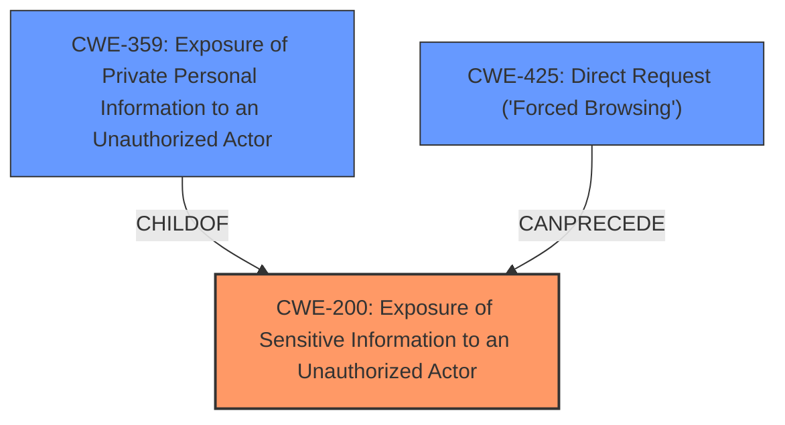

# Raw Analyzer Response for CVE-2024-13829

# Summary
| CWE ID  | CWE Name                                                        | Confidence | CWE Abstraction Level | CWE Vulnerability Mapping Label | CWE-Vulnerability Mapping Notes |
| :------- | :-------------------------------------------------------------- | :--------- | :-------------------- | :------------------------------ | :------------------------------ |
| CWE-200 | Exposure of Sensitive Information to an Unauthorized Actor   | 0.9        | Class                 | Primary                         | Discouraged                    |

## Evidence and Confidence

*   **Confidence Score:** 0.9
*   **Evidence Strength:** HIGH

## Relationship Analysis
The primary CWE selected is CWE-200 [Exposure of Sensitive Information to an Unauthorized Actor], which is a Class-level CWE. The retriever results suggested other CWEs, including those related to authorization and file uploads. However, the vulnerability description explicitly states that the issue is about **Sensitive Information Exposure** via the attachments.php file, making CWE-200 the most relevant. While more specific CWEs might exist, the available information is best captured by this general exposure category.

## Vulnerability Chain
The vulnerability chain starts with a **lack of proper access control** on the attachments.php file, leading to the **exposure of sensitive information**.

1.  **Missing or Incorrect Authorization:** (Implicit - not explicitly stated but inferred)
2.  **CWE-200 [Exposure of Sensitive Information to an Unauthorized Actor]**: Sensitive data, such as files uploaded via forms, is exposed to unauthenticated attackers.

## Summary of Analysis
The primary weakness is the **Sensitive Information Exposure** caused by a missing or broken access control, allowing unauthenticated attackers to extract sensitive data.

The analysis is primarily based on the vulnerability description, which clearly indicates that the issue is related to sensitive information exposure. The description mentions "unauthenticated attackers" being able to "extract sensitive data," supporting the selection of CWE-200 [Exposure of Sensitive Information to an Unauthorized Actor].

The retriever suggested a number of possible CWEs including:
*   CWE-352 [Cross-Site Request Forgery (CSRF)] - This is not relevant because the vulnerability description focuses on sensitive information exposure and unauthorized access to files, not CSRF attacks.
*   CWE-434 [Unrestricted Upload of File with Dangerous Type] - While file uploads are involved, the core issue is not the unrestricted upload of dangerous file types, but rather the exposure of uploaded files to unauthorized users.
*   CWE-306 [Missing Authentication for Critical Function] - Authentication is a potential contributing factor but the high level effect is **sensitive information exposure**.
*   CWE-862 [Missing Authorization] and CWE-425 [Direct Request ('Forced Browsing')] - These are related to authorization issues, which may be a contributing factor to the vulnerability. However, the direct result is the **exposure of sensitive information**, making CWE-200 a more direct fit.
*   CWE-359 [Exposure of Private Personal Information to an Unauthorized Actor] - This is a more specific type of information exposure. But the **Vulnerability Description** only talks about **Sensitive Information Exposure** and doesn't specify that it's personal.

The graph relationships also influenced the decision, as they highlight the potential connection between authorization-related CWEs and information exposure. However, the direct evidence from the vulnerability description points to CWE-200 [Exposure of Sensitive Information to an Unauthorized Actor] as the most appropriate classification.