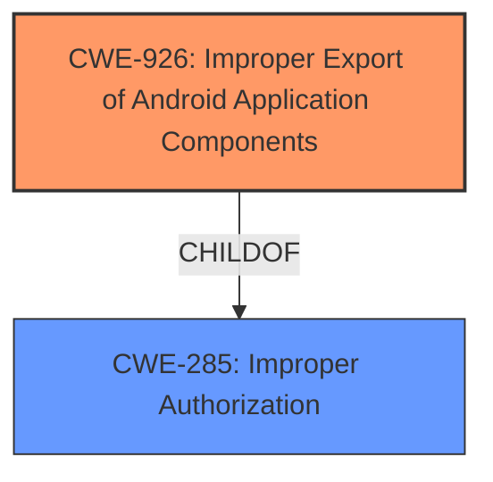

# Analysis for CVE-2024-13916

# Summary
| CWE ID | CWE Name | Confidence | CWE Abstraction Level | CWE Vulnerability Mapping Label | CWE-Vulnerability Mapping Notes |
|---|---|---|---|---|---|
| CWE-926 | Improper Export of Android Application Components | 0.9 | Variant | Allowed | Primary CWE |
| CWE-285 | Improper Authorization | 0.6 | Class | Discouraged | Secondary Candidate |

## Evidence and Confidence

*   **Confidence Score:** 0.75
*   **Evidence Strength:** MEDIUM

## Relationship Analysis
The primary relationship influencing the decision is the hierarchical relationship where CWE-926 is a child of CWE-285. CWE-926 specifically addresses the improper export of Android application components, which aligns more precisely with the vulnerability description compared to the more general CWE-285. Since CWE-926 is a variant and is more specific, it is preferred.

## Vulnerability Chain
The vulnerability chain starts with the **improper export of an Android application component** (CWE-926). This leads to **improper authorization** (CWE-285) where a malicious application can access sensitive information without proper permissions. The final impact is the exfiltration of the PIN code, which compromises the security of encrypted applications.
  - The **Primary CWE** is CWE-926 because it identifies the issue that led to the vulnerability i.e. the first in the "Vulnerability Chain"

## Summary of Analysis
The initial analysis focused on identifying the root cause of the vulnerability, which involves an application **allowing a user to encrypt any application** but failing to properly protect the content provider used to store the encryption PIN. The "CVE Reference Links Content Summary" indicates that the vulnerability involves the exposure of the “com.android.providers.settings.fingerprint.PriFpShareProvider” content provider's public method "query()”. The retriever results suggested several potential CWEs, including CWE-863 (Incorrect Authorization), CWE-285 (Improper Authorization), and CWE-926 (Improper Export of Android Application Components).

The final decision favored CWE-926 because it specifically addresses the **improper export of Android application components**, which directly aligns with the vulnerability description. The "CVE Reference Links Content Summary" states that a malicious application can exploit the exposed content provider to retrieve the PIN code, indicating that the application component was improperly exported.

CWE-285 was considered as a secondary candidate since the improper export leads to an authorization issue where the malicious application can access the PIN code without proper authorization. However, CWE-926 is more specific and better captures the root cause.

Relevant CWE Information:

# Enhanced Context (25 CWEs)
The following CWEs were identified as potentially relevant to this vulnerability:

## CWE-926: Improper Export of Android Application Components
**Abstraction Level**: variant
**Similarity Score**: 2.16
**Source**: graph

**Description**:
CWE-926: Improper Export of Android Application Components

**Mapping Guidance**:
- Usage: Allowed
- Rationale: This CWE entry is at the Variant level of abstraction, which is a preferred level of abstraction for mapping to the root causes of vulnerabilities.

**Relationships**:
- CHILDOF -> CWE-285
- PARENTOF -> CWE-926

## CWE-926: Improper Export of Android Application Components (Primary)
CWE-926 (Improper Export of Android Application Components) is the most appropriate CWE for this vulnerability because it directly addresses the root cause of the issue: the application's failure to properly restrict access to its content provider. This **allows a malicious application to bypass intended security measures and exfiltrate sensitive information**, namely the PIN code used for application encryption. The CWE description aligns perfectly with the vulnerability description, which states that the "com.android.providers.settings.fingerprint.PriFpShareProvider content providers public method query() allows any other malicious application, without any granted Android system permissions, to exfiltrate the PIN code." The security implication is significant, as it allows unauthorized access to sensitive data, and its abstraction level (Variant) is appropriate for the level of detail available in the description.
Confidence: 0.9

## CWE-285: Improper Authorization (Secondary)
CWE-285 (Improper Authorization) could be considered a secondary CWE, as the **improper export of the application component leads to an authorization failure**. The malicious application is able to access the PIN code without proper authorization checks. However, since the root cause is the improper export, CWE-926 is a more direct and accurate classification. The usage is discouraged but the relationships make it a secondary candidate.
Confidence: 0.6