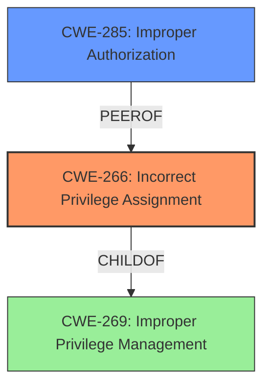

# Analysis Report for CVE-2024-1575

# Vulnerability Analysis Report: CVE-2024-1575

## Description

The **improper privilege management** vulnerability in the Zyxel WBE660S firmware version 6.70(ACGG.3) and earlier versions could allow an authenticated user to escalate privileges and download the configuration files on a vulnerable device.

## Vulnerability Description Key Phrases

- **Rootcause:** improper privilege management
- **Impact:** escalate privileges and download the configuration files
- **Attacker:** authenticated user
- **Product:** Zyxel WBE660S
- **Version:** 6.70(ACGG.3) and earlier versions

## Analysis (with Relationship Data)

# Summary
| CWE ID | CWE Name | Confidence | CWE Abstraction Level | CWE Vulnerability Mapping Label | CWE-Vulnerability Mapping Notes |
|---|---|---|---|---|---|
| CWE-266 | Incorrect Privilege Assignment | 0.9 | Base | Allowed | Primary CWE: The **improper privilege management** is the root cause. |
| CWE-285 | Improper Authorization | 0.6 | Class | Discouraged | Secondary Candidate: The product does not perform or incorrectly performs an authorization check when an actor attempts to access a resource or perform an action. |

## Evidence and Confidence

*   **Confidence Score:** 0.8
*   **Evidence Strength:** HIGH

## Relationship Analysis
The primary relationship that influenced the decision was the guidance provided on privileges vs. permissions. The vulnerability is about assigning the wrong privilege, which makes CWE-266 the best fit. CWE-285 was considered since it relates to authorization, but the root cause is more about the incorrect assignment of privileges than a flawed authorization check.



## Vulnerability Chain
The chain starts with **improper privilege management** (CWE-266) which leads to privilege escalation, allowing an authenticated user to download configuration files.
  - **CWE-266 (Incorrect Privilege Assignment)**: Root cause, the product incorrectly assigns a privilege to an authenticated user.
  - Privilege Escalation: The user gains higher privileges than intended.
  - Impact: Downloading configuration files, leading to potential information disclosure.

## Summary of Analysis
Based on the provided evidence and the CWE definitions, the initial assessment aligns well with the details of the vulnerability. The **root cause** is **improper privilege management**, specifically an **incorrect privilege assignment**. The "Vulnerability Description Key Phrases" section clearly identifies this. The CVE Reference Links Content Summary supports this by stating that the "Root cause of vulnerability" is "Improper privilege management". The retriever results also highlighted CWE-266 as a good candidate.

The analysis relies heavily on the provided evidence, especially the vulnerability description's key phrases and the CVE reference summary. The guidance on privileges vs permissions was also very helpful in selecting the most appropriate CWE.

CWE-266 is at the optimal level of specificity because it directly addresses the root cause. Other CWEs, such as CWE-269 (Improper Privilege Management) and CWE-285 (Improper Authorization), are more general and do not accurately reflect the specific weakness.

Relevant CWE Information:

# Enhanced Context (25 CWEs)
The following CWEs were identified as potentially relevant to this vulnerability:

## CWE-266: Incorrect Privilege Assignment
**Abstraction Level**: Base
**Similarity Score**: 0.79
**Source**: dense

**Description**:
A product incorrectly assigns a privilege to a particular actor, creating an unintended sphere of control for that actor.

**Mapping Guidance**:
- Usage: Allowed
- Rationale: This CWE entry is at the Base level of abstraction, which is a preferred level of abstraction for mapping to the root causes of vulnerabilities.

## CWE-285: Improper Authorization
**Abstraction Level**: Class
**Similarity Score**: 1402.73
**Source**: sparse

**Description**:
The product does not perform or incorrectly performs an authorization check when an actor attempts to access a resource or perform an action.

**Mapping Guidance**:
- Usage: Discouraged
- Rationale: CWE-285 is high-level and lower-level CWEs can frequently be used instead. It is a level-1 Class (i.e., a child of a Pillar).

### Detailed Analysis of Selected CWEs:

*   **CWE-266: Incorrect Privilege Assignment**
    *   **How it matches:** The vulnerability description explicitly states that the issue is related to **improper privilege management**, leading to privilege escalation. This aligns directly with CWE-266, where a product incorrectly assigns a privilege to an actor.
    *   **Security Implications:** Incorrect privilege assignment can lead to unauthorized access to sensitive resources and functionalities, potentially allowing an attacker to perform actions they are not intended to perform.
    *   **Relationships:** CWE-266 is a child of CWE-269 (Improper Privilege Management), providing a more specific classification.
    *   **MITRE Mapping Guidance:** The guidance suggests using CWE-266 when there's a misconfigured role, which is applicable here.
    *   **Primary Weakness:** This is the primary weakness as it's the root cause of the vulnerability.
*   **CWE-285: Improper Authorization**
    *   **How it matches:** The vulnerability allows an authenticated user to escalate privileges and download configuration files. This could be due to an **incorrect** or missing authorization check.
    *   **Security Implications:** An attacker can bypass authorization checks, leading to unauthorized access and privilege escalation.
    *   **Relationships:** CWE-285 is a Class-level CWE, and is related to access control issues.
    *   **MITRE Mapping Guidance:** The guidance suggests using more specific CWEs when possible, so CWE-266 is favored as the primary.
    *   **Secondary Weakness:** This is a secondary weakness that is a consequence of CWE-266.

### CWEs Considered but Not Used:

*   **CWE-269: Improper Privilege Management:** This is a more general class of weakness, and CWE-266 provides a more specific and accurate classification. Also the retriever results stated that this CWE is commonly misused.
*   **CWE-284: Improper Access Control:** This is a very general CWE and doesn't accurately reflect the specific issue of incorrect privilege assignment.
*   **CWE-732: Incorrect Permission Assignment for Critical Resource:** This CWE is more about incorrect permissions on resources, while this vulnerability is about incorrect privileges assigned to a user.


## CWE Relationship Analysis

Current CWEs represent these abstraction levels: .


### Vulnerability Chain Analysis

**Chain starting from CWE-732:**
- 732 (Incorrect Permission Assignment for Critical Resource) - ROOT


**Chain starting from CWE-269:**
- 269 (Improper Privilege Management) - ROOT


### CWE Relationship Diagram

```mermaid
graph TD
    classDef primary fill:#f96,stroke:#333,stroke-width:2px
    classDef secondary fill:#69f,stroke:#333
    classDef tertiary fill:#9e9,stroke:#333
```


*Report generated on 2025-07-13 04:46:52*
