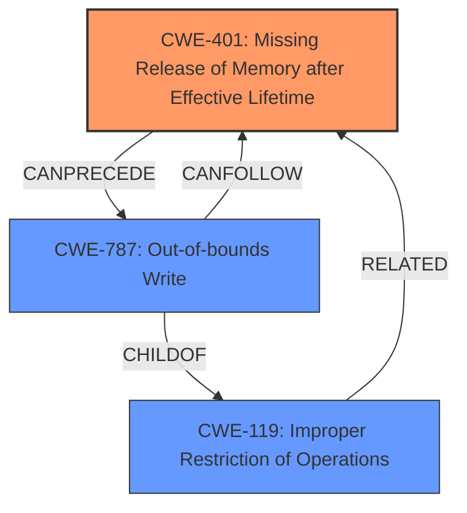

# Raw Analyzer Response for CVE-2024-20330

# Summary

| CWE ID | CWE Name | Confidence | CWE Abstraction Level | CWE Vulnerability Mapping Label | CWE-Vulnerability Mapping Notes |
|---|---|---|---|---|---|
| CWE-401 | Missing Release of Memory after Effective Lifetime | 0.85 | Variant | Allowed | Primary CWE |
| CWE-787 | Out-of-bounds Write | 0.75 | Base | Allowed | Secondary Candidate |

## Evidence and Confidence

*   **Confidence Score:** 0.80
*   **Evidence Strength:** MEDIUM

## Relationship Analysis
The primary relationship influencing the decision is the parent-child relationship between CWE-119 (Improper Restriction of Operations within the Bounds of a Memory Buffer) and its more specific children, such as CWE-787 (Out-of-bounds Write). While the description mentions **memory corruption**, the root cause is **improper memory management**, which leads to a memory leak (CWE-401). CWE-787 could be a consequence of the memory corruption, but the description focuses more on the **missing release** aspect and not the write itself.

## Vulnerability Chain
The vulnerability chain starts with **improper memory management** (CWE-401), which leads to **memory corruption**, and ultimately results in a denial-of-service (DoS) condition.
- **Root Cause:** CWE-401 (Missing Release of Memory after Effective Lifetime)
- **Weakness:** Memory corruption
- **Impact:** Denial of Service due to Snort engine restarts

## Summary of Analysis
The primary focus of the vulnerability is on **improper memory management** that causes memory corruption, leading to a DoS. While several CWEs were considered, the evidence strongly supports CWE-401 as the root cause, specifically the missing release aspect. CWE-787 is a possible consequence, but the initial problem is the failure to properly manage memory.

The analysis is primarily based on the provided vulnerability description and CVE reference. The key phrase "**improper memory management**" is a strong indicator. Additionally, the description notes that the memory corruption persists until the device is reloaded, suggesting a leak rather than a simple buffer overflow. The retriever results support the consideration of CWE-401 and CWE-787. The relationship graph shows how these CWEs can be related but highlights CWE-401 as the likely starting point.

CWE-400 (Uncontrolled Resource Consumption) was considered but not selected because the description explicitly points to memory management issues (leaking), rather than generalized resource consumption. CWE-119 (Improper Restriction of Operations within the Bounds of a Memory Buffer) is too general, and more specific CWEs like CWE-787 or CWE-401 are more appropriate.

**Relevant CWE Information:**

## Enhanced Context (25 CWEs)
The following CWEs were identified as potentially relevant to this vulnerability:

## CWE-755: Improper Handling of Exceptional Conditions
**Abstraction Level**: Class
**Similarity Score**: 0.75
**Source**: dense

**Description**:
The product does not handle or incorrectly handles an exceptional condition.

**Mapping Guidance**:
- Usage: Discouraged
- Rationale: This CWE entry is a level-1 Class (i.e., a child of a Pillar). It might have lower-level children that would be more appropriate

*Not selected*: There isn't sufficient evidence to support that the application failed to handle an exceptional condition.

## CWE-401: Missing Release of Memory after Effective Lifetime
**Abstraction Level**: Variant
**Similarity Score**: 0.74
**Source**: dense

**Description**:
The product does not sufficiently track and release allocated memory after it has been used, which slowly consumes remaining memory.

**Mapping Guidance**:
- Usage: Allowed
- Rationale: This CWE entry is at the Variant level of abstraction, which is a preferred level of abstraction for mapping to the root causes of vulnerabilities.

*Selected*: The **improper memory management** and the fact that the memory cannot be cleared without a reload of the appliance is solid evidence of a memory leak.

## CWE-824: Access of Uninitialized Pointer
**Abstraction Level**: Base
**Similarity Score**: 0.73
**Source**: dense

**Description**:
The product accesses or uses a pointer that has not been initialized.

**Mapping Guidance**:
- Usage: Allowed
- Rationale: This CWE entry is at the Base level of abstraction, which is a preferred level of abstraction for mapping to the root causes of vulnerabilities.

*Not selected*: There is no evidence to support an uninitialized pointer.

## CWE-119: Improper Restriction of Operations within the Bounds of a Memory Buffer
**Abstraction Level**: Class
**Similarity Score**: 0.73
**Source**: dense

**Description**:
The product performs operations on a memory buffer, but it reads from or writes to a memory location outside the buffer's intended boundary. This may result in read or write operations on unexpected memory locations that could be linked to other variables, data structures, or internal program data.

**Mapping Guidance**:
- Usage: Discouraged
- Rationale: CWE-119 is commonly misused in low-information vulnerability reports when lower-level CWEs could be used instead, or when more details about the vulnerability are available.

*Not selected*: Too generic.

## CWE-789: Memory Allocation with Excessive Size Value
**Abstraction Level**: Variant
**Similarity Score**: 0.73
**Source**: dense

**Description**:
The product allocates memory based on an untrusted, large size value, but it does not ensure that the size is within expected limits, allowing arbitrary amounts of memory to be allocated.

**Mapping Guidance**:
- Usage: Allowed
- Rationale: This CWE entry is at the Variant level of abstraction, which is a preferred level of abstraction for mapping to the root causes of vulnerabilities.

*Not selected*: There isn't sufficient evidence to support that the memory allocation had an excessive size.

## CWE-1285: Improper Validation of Specified Index, Position, or Offset in Input
**Abstraction Level**: Base
**Similarity Score**: 0.72
**Source**: dense

**Description**:
The product receives input that is expected to specify an index, position, or offset into an indexable resource such as a buffer or file, but it does not validate or incorrectly validates that the specified index/position/offset has the required properties.

**Mapping Guidance**:
- Usage: Allowed
- Rationale: This CWE entry is at the Base level of abstraction, which is a preferred level of abstraction for mapping to the root causes of vulnerabilities.

*Not selected*: There isn't evidence to support a specific index, position, or offset isn't validated.

## CWE-617: Reachable Assertion
**Abstraction Level**: Base
**Similarity Score**: 0.72
**Source**: dense

**Description**:
The product contains an assert() or similar statement that can be triggered by an attacker, which leads to an application exit or other behavior that is more severe than necessary.

**Mapping Guidance**:
- Usage: Allowed
- Rationale: This CWE entry is at the Base level of abstraction, which is a preferred level of abstraction for mapping to the root causes of vulnerabilities.

*Not selected*: There isn't sufficient evidence to support that the assert statement is reachable.

## CWE-696: Incorrect Behavior Order
**Abstraction Level**: Class
**Similarity Score**: 0.72
**Source**: dense

**Description**:
The product performs multiple related behaviors, but the behaviors are performed in the wrong order in ways which may produce resultant weaknesses.

**Mapping Guidance**:
- Usage: Allowed-with-Review
- Rationale: This CWE entry is a Class and might have Base-level children that would be more appropriate

*Not selected*: There isn't any indication of the incorrect order of steps.

## CWE-131: Incorrect Calculation of Buffer Size
**Abstraction Level**: Base
**Similarity Score**: 0.71
**Source**: dense

**Description**:
The product does not correctly calculate the size to be used when allocating a buffer, which could lead to a buffer overflow.

**Mapping Guidance**:
- Usage: Allowed
- Rationale: This CWE entry is at the Base level of abstraction, which is a preferred level of abstraction for mapping to the root causes of vulnerabilities.

*Not selected*: There is no indication of buffer size calculation issues.

## CWE-400: Uncontrolled Resource Consumption
**Abstraction