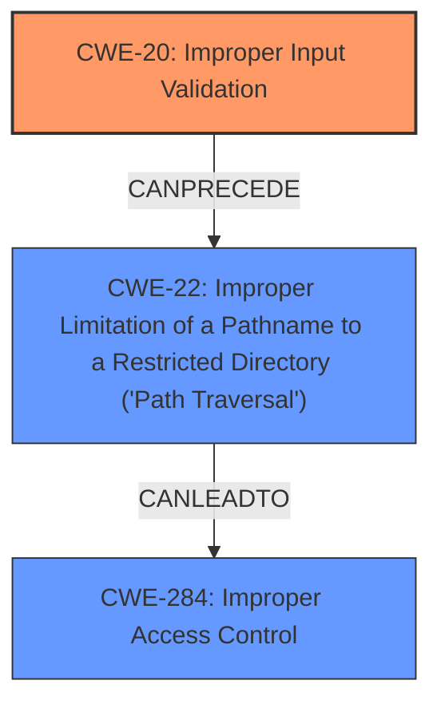

# Analysis for CVE-2024-20343

# Summary
| CWE ID | CWE Name | Confidence | CWE Abstraction Level | CWE Vulnerability Mapping Label | CWE-Vulnerability Mapping Notes |
|---|---|---|---|---|---|
| CWE-20 | Improper Input Validation | 0.9 | Class | Allowed | Primary CWE. The **incorrect validation of the arguments** is the root cause.|
| CWE-22 | Improper Limitation of a Pathname to a Restricted Directory ('Path Traversal') | 0.6 | Base | Allowed | Secondary Candidate. May occur if arguments are file paths. |
| CWE-284 | Improper Access Control | 0.5 | Pillar | Discouraged | Secondary Candidate. The **incorrect validation of the arguments** could lead to unauthorized access. |

## Evidence and Confidence

*   **Confidence Score:** 0.8
*   **Evidence Strength:** HIGH

## Relationship Analysis
The primary weakness is CWE-20 Improper Input Validation because the vulnerability description explicitly mentions **incorrect validation of the arguments** as the root cause. CWE-20 is a class-level CWE, and while it's generally better to choose a base or variant level CWE, in this case, the description doesn't provide sufficient detail to pinpoint a more specific type of input validation error. CWE-20 can precede CWE-22, meaning that if the input validation issue involves a file path, it could lead to a Path Traversal vulnerability. CWE-284 is a high-level Pillar, representing a general failure to restrict access to resources. While the vulnerability does result in unauthorized file access, it is a consequence of the input validation error (CWE-20).

## Vulnerability Chain
The vulnerability chain starts with the **incorrect validation of the arguments** (CWE-20). If the arguments are file paths, this could lead to a Path Traversal vulnerability (CWE-22), where an attacker can access files outside the intended directory. The final impact is **read any file**, which represents a form of Improper Access Control (CWE-284) because the attacker gains unauthorized access to the file system.

## Summary of Analysis
The primary CWE is CWE-20 (Improper Input Validation) because the vulnerability description states that the root cause is **incorrect validation of the arguments**. While CWE-284 (Improper Access Control) might seem applicable due to the attacker gaining unauthorized file access, it is a consequence of the input validation error, not the root cause. CWE-22 (Path Traversal) is a possibility if the **incorrect validation of the arguments** involves file paths.

The assessment is based on the provided evidence, specifically the "Vulnerability Description Key Phrases" section which highlights the "incorrect validation of the arguments" as the root cause.

Relevant CWE Information:

# Enhanced Context (25 CWEs)
The following CWEs were identified as potentially relevant to this vulnerability:

## CWE-755: Improper Handling of Exceptional Conditions
**Abstraction Level**: Class
**Similarity Score**: 0.74
**Source**: dense

**Description**:
The product does not handle or incorrectly handles an exceptional condition.

**Mapping Guidance**:
- Usage: Discouraged
- Rationale: This CWE entry is a level-1 Class (i.e., a child of a Pillar). It might have lower-level children that would be more appropriate

**Not Used:** The vulnerability description does not mention any issue related to exception handling.

## CWE-497: Exposure of Sensitive System Information to an Unauthorized Control Sphere
**Abstraction Level**: Base
**Similarity Score**: 0.74
**Source**: dense

**Description**:
The product does not properly prevent sensitive system-level information from being accessed by unauthorized actors who do not have the same level of access to the underlying system as the product does.

**Mapping Guidance**:
- Usage: Allowed
- Rationale: This CWE entry is at the Base level of abstraction, which is a preferred level of abstraction for mapping to the root causes of vulnerabilities.

**Not Used:** This is more of an impact than a root cause, and is covered by the selection of CWE-20 and CWE-284.

## CWE-269: Improper Privilege Management
**Abstraction Level**: Class
**Similarity Score**: 0.73
**Source**: dense

**Description**:
The product does not properly assign, modify, track, or check privileges for an actor, creating an unintended sphere of control for that actor.

**Mapping Guidance**:
- Usage: Discouraged
- Rationale: CWE-269 is commonly misused. It can be conflated with "privilege escalation," which is a technical impact that is listed in many low-information vulnerability reports [REF-1287]. It is not useful for trend analysis.

**Not Used:** While the attacker uses low-privileged credentials, the core issue isn't privilege management itself but rather the input validation.

## CWE-250: Execution with Unnecessary Privileges
**Abstraction Level**: Base
**Similarity Score**: 0.73
**Source**: dense

**Description**:
The product performs an operation at a privilege level that is higher than the minimum level required, which creates new weaknesses or amplifies the consequences of other weaknesses.

**Mapping Guidance**:
- Usage: Allowed
- Rationale: This CWE entry is at the Base level of abstraction, which is a preferred level of abstraction for mapping to the root causes of vulnerabilities.

**Not Used:** The issue isn't about executing with unnecessary privileges, but about **incorrect validation of the arguments**.

## CWE-303: Incorrect Implementation of Authentication Algorithm
**Abstraction Level**: Base
**Similarity Score**: 0.72
**Source**: dense

**Description**:
The requirements for the product dictate the use of an established authentication algorithm, but the implementation of the algorithm is incorrect.

**Mapping Guidance**:
- Usage: Allowed
- Rationale: This CWE entry is at the Base level of abstraction, which is a preferred level of abstraction for mapping to the root causes of vulnerabilities.

**Not Used:** The vulnerability is not related to the authentication algorithm.

## CWE-280: Improper Handling of Insufficient Permissions or Privileges
**Abstraction Level**: Base
**Similarity Score**: 0.72
**Source**: dense

**Description**:
The product does not handle or incorrectly handles when it has insufficient privileges to access resources or functionality as specified by their permissions. This may cause it to follow unexpected code paths that may leave the product in an invalid state.

**Mapping Guidance**:
- Usage: Allowed
- Rationale: This CWE entry is at the Base level of abstraction, which is a preferred level of abstraction for mapping to the root causes of vulnerabilities.

**Not Used:** The vulnerability is not due to insufficient privileges, but rather due to **incorrect validation of the arguments**.

## CWE-20: Improper Input Validation
**Abstraction Level**: Class
**Similarity Score**: 0.72
**Source**: dense

**Description**:
The product receives input or data, but it does
        not validate or incorrectly validates that the input has the
        properties that are required to process the data safely and
        correctly.

**Mapping Guidance**:
- Usage: Discouraged
- Rationale: CWE-20 is commonly misused in low-information vulnerability reports when lower-level CWEs could be used instead, or when more details about the vulnerability are available [REF-1287]. It is not useful for trend analysis. It is also a level-1 Class (i.e., a child of a Pillar).

**Used:** This is the Primary CWE as the **incorrect validation of the arguments** is the root cause of the vulnerability.

## CWE-754: Improper Check for Unusual or Exceptional Conditions
**Abstraction Level**: Class
**Similarity Score**: 0.72
**Source**: dense

**Description**:
The product does not check or incorrectly checks for unusual or exceptional conditions that are not expected to occur frequently during day to day operation of the product.

**Mapping Guidance**:
- Usage: Allowed-with-Review
- Rationale: This CWE entry is a Class and might have Base-level children that would be more appropriate

**Not Used:** The vulnerability is not directly related to checking unusual conditions.

## CWE-807: Reliance on Untrusted Inputs in a Security Decision
**Abstraction Level**: Base
**Similarity Score**: 0.72
**Source**: dense

**Description**:
The product uses a protection mechanism that relies on the existence or values of an input, but the input can be modified by an untrusted actor in a way that bypasses the protection mechanism.

**Mapping Guidance**:
- Usage: Allowed
- Rationale: This CWE entry