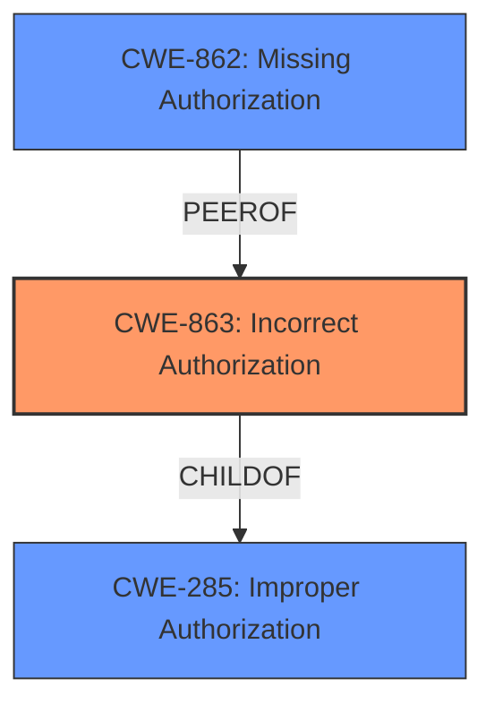

# Enhanced Analysis for CVE-2024-2035

# Summary
| CWE ID  | CWE Name                                                        | Confidence | CWE Abstraction Level | CWE Vulnerability Mapping Label | CWE-Vulnerability Mapping Notes |
| :-------- | :-------------------------------------------------------------- | :--------- | :---------------------- | :------------------------------ | :------------------------------ |
| CWE-863   | Incorrect Authorization                                         | 0.95       | Class                   | Primary CWE                     | Allowed-with-Review             |
| CWE-285   | Improper Authorization                                        | 0.70       | Class                   | Secondary Candidate             | Discouraged                     |
| CWE-862   | Missing Authorization                                         | 0.60       | Class                   | Secondary Candidate             | Allowed-with-Review             |

## Evidence and Confidence

*   **Confidence Score:** 0.90
*   **Evidence Strength:** HIGH

## Relationship Analysis
The primary CWE identified is CWE-863, **Incorrect Authorization**, as the vulnerability involves a flaw in the authorization logic that allows unauthorized users to modify other users' information. CWE-863 is a child of CWE-285, **Improper Authorization**, which is a more general class encompassing various authorization issues. CWE-862, **Missing Authorization**, is also related but less specific, as it describes cases where authorization checks are entirely absent. Choosing CWE-863 provides a more precise characterization of the vulnerability.



## Vulnerability Chain
The vulnerability chain starts with an **improper authorization** check (CWE-863) on the `API PUT /api/v1/users/id` endpoint. This leads to any authenticated user being able to modify other users' information. The impact of this is the ability to deactivate user accounts, including admin accounts, which can disrupt the security and functionality of the application.

## Summary of Analysis
The initial analysis identified an **improper authorization** issue in the `zenml-io/zenml` repository. The vulnerability allows any authenticated user to modify the information of other users via the `API PUT /api/v1/users/id` endpoint. This includes deactivating user accounts, even those of administrators.

The retriever results and the CWE specifications were then reviewed. The primary candidate was CWE-863, **Incorrect Authorization**, which aligns well with the vulnerability description. The vulnerability description states: "An **improper authorization** vulnerability exists in the zenml-io/zenml repository, specifically within the API PUT /api/v1/users/id endpoint. This vulnerability allows any authenticated user to modify the information of other users". The CWE guidance also suggests considering CWE-862 (Missing Authorization) or CWE-285 (Improper Authorization) as alternatives, but CWE-863 is more specific because it highlights that the authorization check exists but is flawed.

Therefore, the primary CWE assigned is CWE-863, with a confidence score of 0.95. This is a Class-level CWE, which, according to the guidance, should ideally be replaced by a Base-level CWE if one exists that is more appropriate. However, in this case, CWE-863 accurately describes the core issue of incorrect authorization logic.

CWE-285 is considered as a secondary candidate with a confidence of 0.70, as it's a broader category that encompasses the authorization flaw. CWE-862 is also considered as a secondary candidate with a confidence score of 0.60, but it's less accurate than CWE-863, as it describes the absence of an authorization check, which isn't the case here.

Relevant CWE Information:

# Enhanced Context (25 CWEs)
The following CWEs were identified as potentially relevant to this vulnerability:

## CWE-267: Privilege Defined With Unsafe Actions
**Abstraction Level**: Base
**Similarity Score**: 0.75
**Source**: dense

**Description**:
A particular privilege, role, capability, or right can be used to perform unsafe actions that were not intended, even when it is assigned to the correct entity.

**Mapping Guidance**:
- Usage: Allowed
- Rationale: This CWE entry is at the Base level of abstraction, which is a preferred level of abstraction for mapping to the root causes of vulnerabilities.

## CWE-639: Authorization Bypass Through User-Controlled Key
**Abstraction Level**: Base
**Similarity Score**: 0.75
**Source**: dense

**Description**:
The system's authorization functionality does not prevent one user from gaining access to another user's data or record by modifying the key value identifying the data.

**Mapping Guidance**:
- Usage: Allowed
- Rationale: This CWE entry is at the Base level of abstraction, which is a preferred level of abstraction for mapping to the root causes of vulnerabilities.

## CWE-1390: Weak Authentication
**Abstraction Level**: Class
**Similarity Score**: 0.74
**Source**: dense

**Description**:
The product uses an authentication mechanism to restrict access to specific users or identities, but the mechanism does not sufficiently prove that the claimed identity is correct.

**Mapping Guidance**:
- Usage: Allowed-with-Review
- Rationale: This CWE entry is a Class and might have Base-level children that would be more appropriate

## CWE-472: External Control of Assumed-Immutable Web Parameter
**Abstraction Level**: Base
**Similarity Score**: 0.74
**Source**: dense

**Description**:
The web application does not sufficiently verify inputs that are assumed to be immutable but are actually externally controllable, such as hidden form fields.

**Mapping Guidance**:
- Usage: Allowed
- Rationale: This CWE entry is at the Base level of abstraction, which is a preferred level of abstraction for mapping to the root causes of vulnerabilities.

## CWE-807: Reliance on Untrusted Inputs in a Security Decision
**Abstraction Level**: Base
**Similarity Score**: 0.74
**Source**: dense

**Description**:
The product uses a protection mechanism that relies on the existence or values of an input, but the input can be modified by an untrusted actor in a way that bypasses the protection mechanism.

**Mapping Guidance**:
- Usage: Allowed
- Rationale: This CWE entry is at the Base level of abstraction, which is a preferred level of abstraction for mapping to the root causes of vulnerabilities.

## CWE-303: Incorrect Implementation of Authentication Algorithm
**Abstraction Level**: Base
**Similarity Score**: 0.73
**Source**: dense

**Description**:
The requirements for the product dictate the use of an established authentication algorithm, but the implementation of the algorithm is incorrect.

**Mapping Guidance**:
- Usage: Allowed
- Rationale: This CWE entry is at the Base level of abstraction, which is a preferred level of abstraction for mapping to the root causes of vulnerabilities.

## CWE-266: Incorrect Privilege Assignment
**Abstraction Level**: Base
**Similarity Score**: 0.73
**Source**: dense

**Description**:
A product incorrectly assigns a privilege to a particular actor, creating an unintended sphere of control for that actor.

**Mapping Guidance**:
- Usage: Allowed
- Rationale: This CWE entry is at the Base level of abstraction, which is a preferred level of abstraction for mapping to the root causes of vulnerabilities.

## CWE-668: Exposure of Resource to Wrong Sphere
**Abstraction Level**: Class
**Similarity Score**: 0.73
**Source**: dense

**Description**:
The product exposes a resource to the wrong control sphere, providing unintended actors with inappropriate access to the resource.

**Mapping Guidance**:
- Usage: Discouraged
- Rationale: CWE-668 is high-level and is often misused as a catch-all when lower-level CWE IDs might be applicable. It is sometimes used for low-information vulnerability reports [REF-1287]. It is a level-1 Class (i.e., a child of a Pillar). It is not useful for trend analysis.

## CWE-204: Observable Response Discrepancy
**Abstraction Level**: Base
**Similarity Score**: 0.73
**Source**: dense

**Description**:
The product provides different responses to incoming requests in a way that reveals internal state information to an unauthorized actor outside of the intended control sphere.

**Mapping Guidance**:
- Usage: Allowed
- Rationale: This CWE entry is at the Base level of abstraction, which is a preferred level of abstraction for mapping to the root causes of vulnerabilities.

## CWE-74: Improper Neutralization of Special Elements in Output Used by a Downstream Component ('Injection')
**Abstraction Level**: Class
**Similarity Score**: 0.73
**Source**: dense


## CWE Relationship Analysis

Current CWEs represent these abstraction levels: .


### Vulnerability Chain Analysis

**Chain starting from CWE-1390:**
- 1390 (Weak Authentication) - ROOT


**Chain starting from CWE-863:**
- 863 (Incorrect Authorization) - ROOT


### CWE Relationship Diagram

```mermaid
graph TD
    classDef primary fill:#f96,stroke:#333,stroke-width:2px
    classDef secondary fill:#69f,stroke:#333
    classDef tertiary fill:#9e9,stroke:#333
```