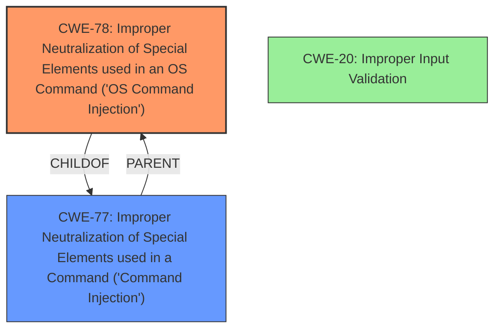

# Analysis Report for CVE-2024-20374

# Vulnerability Analysis Report: CVE-2024-20374

## Description

A vulnerability in the web-based management interface of Cisco Secure Firewall Management Center (FMC) Software, formerly Firepower Management Center Software, could allow an authenticated, remote attacker with Administrator-level privileges to execute arbitrary commands on the underlying operating system. This vulnerability is due to **insufficient input validation** of certain HTTP request parameters that are sent to the web-based management interface. An attacker could exploit this vulnerability by authenticating to the Cisco FMC web-based management interface and sending a crafted HTTP request to an affected device. A successful exploit could allow the attacker to execute commands as the root user on the affected device. To exploit this vulnerability, an attacker would need Administrator-level credentials.

## Vulnerability Description Key Phrases

- **Rootcause:** insufficient input validation
- **Weakness:** command injection
- **Impact:** execute arbitrary commands on the underlying operating system
- **Vector:** crafted HTTP request
- **Attacker:** authenticated remote attacker with Administrator-level privileges
- **Product:** Cisco Secure Firewall Management Center (FMC) Software
- **Component:** web-based management interface

## Analysis (with Relationship Data)

# Summary
| CWE ID | CWE Name | Confidence | CWE Abstraction Level | CWE Vulnerability Mapping Label | CWE-Vulnerability Mapping Notes |
|---|---|---|---|---|---|
| CWE-78 | Improper Neutralization of Special Elements used in an OS Command ('OS Command Injection') | 1.0 | Base | Primary | Allowed |
| CWE-20 | Improper Input Validation | 0.7 | Class | Secondary | Discouraged |

## Evidence and Confidence

*   **Confidence Score:** 0.9
*   **Evidence Strength:** HIGH

## Relationship Analysis
The primary relationship influencing the decision is the parent-child relationship between CWE-77 (Command Injection) and CWE-78 (OS Command Injection), with CWE-78 being a more specific case of CWE-77. The vulnerability involves the execution of operating system commands, making CWE-78 the more appropriate choice. CWE-20 is a general input validation issue which is a higher level abstraction than CWE-78.



## Vulnerability Chain
The vulnerability chain starts with **insufficient input validation** (CWE-20), which leads to **command injection** (CWE-78), ultimately allowing an attacker to execute arbitrary commands on the underlying operating system.

## Summary of Analysis
The initial assessment identified **insufficient input validation** as a key factor. The Retriever Results and vulnerability description point towards command injection as the root cause. The relationships between CWEs, particularly the parent-child relationship between CWE-77 and CWE-78, support the selection of CWE-78 as the primary weakness. The evidence includes the "Vulnerability Description Key Phrases" that points to "**insufficient input validation**" as the root cause and "**command injection**" as a weakness, with the impact being "execute arbitrary commands on the underlying operating system". The "CVE Reference Links Content Summary" reinforces this by stating, "Insufficient input validation of certain HTTP request parameters sent to the web-based management interface of Cisco Secure Firewall Management Center (FMC) Software" and confirming the presence of "Command Injection."

The selection of CWE-78 is at the optimal level of specificity because the vulnerability description explicitly mentions the ability to execute arbitrary commands on the *operating system*, making it more specific than a general command injection (CWE-77).

Relevant CWE Information:

# Enhanced Context (25 CWEs)
The following CWEs were identified as potentially relevant to this vulnerability:

## CWE-78: Improper Neutralization of Special Elements used in an OS Command ('OS Command Injection')
**Abstraction Level**: base
**Similarity Score**: 4.33
**Source**: graph

**Description**:
CWE-78: Improper Neutralization of Special Elements used in an OS Command ('OS Command Injection')

**Mapping Guidance**:
- Usage: Allowed
- Rationale: This CWE entry is at the Base level of abstraction, which is a preferred level of abstraction for mapping to the root causes of vulnerabilities.

**Relationships**:
- CANFOLLOW -> CWE-184
- CANALSOBE -> CWE-88
- CHILDOF -> CWE-77
- CHILDOF -> CWE-77
- CHILDOF -> CWE-74

## CWE-20: Improper Input Validation
**Abstraction Level**: Class
**Similarity Score**: 1732.31
**Source**: sparse

**Description**:
The product receives input or data, but it does
        not validate or incorrectly validates that the input has the
        properties that are required to process the data safely and
        correctly.

**Mapping Guidance**:
- Usage: Discouraged
- Rationale: CWE-20 is commonly misused in low-information vulnerability reports when lower-level CWEs could be used instead, or when more details about the vulnerability are available [REF-1287]. It is not useful for trend analysis. It is also a level-1 Class (i.e., a child of a Pillar).

### Detailed Analysis

#### CWE-78: Improper Neutralization of Special Elements used in an OS Command ('OS Command Injection')
*   **Explanation:** This CWE describes a vulnerability where an attacker can inject operating system commands through improper neutralization of special elements. In this case, the vulnerability allows an authenticated attacker to execute arbitrary commands on the underlying operating system due to **insufficient input validation**.
*   **Match:** The vulnerability aligns perfectly with CWE-78, as the attacker can inject commands that are then executed by the OS. The "CVE Reference Links Content Summary" notes "**Weakness/vulnerabilities present**: Command Injection." and "**Impact of exploitation**: Successful exploitation allows an attacker to execute arbitrary commands as the *root* user on the affected device."
*   **Security Implications:** This can lead to complete system compromise, as the attacker can execute commands as the root user.
*   **Relationships:** CWE-78 is a child of CWE-77 (Improper Neutralization of Special Elements used in a Command) and CWE-74 (Improper Neutralization of Special Elements in Output Used by a Downstream Component ('Injection')).
*   **Primary/Secondary:** This is the primary CWE because it represents the direct cause of the vulnerability.
*   **Mapping Guidance:** The usage is "Allowed," and it is at the Base level of abstraction.

#### CWE-20: Improper Input Validation
*   **Explanation:** This CWE describes a vulnerability where the product does not validate or incorrectly validates input, leading to exploitable weaknesses.
*   **Match:** The vulnerability description indicates "**insufficient input validation** of certain HTTP request parameters" as the root cause.
*   **Security Implications:** Improper input validation can lead to various vulnerabilities, including command injection, cross-site scripting, and buffer overflows.
*   **Relationships:** CWE-20 is a class-level CWE and a parent of many more specific input validation errors.
*   **Primary/Secondary:** This is a secondary CWE because it is a more general description of the root cause, while CWE-78 is the specific type of vulnerability that results from the **improper input validation**.
*   **Mapping Guidance:** The usage is "Discouraged" because it is too high-level. However, it is included as a contributing factor.

#### Other CWEs Considered and Rejected

*   **CWE-77:** While related to command injection, CWE-78 is more specific to OS command injection, making it a better fit.
*   **CWE-269 (Improper Privilege Management):** The provided privilege guidance indicates that this is related to an actor's identity level whereas the vulnerability is related to input validation.
*   **CWE-284 (Improper Access Control):** This is a very high-level CWE and doesn't accurately reflect the specific vulnerability.
*   **CWE-94 (Improper Control of Generation of Code ('Code Injection')):** The vulnerability description doesn't describe the dynamic generation of code, but rather command execution through input manipulation.


## CWE Relationship Analysis

Current CWEs represent these abstraction levels: .


### Vulnerability Chain Analysis

**Chain starting from CWE-94:**
- 94 (Improper Control of Generation of Code ('Code Injection')) - ROOT


**Chain starting from CWE-88:**
- 88 (Improper Neutralization of Argument Delimiters in a Command ('Argument Injection')) - ROOT


### CWE Relationship Diagram

```mermaid
graph TD
    classDef primary fill:#f96,stroke:#333,stroke-width:2px
    classDef secondary fill:#69f,stroke:#333
    classDef tertiary fill:#9e9,stroke:#333
```


*Report generated on 2025-07-13 04:57:41*
