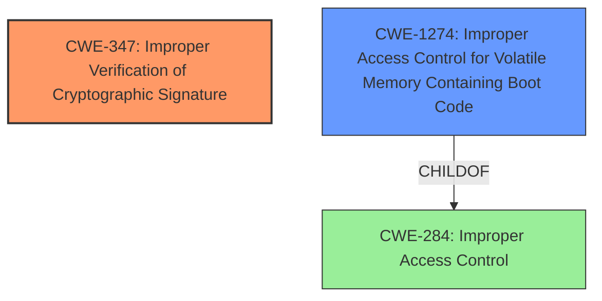

# Enhanced Analysis for CVE-2024-20397

# Summary
| CWE ID | CWE Name | Confidence | CWE Abstraction Level | CWE Vulnerability Mapping Label | CWE-Vulnerability Mapping Notes |
|---|---|---|---|---|---|
| CWE-347 | Improper Verification of Cryptographic Signature | 0.9 | Base | Allowed | Primary CWE.  The vulnerability stems from the bootloader failing to properly verify the cryptographic signature of the NX-OS image, which is a direct match for this CWE. |
| CWE-1274 | Improper Access Control for Volatile Memory Containing Boot Code | 0.6 | Base | Allowed | Secondary candidate.  This CWE is related as the bootloader is in volatile memory and access to it is not properly controlled. |

## Evidence and Confidence

*   **Confidence Score:** 0.8
*   **Evidence Strength:** HIGH

## Relationship Analysis
The primary relationship that influenced the decision was the direct match between the vulnerability description and **CWE-347 (Improper Verification of Cryptographic Signature)**. This CWE's focus on signature verification aligns directly with the described vulnerability where the bootloader **fails to properly verify the NX-OS image signature**. **CWE-1274 (Improper Access Control for Volatile Memory Containing Boot Code)** is a child of **CWE-284 (Improper Access Control)**, representing a broader category. While the bootloader exists in volatile memory, the core issue is signature verification, making **CWE-347 (Improper Verification of Cryptographic Signature)** a more precise fit.



## Vulnerability Chain
The vulnerability chain starts with **insecure bootloader settings**, leading to **improper verification of the NX-OS image signature (CWE-347)**. This allows an attacker to **bypass the signature verification** and **load unverified software**, which ultimately compromises the device's integrity.

## Summary of Analysis
The primary CWE selection, **CWE-347 (Improper Verification of Cryptographic Signature)**, is strongly supported by the vulnerability description, which explicitly states that the vulnerability is due to **insecure bootloader settings** that allow an attacker to **bypass NX-OS image signature verification and load unverified software**. The CVE reference links confirm this, stating the **root cause** is **insecure bootloader settings** and a **lack of proper image signature verification**. This direct alignment makes **CWE-347 (Improper Verification of Cryptographic Signature)** the most appropriate choice. While other CWEs like **CWE-284 (Improper Access Control)** and **CWE-20 (Improper Input Validation)** were considered, they represent broader categories and are less specific than **CWE-347 (Improper Verification of Cryptographic Signature)**. **CWE-347 (Improper Verification of Cryptographic Signature)** is at the Base level of abstraction, which is preferred.

Relevant CWE Information:
# Enhanced Context (25 CWEs)
The following CWEs were identified as potentially relevant to this vulnerability:

## CWE-345: Insufficient Verification of Data Authenticity
**Abstraction Level**: Class
**Similarity Score**: 0.78
**Source**: dense

**Description**:
The product does not sufficiently verify the origin or authenticity of data, in a way that causes it to accept invalid data.

**Mapping Guidance**:
- Usage: Discouraged
- Rationale: This CWE entry is a level-1 Class (i.e., a child of a Pillar). It might have lower-level children that would be more appropriate

This was considered but rejected. While related, **CWE-347 (Improper Verification of Cryptographic Signature)** is more specific to the cryptographic nature of the signature verification failure.

## CWE-755: Improper Handling of Exceptional Conditions
**Abstraction Level**: Class
**Similarity Score**: 0.77
**Source**: dense

**Description**:
The product does not handle or incorrectly handles an exceptional condition.

**Mapping Guidance**:
- Usage: Discouraged
- Rationale: This CWE entry is a level-1 Class (i.e., a child of a Pillar). It might have lower-level children that would be more appropriate

This was considered but rejected. This is too generic for the **rootcause**.

## CWE-497: Exposure of Sensitive System Information to an Unauthorized Control Sphere
**Abstraction Level**: Base
**Similarity Score**: 0.76
**Source**: dense

**Description**:
The product does not properly prevent sensitive system-level information from being accessed by unauthorized actors who do not have the same level of access to the underlying system as the product does.

**Mapping Guidance**:
- Usage: Allowed
- Rationale: This CWE entry is at the Base level of abstraction, which is a preferred level of abstraction for mapping to the root causes of vulnerabilities.

This was considered but rejected. This is not a data exposure issue.

## CWE-1391: Use of Weak Credentials
**Abstraction Level**: Class
**Similarity Score**: 0.76
**Source**: dense

**Description**:
The product uses weak credentials (such as a default key or hard-coded password) that can be calculated, derived, reused, or guessed by an attacker.

**Mapping Guidance**:
- Usage: Allowed-with-Review
- Rationale: This CWE entry is a Class and might have Base-level children that would be more appropriate

This was considered but rejected. The description does not suggest weak credentials are used.

## CWE-203: Observable Discrepancy
**Abstraction Level**: Base
**Similarity Score**: 0.76
**Source**: dense

**Description**:
The product behaves differently or sends different responses under different circumstances in a way that is observable to an unauthorized actor, which exposes security-relevant information about the state of the product, such as whether a particular operation was successful or not.

**Mapping Guidance**:
- Usage: Allowed
- Rationale: This CWE entry is at the Base level of abstraction, which is a preferred level of abstraction for mapping to the root causes of vulnerabilities.

This was considered but rejected. This is not related to the vulnerability.

## CWE-703: Improper Check or Handling of Exceptional Conditions
**Abstraction Level**: Pillar
**Similarity Score**: 0.76
**Source**: dense

**Description**:
The product does not properly anticipate or handle exceptional conditions that rarely occur during normal operation of the product.

**Mapping Guidance**:
- Usage: Discouraged
- Rationale: This CWE entry is extremely high-level, a Pillar.

This was considered but rejected. This is too generic for the **rootcause**.

## CWE-303: Incorrect Implementation of Authentication Algorithm
**Abstraction Level**: Base
**Similarity Score**: 0.76
**Source**: dense

**Description**:
The requirements for the product dictate the use of an established authentication algorithm, but the implementation of the algorithm is incorrect.

**Mapping Guidance**:
- Usage: Allowed
- Rationale: This CWE entry is at the Base level of abstraction, which is a preferred level of abstraction for mapping to the root causes of vulnerabilities.

This was considered but rejected. The advisory doesn't suggest there's an incorrect implementation of an authentication algorithm, but rather that the bootloader settings are **insecure**.

## CWE-280: Improper Handling of Insufficient Permissions or Privileges
**Abstraction Level**: Base
**Similarity Score**: 0.76
**Source**: dense

**Description**:
The product does not handle or incorrectly handles when it has insufficient privileges to access resources or functionality as specified by their permissions. This may cause it to follow unexpected code paths that may leave the product in an invalid state.

**Mapping Guidance**:
- Usage: Allowed
- Rationale: This CWE entry is at the Base level of abstraction, which is a preferred level of abstraction for mapping to the root causes of vulnerabilities.

This was considered but rejected. The advisory does not suggest a privilege issue.

## CWE-807: Reliance on Untrusted Inputs in a Security Decision
**Abstraction Level**: Base
**Similarity Score**: 0.75
**Source**: dense

**Description**:
The product uses a protection mechanism that relies on the existence or values of an input, but the input can be modified by an untrusted actor in a way that bypasses the protection mechanism.

**Mapping Guidance**:
- Usage: Allowed
- Rationale: This CWE entry is at the Base level of abstraction, which is a preferred level of abstraction for mapping to the root causes of vulnerabilities.

This was considered but rejected. This does not apply.

## CWE-20: Improper Input Validation
**Abstraction Level**: Class
**Similarity Score**: 2792.84


## CWE Relationship Analysis

Current CWEs represent these abstraction levels: .


### Vulnerability Chain Analysis

**Chain starting from CWE-1391:**
- 1391 (Use of Weak Credentials) - ROOT


**Chain starting from CWE-280:**
- 280 (Improper Handling of Insufficient Permissions or Privileges ) - ROOT


### CWE Relationship Diagram

```mermaid
graph TD
    classDef primary fill:#f96,stroke:#333,stroke-width:2px
    classDef secondary fill:#69f,stroke:#333
    classDef tertiary fill:#9e9,stroke:#333
```