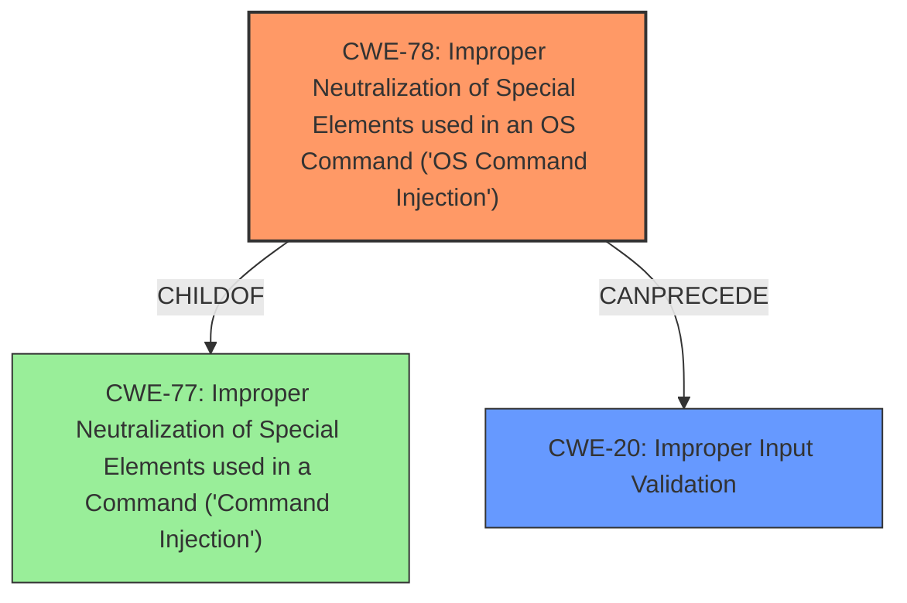

# Analysis Report for CVE-2024-20418

# Vulnerability Analysis Report: CVE-2024-20418

## Description

A vulnerability in the web-based management interface of Cisco Unified Industrial Wireless Software for Cisco Ultra-Reliable Wireless Backhaul (URWB) Access Points could allow an unauthenticated, remote attacker to perform **command injection** attacks with root privileges on the underlying operating system. This vulnerability is due to improper validation of input to the web-based management interface. An attacker could exploit this vulnerability by sending crafted HTTP requests to the web-based management interface of an affected system. A successful exploit could allow the attacker to execute arbitrary commands with root privileges on the underlying operating system of the affected device.

## Vulnerability Description Key Phrases

- **Rootcause:** improper input validation
- **Weakness:** command injection
- **Impact:** ['arbitrary command execution', 'execute arbitrary commands']
- **Vector:** crafted HTTP requests
- **Attacker:** unauthenticated remote attacker
- **Product:** Cisco Unified Industrial Wireless Software
- **Component:** web-based management interface

## Analysis (with Relationship Data)

# Summary
| CWE ID  | CWE Name                                                                        | Confidence | CWE Abstraction Level | CWE Vulnerability Mapping Label | CWE-Vulnerability Mapping Notes |
| :-------- | :------------------------------------------------------------------------------ | :--------- | :---------------------- | :------------------------------ | :------------------------------ |
| CWE-78  | Improper Neutralization of Special Elements used in an OS Command ('OS Command Injection') | 1.0        | Base                    | Primary                         | Allowed                         |
| CWE-20  | Improper Input Validation                                                          | 0.8        | Class                  | Secondary                       | Discouraged                    |

## Evidence and Confidence

*   **Confidence Score:** 0.9
*   **Evidence Strength:** HIGH

## Relationship Analysis
The primary relationship that influenced the decision was the parent-child relationship between CWE-77 and CWE-78. CWE-78 is a specific type of CWE-77, focusing on OS commands. Since the vulnerability description explicitly mentions command injection with root privileges on the underlying operating system, CWE-78 was chosen as the more specific and appropriate classification. CWE-20 is a parent of CWE-78, representing the **improper input validation** that leads to the command injection.



## Vulnerability Chain
The vulnerability chain starts with **improper input validation** (CWE-20), which allows for **command injection** (CWE-78). The successful exploitation leads to arbitrary command execution with root privileges, resulting in a full system compromise.

CWE-20 (Improper Input Validation) -> CWE-78 (OS Command Injection) -> Arbitrary Command Execution (Impact)

## Summary of Analysis
The initial analysis strongly pointed towards **command injection** due to the vulnerability description and CVE summary explicitly stating it. The key phrase "improper validation of input" clearly indicates the root cause.

The selection of CWE-78 is based on the direct evidence from the vulnerability description and CVE summary, which points to **command injection** on the underlying operating system. CWE-78 is a more specific case of command injection than CWE-77, making it the optimal choice. The relationship graph shows that CWE-78 is a child of CWE-77, meaning it is a more specific type of command injection, making it more appropriate. The **improper input validation** (CWE-20) is the cause that precedes the **command injection**.

Relevant CWE Information:

# Enhanced Context (25 CWEs)
The following CWEs were identified as potentially relevant to this vulnerability:

## CWE-280: Improper Handling of Insufficient Permissions or Privileges 
**Abstraction Level**: Base
**Similarity Score**: 0.79
**Source**: dense

**Description**:
The product does not handle or incorrectly handles when it has insufficient privileges to access resources or functionality as specified by their permissions. This may cause it to follow unexpected code paths that may leave the product in an invalid state.
**NOT USED:** This CWE focuses on insufficient privileges, but the vulnerability leads to *gaining* root privileges, so it's not applicable.

## CWE-41: Improper Resolution of Path Equivalence
**Abstraction Level**: Base
**Similarity Score**: 0.79
**Source**: dense

**Description**:
The product is vulnerable to file system contents disclosure through path equivalence. Path equivalence involves the use of special characters in file and directory names. The associated manipulations are intended to generate multiple names for the same object.
**NOT USED:** This vulnerability is not related to path equivalence or file system disclosure.

## CWE-807: Reliance on Untrusted Inputs in a Security Decision
**Abstraction Level**: Base
**Similarity Score**: 0.78
**Source**: dense

**Description**:
The product uses a protection mechanism that relies on the existence or values of an input, but the input can be modified by an untrusted actor in a way that bypasses the protection mechanism.
**NOT USED:** While untrusted input is involved, the core issue is the **improper neutralization** of that input in an OS command, making CWE-78 more accurate.

## CWE-267: Privilege Defined With Unsafe Actions
**Abstraction Level**: Base
**Similarity Score**: 0.78
**Source**: dense

**Description**:
A particular privilege, role, capability, or right can be used to perform unsafe actions that were not intended, even when it is assigned to the correct entity.
**NOT USED:** This CWE does not directly apply because the vulnerability's focus is on **command injection** due to **improper input validation**, rather than misuse of defined privileges.

## CWE-266: Incorrect Privilege Assignment
**Abstraction Level**: Base
**Similarity Score**: 0.78
**Source**: dense

**Description**:
A product incorrectly assigns a privilege to a particular actor, creating an unintended sphere of control for that actor.
**NOT USED:** This CWE is not relevant because the vulnerability does not involve incorrect privilege assignment. Instead, the attacker gains privileges via **command injection**.

## CWE-497: Exposure of Sensitive System Information to an Unauthorized Control Sphere
**Abstraction Level**: Base
**Similarity Score**: 0.78
**Source**: dense

**Description**:
The product does not properly prevent sensitive system-level information from being accessed by unauthorized actors who do not have the same level of access to the underlying system as the product does.
**NOT USED:** This CWE is not the primary issue. While sensitive information might be accessed as a consequence, the root cause is the **command injection**.

## CWE-274: Improper Handling of Insufficient Privileges
**Abstraction Level**: Base
**Similarity Score**: 0.78
**Source**: dense

**Description**:
The product does not handle or incorrectly handles when it has insufficient privileges to perform an operation, leading to resultant weaknesses.
**NOT USED:** In this case, the attacker *gains* privileges, so this CWE doesn't apply.

## CWE-668: Exposure of Resource to Wrong Sphere
**Abstraction Level**: Class
**Similarity Score**: 0.78
**Source**: dense

**Description**:
The product exposes a resource to the wrong control sphere, providing unintended actors with inappropriate access to the resource.
**NOT USED:** This is a high-level CWE, and CWE-78 provides a more specific description of the vulnerability.

## CWE-74: Improper Neutralization of Special Elements in Output Used by a Downstream Component ('Injection')
**Abstraction Level**: Class
**Similarity Score**: 0.77
**Source**: dense

**Description**:
The product constructs all or part of a command, data structure, or record using externally-influenced input from an upstream component, but it does not neutralize or incorrectly neutralizes special elements that could modify how it is parsed or interpreted when it is sent to a downstream component.
**NOT USED:** While related to injection, CWE-78 is more specific to OS command injection.

## CWE-73: External Control of File Name or Path
**Abstraction Level**: Base
**Similarity Score**: 0.77
**Source**: dense

**Description**:
The product allows user input to control or influence paths or file names that are used in filesystem operations.
**NOT USED:** The vulnerability is about **command injection**, not file path manipulation.

## CWE-269: Improper Privilege Management
**Abstraction Level**: Class
**Similarity Score**: 2279.69
**Source**: sparse

**Description**:
The product does not properly assign, modify, track, or check privileges for an actor, creating an unintended sphere of control for that actor.
**NOT USED:** This CWE is not the primary issue. The attacker gains privileges through **command injection**, not through a flaw in privilege management.

## CWE-20: Improper Input Validation
**Abstraction Level**: Class
**Similarity Score**: 2229.39
**Source**: sparse

**Description**:
The product receives input or data, but it does
        not validate or incorrectly validates that the input has the
        properties that are required to process the data safely and
        correctly.
**USED:** The vulnerability description explicitly mentions **improper input validation** as the root cause. While CWE-78 is the primary weakness, CWE-20 represents the underlying cause.

## CWE-22: Improper Limitation of a Pathname to a Restricted Directory ('Path Traversal')
**Abstraction Level**: Base
**Similarity Score**: 2224.08
**Source**: sparse

**Description**:
The product uses external input to construct a pathname that is intended to identify a file or directory


## CWE Relationship Analysis

Current CWEs represent these abstraction levels: .


### Vulnerability Chain Analysis

**Chain starting from CWE-274:**
- 274 (Improper Handling of Insufficient Privileges) - ROOT


**Chain starting from CWE-280:**
- 280 (Improper Handling of Insufficient Permissions or Privileges ) - ROOT


### CWE Relationship Diagram

```mermaid
graph TD
    classDef primary fill:#f96,stroke:#333,stroke-width:2px
    classDef secondary fill:#69f,stroke:#333
    classDef tertiary fill:#9e9,stroke:#333
```


*Report generated on 2025-07-13 05:01:00*
