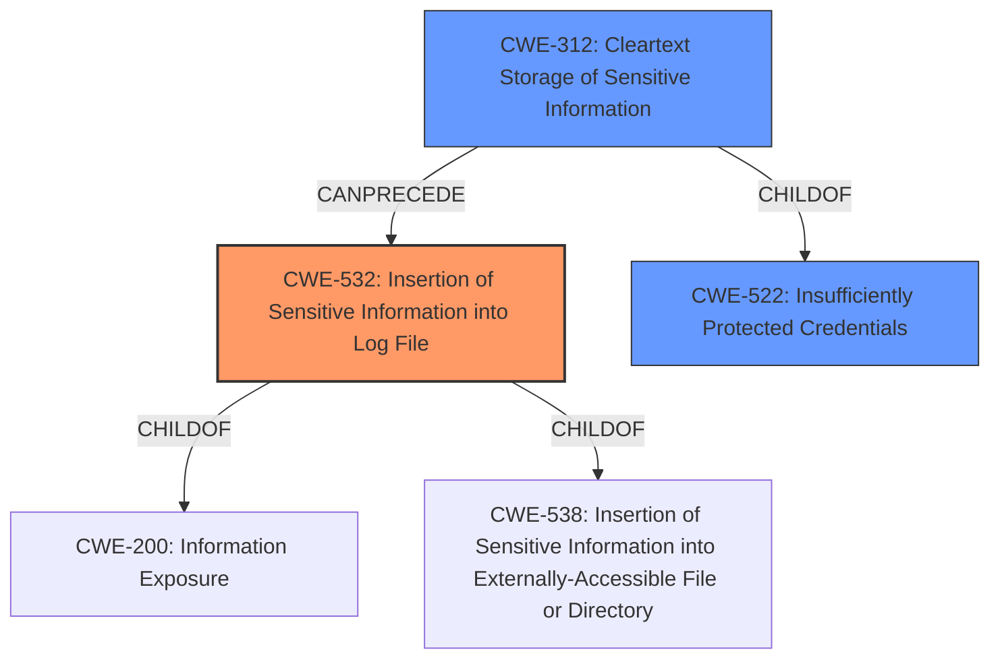

# Enhanced Analysis for CVE-2024-20457

# Summary
| CWE ID  | CWE Name                                                        | Confidence | CWE Abstraction Level | CWE Vulnerability Mapping Label | CWE-Vulnerability Mapping Notes |
| :-------- | :-------------------------------------------------------------- | :--------- | :-------------------- | :------------------------------ | :------------------------------ |
| CWE-532   | Insertion of Sensitive Information into Log File             | 1          | Base                  | Primary                         | Allowed                         |
| CWE-312   | Cleartext Storage of Sensitive Information                    | 0.9        | Base                  | Secondary                       | Allowed                         |
| CWE-522   | Insufficiently Protected Credentials                          | 0.7        | Class                 | Secondary                       | Allowed-with-Review             |

## Evidence and Confidence

*   **Confidence Score:** 0.9
*   **Evidence Strength:** HIGH

## Relationship Analysis
The primary CWE is CWE-532, which is the **insertion of sensitive information into a log file**. This is directly caused by **storing unencrypted credentials**, which is represented by CWE-312. CWE-532 is related to CWE-522, **insufficiently protected credentials**, as storing sensitive information in logs can be seen as a form of insufficient protection. The relationships are hierarchical, moving from a more general class (CWE-522) to more specific base weaknesses (CWE-312 and CWE-532).



## Vulnerability Chain
The vulnerability chain begins with the **storage of unencrypted credentials** (CWE-312). This leads to the **insertion of sensitive information into log files** (CWE-532). The impact is the potential **disclosure of sensitive information** when an attacker gains access to the logs.

## Summary of Analysis
The vulnerability is caused by the **storage of unencrypted credentials in log files**. The primary weakness is CWE-532, as the vulnerability description and CVE summary highlight the logging aspect. The retriever results also support this, with CWE-532 having the highest score. CWE-312 is a contributing factor, representing the root cause of storing credentials in cleartext. CWE-522 is a broader classification that encompasses the insufficient protection of credentials, but the more specific CWE-312 and CWE-532 are more accurate.

Evidence:
- Vulnerability Description Key Phrases: "**storage of unencrypted credentials in certain logs**"
- CVE Reference Links Content Summary: "The vulnerability is due to the storage of unencrypted credentials within certain logs" and "Sensitive information, specifically credentials, are stored in clear text in logs, which should be encrypted."

I considered other CWEs such as CWE-256 (Plaintext Storage of a Password) and CWE-311 (Missing Encryption of Sensitive Data). CWE-256 is similar to CWE-312 but focuses specifically on passwords, whereas the vulnerability description mentions credentials in general. CWE-311 is too high-level. Therefore, CWE-312 is a better fit.

CWE-778 (Insufficient Logging) was considered but not chosen as the primary CWE because the core issue is not the lack of logging, but the logging of sensitive information in cleartext.

The final selection provides the most specific and accurate representation of the vulnerability, focusing on the logging of sensitive information without encryption.

Relevant CWE Information:

**CWE-532: Insertion of Sensitive Information into Log File**
The product writes sensitive information to a log file.

**CWE-312: Cleartext Storage of Sensitive Information**
The product stores sensitive information in cleartext within a resource that might be accessible to another control sphere.

**CWE-522: Insufficiently Protected Credentials**
The product transmits or stores authentication credentials, but it uses an insecure method that is susceptible to unauthorized interception and/or retrieval.


## CWE Relationship Analysis

Current CWEs represent these abstraction levels: .


### Vulnerability Chain Analysis

**Chain starting from CWE-538:**
- 538 (Insertion of Sensitive Information into Externally-Accessible File or Directory) - ROOT


**Chain starting from CWE-256:**
- 256 (Plaintext Storage of a Password) - ROOT


### CWE Relationship Diagram

```mermaid
graph TD
    classDef primary fill:#f96,stroke:#333,stroke-width:2px
    classDef secondary fill:#69f,stroke:#333
    classDef tertiary fill:#9e9,stroke:#333
```