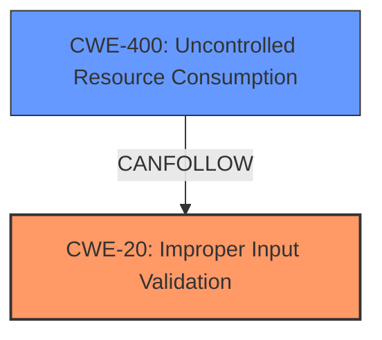

# Raw Analyzer Response for CVE-2024-20484

# Summary
| CWE ID | CWE Name | Confidence | CWE Abstraction Level | CWE Vulnerability Mapping Label | CWE-Vulnerability Mapping Notes |
|---|---|---|---|---|---|
| CWE-20 ([CWE-20: Improper Input Validation](https://cwe.mitre.org/data/definitions/20.html)) | Improper Input Validation | 0.9 | Class | Allowed-with-Review | The vulnerability is due to **insufficient validation of Media Routing Peripheral Interface Manager (MR PIM) traffic** that is received by an affected device. This matches the description of CWE-20 ([CWE-20: Improper Input Validation](https://cwe.mitre.org/data/definitions/20.html)). Although CWE-20 ([CWE-20: Improper Input Validation](https://cwe.mitre.org/data/definitions/20.html)) is discouraged, the retriever results rank it as the top candidate. Further investigation may reveal more specific CWEs. |
| CWE-400 ([CWE-400: Uncontrolled Resource Consumption](https://cwe.mitre.org/data/definitions/400.html)) | Uncontrolled Resource Consumption | 0.7 | Class | Discouraged | A successful exploit could allow the attacker to trigger a failure on the MR PIM connection between Cisco ECE and Cisco Unified Contact Center Enterprise (CCE), leading to a DoS condition on EAAS that would prevent customers from starting chat, callback, or delayed callback sessions. This can lead to resource exhaustion, however the **root cause** is the **Improper Input Validation** rather than resource consumption |

## Evidence and Confidence

*   **Confidence Score:** 0.8
*   **Evidence Strength:** HIGH

## Relationship Analysis
The primary weakness is CWE-20 ([CWE-20: Improper Input Validation](https://cwe.mitre.org/data/definitions/20.html)), which is a class-level CWE. While it is discouraged to use class-level CWEs, it accurately reflects the **root cause** of the vulnerability described. CWE-400 ([CWE-400: Uncontrolled Resource Consumption](https://cwe.mitre.org/data/definitions/400.html)) is an impact of the vulnerability but not the root cause.

## Vulnerability Chain
The vulnerability chain starts with **insufficient validation of MR PIM traffic** (CWE-20 ([CWE-20: Improper Input Validation](https://cwe.mitre.org/data/definitions/20.html))) leading to a denial-of-service condition (CWE-400 ([CWE-400: Uncontrolled Resource Consumption](https://cwe.mitre.org/data/definitions/400.html))).

## Summary of Analysis
The initial analysis identified the **root cause** as **insufficient validation of Media Routing Peripheral Interface Manager traffic**. The retriever results suggested CWE-20 ([CWE-20: Improper Input Validation](https://cwe.mitre.org/data/definitions/20.html)) as the top candidate, which aligns with the description of the vulnerability. The relationship analysis showed that CWE-400 ([CWE-400: Uncontrolled Resource Consumption](https://cwe.mitre.org/data/definitions/400.html)) is a consequence of the **improper input validation**, but the **root cause** is the **missing validation**.

The selected CWEs are at the appropriate level of specificity based on the available evidence. While more specific CWEs might exist, the current information points towards CWE-20 ([CWE-20: Improper Input Validation](https://cwe.mitre.org/data/definitions/20.html)) as the most accurate representation of the **root cause**.

Other CWEs Considered:

*   CWE-119 ([CWE-119: Improper Restriction of Operations within the Bounds of a Memory Buffer](https://cwe.mitre.org/data/definitions/119.html)): This CWE is related to memory buffer issues, which are not explicitly mentioned in the vulnerability description. The vulnerability focuses on **insufficient validation of input**, not necessarily memory operations.
*   CWE-401 ([CWE-401: Missing Release of Memory after Effective Lifetime](https://cwe.mitre.org/data/definitions/401.html)): This CWE is related to memory leaks, which are not mentioned in the vulnerability description. The vulnerability focuses on **insufficient validation of input**.
*   CWE-799 ([CWE-799: Improper Control of Interaction Frequency](https://cwe.mitre.org/data/definitions/799.html)): This CWE is related to controlling the frequency of interactions, which is not the primary issue in this vulnerability. The main issue is the **lack of input validation**.
*   CWE-755 ([CWE-755: Improper Handling of Exceptional Conditions](https://cwe.mitre.org/data/definitions/755.html)): While the DoS could be considered an exceptional condition, the **root cause** is the **improper input validation** and not the handling of the exception.
*   CWE-410 ([CWE-410: Insufficient Resource Pool](https://cwe.mitre.org/data/definitions/410.html)): The description indicates a DoS, but the **root cause** isn't related to the size of the resource pool, it is related to the **lack of validation**.
*   CWE-770 ([CWE-770: Allocation of Resources Without Limits or Throttling](https://cwe.mitre.org/data/definitions/770.html)): This is similar to CWE-400 ([CWE-400: Uncontrolled Resource Consumption](https://cwe.mitre.org/data/definitions/400.html)) in that it could be an impact.