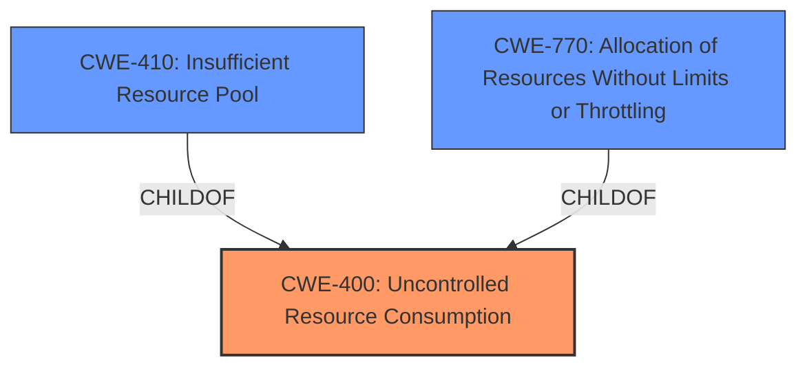

# Raw Analyzer Response for CVE-2024-20500

# Summary
| CWE ID | CWE Name | Confidence | CWE Abstraction Level | CWE Vulnerability Mapping Label | CWE-Vulnerability Mapping Notes |
|---|---|---|---|---|---|
| **CWE-400** | Uncontrolled Resource Consumption | 0.9 | Class | Primary CWE | Discouraged, but selected due to strong evidence and similarity to the description. |
| CWE-410 | Insufficient Resource Pool | 0.7 | Base | Secondary Candidate | Allowed, but CWE-400 is a more direct match. |
| CWE-770 | Allocation of Resources Without Limits or Throttling | 0.6 | Base | Secondary Candidate | Allowed, but less specific than CWE-400. |

## Evidence and Confidence

*   **Confidence Score:** 0.9
*   **Evidence Strength:** HIGH

## Relationship Analysis
The primary relationship influencing the decision is that CWE-400 is a Class-level CWE, while CWE-410 and CWE-770 are Base-level CWEs. While Base-level CWEs are generally preferred, the vulnerability description's emphasis on **insufficient resource management** and the resulting DoS aligns more closely with the broader scope of CWE-400. The retriever results also ranked CWE-400 as the top candidate.

## Vulnerability Chain
The vulnerability chain starts with **insufficient resource management when establishing TLS/SSL sessions** (CWE-400). This leads to the AnyConnect VPN server being unable to accept new connections, resulting in a denial-of-service (DoS) condition.

## Summary of Analysis
The initial analysis, based on the vulnerability description and CVE reference links, strongly suggests CWE-400 (Uncontrolled Resource Consumption) as the primary CWE. The description highlights **insufficient resource management** as the root cause, which directly aligns with CWE-400's definition: "The product does not properly control the allocation and maintenance of a limited resource, thereby enabling an actor to influence the amount of resources consumed, eventually leading to the exhaustion of available resources."

The CVE reference links content summary further reinforces this by stating: "Root Cause: Insufficient resource management when establishing TLS/SSL sessions."

While CWE-400 is a Class-level CWE and the guidance discourages its use when more specific CWEs are available, in this case, the evidence points to a broad resource management issue rather than a specific type of resource exhaustion (like memory exhaustion). CWE-410 (Insufficient Resource Pool) and CWE-770 (Allocation of Resources Without Limits or Throttling) were considered, but they represent more specific scenarios than what is described in the vulnerability. The vulnerability description lacks information to suggest whether the pool size is insufficient (CWE-410) or whether there are no limits on resource allocation (CWE-770).

Therefore, despite the discouraged usage, CWE-400 is the most appropriate CWE due to the strong match with the vulnerability description and the root cause identified in the CVE reference links.

Relevant CWE Information:

# Enhanced Context (25 CWEs)
The following CWEs were identified as potentially relevant to this vulnerability:

## CWE-755: Improper Handling of Exceptional Conditions
**Abstraction Level**: Class
**Similarity Score**: 0.72
**Source**: dense

**Description**:
The product does not handle or incorrectly handles an exceptional condition.

**Mapping Guidance**:
- Usage: Discouraged
- Rationale: This CWE entry is a level-1 Class (i.e., a child of a Pillar). It might have lower-level children that would be more appropriate

*Not selected* because the vulnerability is not about exceptional conditions, but about resource management.

## CWE-410: Insufficient Resource Pool
**Abstraction Level**: Base
**Similarity Score**: 0.72
**Source**: dense

**Description**:
The product's resource pool is not large enough to handle peak demand, which allows an attacker to prevent others from accessing the resource by using a (relatively) large number of requests for resources.

**Mapping Guidance**:
- Usage: Allowed
- Rationale: This CWE entry is at the Base level of abstraction, which is a preferred level of abstraction for mapping to the root causes of vulnerabilities.

*Considered but not selected* because the description focuses on **insufficient resource management** rather than explicitly stating that the resource pool is too small.

## CWE-400: Uncontrolled Resource Consumption
**Abstraction Level**: Class
**Similarity Score**: 0.71
**Source**: dense

**Description**:
The product does not properly control the allocation and maintenance of a limited resource, thereby enabling an actor to influence the amount of resources consumed, eventually leading to the exhaustion of available resources.

**Mapping Guidance**:
- Usage: Discouraged
- Rationale: CWE-400 is intended for incorrect behaviors in which the product is expected to track and restrict how many resources it consumes, but CWE-400 is often misused because it is conflated with the "technical impact" of vulnerabilities in which resource consumption occurs. It is sometimes used for low-information vulnerability reports. It is a level-1 Class (i.e., a child of a Pillar).

*Selected* because the vulnerability involves **insufficient resource management when establishing TLS/SSL sessions**, leading to a denial-of-service condition. The description aligns directly with CWE-400.

## CWE-303: Incorrect Implementation of Authentication Algorithm
**Abstraction Level**: Base
**Similarity Score**: 0.71
**Source**: dense

**Description**:
The requirements for the product dictate the use of an established authentication algorithm, but the implementation of the algorithm is incorrect.

**Mapping Guidance**:
- Usage: Allowed
- Rationale: This CWE entry is at the Base level of abstraction, which is a preferred level of abstraction for mapping to the root causes of vulnerabilities.

*Not selected* because the vulnerability is not related to the implementation of an authentication algorithm.

## CWE-696: Incorrect Behavior Order
**Abstraction Level**: Class
**Similarity Score**: 0.70
**Source**: dense

**Description**:
The product performs multiple related behaviors, but the behaviors are performed in the wrong order in ways which may produce resultant weaknesses.

**Mapping Guidance**:
- Usage: Allowed-with-Review
- Rationale: This CWE entry is a Class and might have Base-level children that would be more appropriate

*Not selected* because the vulnerability is not about incorrect behavior order.

## CWE-497: Exposure of Sensitive System Information to an Unauthorized Control Sphere
**Abstraction Level**: Base
**Similarity Score**: 0.70
**Source**: dense

**Description**:
The product does not properly prevent sensitive system-level information from being accessed by unauthorized actors who do not have the same level of access to the underlying system as the product does.

**Mapping Guidance**:
- Usage: Allowed
- Rationale: This CWE entry is at the Base level of abstraction, which is a preferred level of abstraction for mapping to the root causes of vulnerabilities.

*Not selected* because the vulnerability is not about information exposure.

## CWE-290: Authentication Bypass by Spoofing
**Abstraction Level**: Base
**Similarity Score**: 0.70
**Source**: dense

**Description**:
This attack-focused weakness is caused by incorrectly implemented authentication schemes that are subject to spoofing attacks.

**Mapping Guidance**:
- Usage: Allowed
- Rationale: This CWE entry is at the Base level of abstraction, which is a preferred level of abstraction for mapping to the root causes of vulnerabilities.

*Not selected* because the vulnerability is not about authentication bypass.

## CWE-346: Origin Validation Error
**Abstraction Level**: Class
**Similarity Score**: 0.70
**Source**: dense

**Description**:
The product does not properly verify that the source of data or communication is valid.

**Mapping Guidance**:
- Usage: Allowed-with-Review
- Rationale: This CWE entry is a Class and might have Base-level children that would be more appropriate

*Not selected* because the vulnerability is not about origin validation.

## CWE-941: Incorrectly Specified Destination in a Communication Channel
**Abstraction Level**: Base
**Similarity Score**: 0.70
**Source**: dense

**Description**:
The product creates a communication channel to initiate an outgoing request to an actor, but it does not correctly specify the intended destination for that actor.

**Mapping Guidance**:
- Usage: Allowed
- Rationale: This CWE entry is at the Base level of abstraction, which is a preferred level of abstraction for mapping to the root