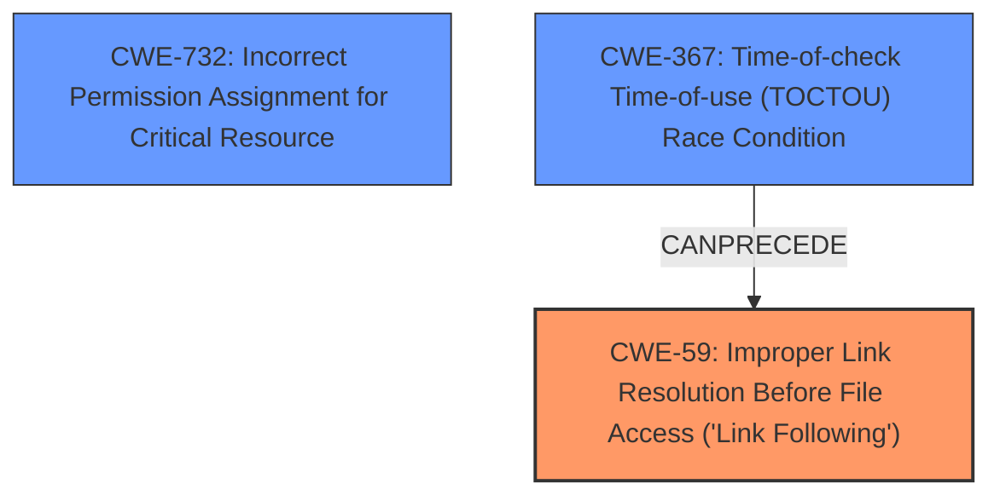

# Analysis Report for CVE-2024-20506

# Vulnerability Analysis Report: CVE-2024-20506

## Description

A vulnerability in the ClamD service module of Clam AntiVirus (ClamAV) versions 1.4.0, 1.3.2 and prior versions, all 1.2.x versions, 1.0.6 and prior versions, all 0.105.x versions, all 0.104.x versions, and 0.103.11 and all prior versions could allow an authenticated, local attacker to corrupt critical system files. The vulnerability is due to allowing the ClamD process to write to its log file while privileged without checking if the logfile has been replaced with a symbolic link. An attacker could exploit this vulnerability if they replace the ClamD log file with a symlink to a critical system file and then find a way to restart the ClamD process. An exploit could allow the attacker to corrupt a critical system file by appending ClamD log messages after restart.

## Vulnerability Description Key Phrases

- **Weakness:** improper file permissions
- **Impact:** corrupt critical system files
- **Vector:** symbolic link attack
- **Attacker:** authenticated local attacker
- **Product:** Clam AntiVirus
- **Version:** multiple versions
- **Component:** ClamD service module

## Analysis (with Relationship Data)

# Summary
| CWE ID | CWE Name | Confidence | CWE Abstraction Level | CWE Vulnerability Mapping Label | CWE-Vulnerability Mapping Notes |
|---|---|---|---|---|---|
| CWE-59 | Improper Link Resolution Before File Access ('Link Following') | 0.9 | Base | Allowed | Primary CWE.  The core issue is the failure to properly handle symlinks when writing to the log file. |
| CWE-732 | Incorrect Permission Assignment for Critical Resource | 0.7 | Class | Allowed-with-Review | Secondary candidate. The vulnerability involves an **improper file permission** because the log file can be replaced with a symbolic link. |
| CWE-367 | Time-of-check Time-of-use (TOCTOU) Race Condition | 0.6 | Base | Allowed | Secondary candidate.  There is a race condition because the symlink is created before the ClamD process restarts. |

## Evidence and Confidence

*   **Confidence Score:** 0.8
*   **Evidence Strength:** MEDIUM

## Relationship Analysis
The primary weakness is CWE-59, which describes the **improper handling of symlinks**. CWE-732 is a related class, but CWE-59 is more specific to the symlink issue. CWE-367 describes a race condition, which is present here because of the timing of the symlink creation and the restart of the process. CWE-367 can precede CWE-59.



## Vulnerability Chain
1.  Attacker replaces the ClamD log file with a symlink.
2.  ClamD process restarts.
3.  ClamD process writes to the log file, which is now a symlink to a critical system file (CWE-59).
4.  Critical system file is corrupted.

The root cause is the **improper handling of symlinks** (CWE-59).

## Summary of Analysis
The primary vulnerability is the **improper handling of symlinks** in the ClamD logging module, which allows an attacker to corrupt critical system files. This matches CWE-59.

The evidence is based on these facts from the vulnerability description:
*   "The vulnerability is due to allowing the ClamD process to write to its log file while privileged without checking if the logfile has been replaced with a symbolic link."
*   "An attacker could exploit this vulnerability if they replace the ClamD log file with a symlink to a critical system file and then find a way to restart the ClamD process."
*   "An exploit could allow the attacker to corrupt a critical system file by appending ClamD log messages after restart."
*   "Root cause of vulnerability: The logging module in ClamAV was following symlinks on Linux and Unix systems."
*   "Weaknesses/vulnerabilities present: Improper handling of symlinks in the logging module."

CWE-732 is considered because the vulnerability involves an **improper file permission** because the log file can be replaced with a symbolic link. However, CWE-59 is a better fit because it more specifically describes the symlink issue.

CWE-367 is considered because there is a race condition involved. The attacker has to replace the log file with a symlink before the ClamD process restarts.

I am confident in this assessment because it is based on the vulnerability description and the CVE reference links content summary.

Relevant CWE Information:

# Enhanced Context (25 CWEs)
The following CWEs were identified as potentially relevant to this vulnerability:

## CWE-59: Improper Link Resolution Before File Access ('Link Following')
**Abstraction Level**: Base
**Similarity Score**: 0.80
**Source**: dense

**Description**:
The product attempts to access a file based on the filename, but it does not properly prevent that filename from identifying a link or shortcut that resolves to an unintended resource.

**Mapping Guidance**:
- Usage: Allowed
- Rationale: This CWE entry is at the Base level of abstraction, which is a preferred level of abstraction for mapping to the root causes of vulnerabilities.


## CWE Relationship Analysis

Current CWEs represent these abstraction levels: .


### Vulnerability Chain Analysis

**Chain starting from CWE-59:**
- 59 (Improper Link Resolution Before File Access ('Link Following')) - ROOT


**Chain starting from CWE-367:**
- 367 (Time-of-check Time-of-use (TOCTOU) Race Condition) - ROOT


### CWE Relationship Diagram

```mermaid
graph TD
    classDef primary fill:#f96,stroke:#333,stroke-width:2px
    classDef secondary fill:#69f,stroke:#333
    classDef tertiary fill:#9e9,stroke:#333
```


*Report generated on 2025-07-13 05:08:46*
