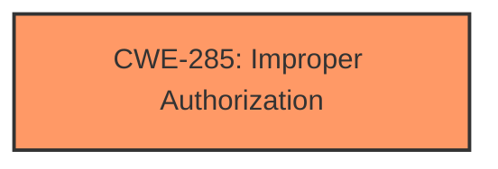

# Enhanced Analysis for CVE-2024-20875

# Summary
| CWE ID | CWE Name | Confidence | CWE Abstraction Level | CWE Vulnerability Mapping Label | CWE-Vulnerability Mapping Notes |
|---|---|---|---|---|---|
| CWE-285 | Improper Authorization | 1.0 | Class | Allowed | Primary CWE |

## Evidence and Confidence

*   **Confidence Score:** 1.0
*   **Evidence Strength:** HIGH

## Relationship Analysis
The primary CWE selected is CWE-285 Improper Authorization, which is a class level CWE. There are several child CWEs that could be more specific, but the information provided does not give enough evidence to select one of the children.



## Vulnerability Chain
The vulnerability chain is as follows:
1.  The root cause is **Improper caller verification** (CWE-285).
2.  This leads to the impact of local attackers being able to access arbitrary files.

## Summary of Analysis
The vulnerability description clearly states that there is **improper caller verification** in SemClipboard which allows local attackers to access arbitrary files. The CVE Reference Links Content Summary confirms that the root cause of the vulnerability is "Improper caller verification in SemClipboard" and the impact of exploitation is "Local attackers can access arbitrary files".

Based on this information, the most appropriate CWE is CWE-285, Improper Authorization. This CWE describes a situation where the product does not perform or incorrectly performs an authorization check when an actor attempts to access a resource or perform an action. In this case, SemClipboard is not properly verifying the caller, which allows local attackers to access arbitrary files.

CWE-285 is a Class-level CWE, and the mapping guidance discourages its use when lower-level CWEs are applicable. However, the provided information does not give enough detail to determine which specific type of authorization is missing or incorrect. Therefore, CWE-285 is the most appropriate choice at this time.

Other CWEs Considered:

*   CWE-287 (Improper Authentication): Authentication is about verifying the identity of a user, while authorization is about determining what a user is allowed to do. The vulnerability description focuses on the **improper verification** of the caller, which aligns more closely with authorization than authentication.
*   CWE-284 (Improper Access Control): This is a parent of CWE-285, so it is less specific.
*   CWE-22 (Improper Limitation of a Pathname to a Restricted Directory ('Path Traversal')): This CWE is related to path traversal vulnerabilities, where an attacker can access files outside of the intended directory. While the impact of this vulnerability is that attackers can access arbitrary files, the root cause is **improper caller verification**, not a path traversal issue.
*   CWE-347 (Improper Verification of Cryptographic Signature): This CWE is specific to cryptographic signatures, which are not mentioned in the vulnerability description.
*   CWE-926 (Improper Export of Android Application Components) and CWE-927 (Use of Implicit Intent for Sensitive Communication): These CWEs are specific to Android applications. The vulnerability description does not specify that SemClipboard is an Android application, so these CWEs are not appropriate.
*   CWE-367 (Time-of-check Time-of-use (TOCTOU) Race Condition): This CWE is about race conditions, which are not mentioned in the vulnerability description.
*   CWE-648 (Incorrect Use of Privileged APIs): This CWE could be applicable if the **improper caller verification** relates to the incorrect use of privileged APIs. However, without more information, CWE-285 is a more direct fit.
*   CWE-269 (Improper Privilege Management): This CWE is about assigning, modifying, enabling, or disabling privileges. The vulnerability description focuses on **improper verification**, not privilege management.


## CWE Relationship Analysis

Current CWEs represent these abstraction levels: .


### Vulnerability Chain Analysis

**Chain starting from CWE-22:**
- 22 (Improper Limitation of a Pathname to a Restricted Directory ('Path Traversal')) - ROOT


**Chain starting from CWE-926:**
- 926 (Improper Export of Android Application Components) - ROOT


### CWE Relationship Diagram

```mermaid
graph TD
    classDef primary fill:#f96,stroke:#333,stroke-width:2px
    classDef secondary fill:#69f,stroke:#333
    classDef tertiary fill:#9e9,stroke:#333
```