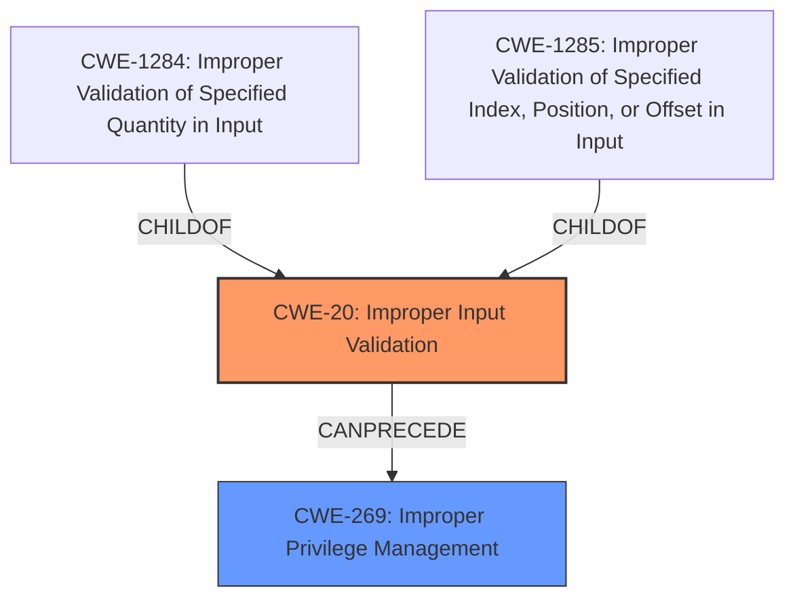

# Analysis for CVE-2024-20881

# Summary
| CWE ID | CWE Name | Confidence | CWE Abstraction Level | CWE Vulnerability Mapping Label | CWE-Vulnerability Mapping Notes |
|---|---|---|---|---|---|
| CWE-20 | Improper Input Validation | 1.0 | Class | Primary | Allowed |
| CWE-269 | Improper Privilege Management | 0.7 | Class | Secondary | Allowed |

## Evidence and Confidence

*   **Confidence Score:** 0.9
*   **Evidence Strength:** HIGH

## Relationship Analysis
The primary CWE is CWE-20, which is a class-level CWE. Several base-level CWEs are children of CWE-20, such as CWE-1284 and CWE-1285. However, the description does not provide enough detail to choose a more specific CWE. The vulnerability description mentions that **improper input validation** leads to potential arbitrary code execution by local privileged attackers. This suggests that a secondary weakness might involve privilege management, leading to the consideration of CWE-269.

## Vulnerability Chain
The vulnerability chain starts with **improper input validation** (CWE-20). This allows local privileged attackers to perform actions they should not be able to, potentially leading to arbitrary code execution. The fact that "local privileged attackers" can exploit the **improper input validation** to achieve arbitrary code execution suggests a failure in privilege management (CWE-269).

## Summary of Analysis
The analysis is based on the provided vulnerability description, which clearly states the root cause as **improper input validation**. The retriever results also strongly suggest CWE-20 as the primary weakness. While more specific CWEs like CWE-1284 and CWE-1285 exist, the description lacks the necessary detail to definitively choose one of them. The fact that the vulnerability can lead to arbitrary code execution, especially by "local privileged attackers", hints at an issue with privilege management. Therefore, CWE-269 is considered as a secondary CWE. CWE-20 is at the class level, which is acceptable given the limited information.

Relevant CWE Information:

*   **CWE-20: Improper Input Validation**: The product receives input or data, but it does not validate or incorrectly validates that the input has the properties that are required to process the data safely and correctly. This aligns with the "**improper input validation**" root cause identified in the vulnerability description.
*   **CWE-269: Improper Privilege Management**: The product does not properly assign, modify, track, or check privileges for an actor, creating an unintended sphere of control for that actor. This aligns with the fact that "local privileged attackers" can exploit the vulnerability.

CWEs Considered but Not Used:

*   CWE-1285, CWE-1284: While these are more specific forms of **improper input validation**, the provided description does not offer the granularity needed to determine if the input is specifically an index/position/offset (CWE-1285) or a quantity (CWE-1284).
*   CWE-367: This CWE relates to Time-of-check Time-of-use (TOCTOU) race conditions, which are not explicitly mentioned or implied in the vulnerability description.
*   CWE-287: This CWE relates to **improper authentication**, which is not explicitly mentioned or implied in the vulnerability description.
*   CWE-213: This CWE relates to Exposure of Sensitive Information Due to Incompatible Policies, which is not explicitly mentioned or implied in the vulnerability description.
*   CWE-476: This CWE relates to NULL Pointer Dereference, which is not explicitly mentioned or implied in the vulnerability description.
*   CWE-1295: This CWE relates to Debug Messages Revealing Unnecessary Information, which is not explicitly mentioned or implied in the vulnerability description.
*   CWE-285: This CWE relates to **improper authorization**, but CWE-269 is more appropriate because it relates directly to the attacker's elevated privileges.
*   CWE-119: This CWE relates to Improper Restriction of Operations within the Bounds of a Memory Buffer, which is not explicitly mentioned or implied in the vulnerability description.
*   CWE-927: This CWE relates to Use of Implicit Intent for Sensitive Communication, which is not applicable to this vulnerability.